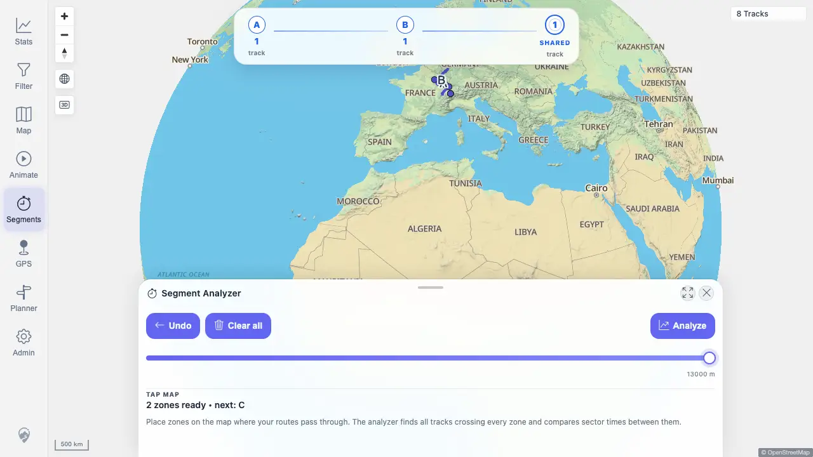
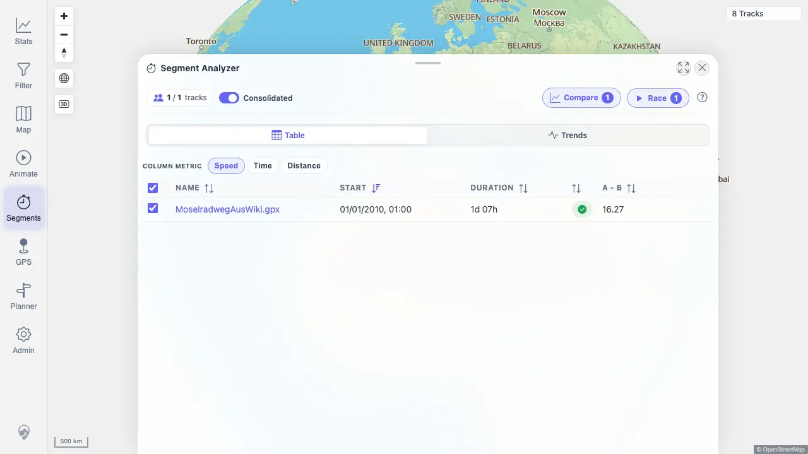
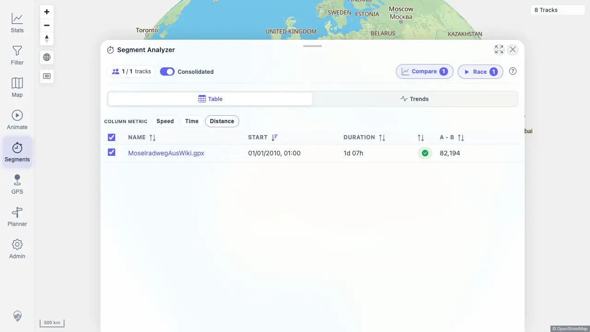

# Packet: MCT_01

## Scope

- Coverage source: `documentation/testing/frontend-regression-test-plan.md`
- Coverage ID or run packet: MCT_01
- In scope: Start Segment Analyzer, place start/end zones, analyze crossing tracks, and verify speed/time/distance result metrics.
- Out of scope: Result-row navigation and cleanup behavior covered by later MCT packets.

## Prerequisites

- Required previous coverage IDs or run packets: PLN_11
- Required app/data state: Imported public/synthetic tracks visible on the map.
- Required browser context: Authenticated desktop browser context against `http://178.104.209.132:18080/mtl/`.

## Allowed Mutations

- Allowed: Activate Segment Analyzer, place temporary measure zones, analyze results, and switch metric chips.
- Not allowed: Delete tracks or mutate imported data.

## Actions And Results

| Coverage ID | Action | Expected result | Actual result | Status | Evidence |
|---|---|---|---|---|---|
| MCT_01 | Opened `/mtl/segments`, retoggled Segments after map readiness, set detection radius to `13000 m`, placed A/B zones at `[698,130]` and `[695,125]`, clicked Analyze, then switched result metrics from speed to time and distance. | Result list of crossing tracks appears with speed, time, and distance values. | PASS. A and B each found `1` track with `1` shared track. Results showed `MoselradwegAusWiki.gpx`; speed `16.27`, time `05:03:10`, and distance `82,194`. | PASS | [assets/MCT_01-results.txt](../assets/MCT_01-results.txt); [assets/MCT_01-zones-placed.webp](../assets/MCT_01-zones-placed.webp); [assets/MCT_01-results-speed-metric.webp](../assets/MCT_01-results-speed-metric.webp); [assets/MCT_01-results-distance-metric.webp](../assets/MCT_01-results-distance-metric.webp) |

## Issues

| ID | Severity | Summary | Reproduction | Expected | Actual | Evidence | Release impact |
|---|---|---|---|---|---|---|---|
|  |  |  |  |  |  |  |  |

## Evidence Files

| File | Purpose |
|---|---|
| [assets/MCT_01-results.txt](../assets/MCT_01-results.txt) | Segment Analyzer activation, zone, metric, API, and assertion summary. |
| [assets/MCT_01-zones-placed.webp](../assets/MCT_01-zones-placed.webp) | A/B zones placed with one shared track and Analyze enabled. |
| [assets/MCT_01-results-speed-metric.webp](../assets/MCT_01-results-speed-metric.webp) | Result table on speed metric. |
| [assets/MCT_01-results-distance-metric.webp](../assets/MCT_01-results-distance-metric.webp) | Result table on distance metric after metric switching. |

## Screenshot Evidence

## Timings

| Step | Timing |
|---|---:|
| Activate tool, place zones, analyze, switch metrics | ~1 min |

## Handoff Notes

- Completed: MCT_01 passed for Segment Analyzer result list and speed/time/distance metrics.
- Remaining unfinished coverage: MCT_02 onward.
- Blocked or not applicable: None for MCT_01.
- State left for the next packet: Browser context closed; no data mutation.
