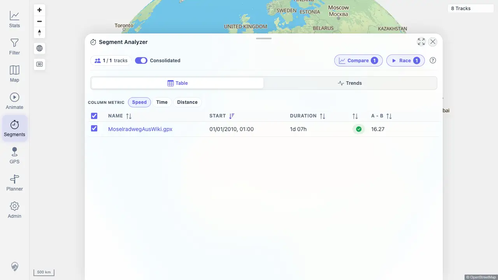
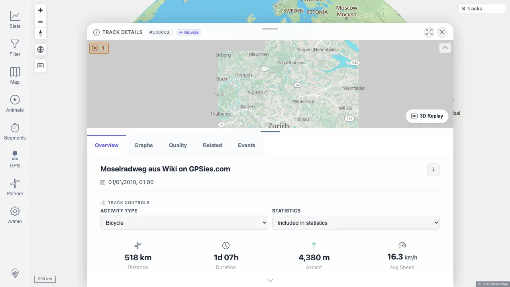

# Packet: MCT_02

## Scope

- Coverage source: `documentation/testing/frontend-regression-test-plan.md`
- Coverage ID or run packet: MCT_02
- In scope: Open a Segment Analyzer result row/link and verify the related track detail/segment view loads.
- Out of scope: Metric switching and result-list calculation, covered by MCT_01.

## Prerequisites

- Required previous coverage IDs or run packets: MCT_01
- Required app/data state: Imported public/synthetic tracks visible; Segment Analyzer can find the MCT_01 shared result.
- Required browser context: Authenticated desktop browser context against `http://178.104.209.132:18080/mtl/`.

## Allowed Mutations

- Allowed: Activate Segment Analyzer, place temporary measure zones, analyze results, and navigate to a result detail.
- Not allowed: Delete tracks, change imported files, or persist planner/filter state.

## Actions And Results

| Coverage ID | Action | Expected result | Actual result | Status | Evidence |
|---|---|---|---|---|---|
| MCT_02 | Recreated the MCT_01 Segment Analyzer result with radius `13000 m`, clicked the `MoselradwegAusWiki.gpx` result link, and observed route/API traffic. | Clicking a result opens the corresponding track detail/segment view without page errors. | PASS. The result link opened `/mtl/track/100002`; Track Details showed `#100002`, `Bicycle`, tabs, stats, and map, while sub-track and track-detail APIs returned 200. | PASS | [assets/MCT_02-result-detail.txt](../assets/MCT_02-result-detail.txt); [assets/MCT_02-results-before-click.webp](../assets/MCT_02-results-before-click.webp); [assets/MCT_02-result-detail.webp](../assets/MCT_02-result-detail.webp) |

## Issues

| ID | Severity | Summary | Reproduction | Expected | Actual | Evidence | Release impact |
|---|---|---|---|---|---|---|---|
|  |  |  |  |  |  |  |  |

## Evidence Files

| File | Purpose |
|---|---|
| [assets/MCT_02-result-detail.txt](../assets/MCT_02-result-detail.txt) | Result navigation, detail URL/header, and API summary. |
| [assets/MCT_02-results-before-click.webp](../assets/MCT_02-results-before-click.webp) | Segment Analyzer result list before clicking the result link. |
| [assets/MCT_02-result-detail.webp](../assets/MCT_02-result-detail.webp) | Track Details page opened from the Segment Analyzer result. |

## Screenshot Evidence

## Timings

| Step | Timing |
|---|---:|
| Recreate Segment Analyzer result and open result detail | ~1 min |

## Handoff Notes

- Completed: MCT_02 passed for result-row navigation to Track Details.
- Remaining unfinished coverage: MCT_03 onward.
- Blocked or not applicable: None for MCT_02.
- State left for the next packet: Browser context closed; no data mutation.
