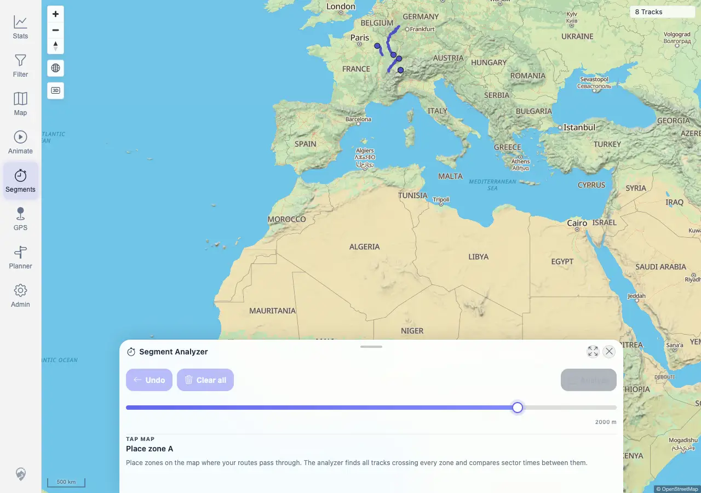
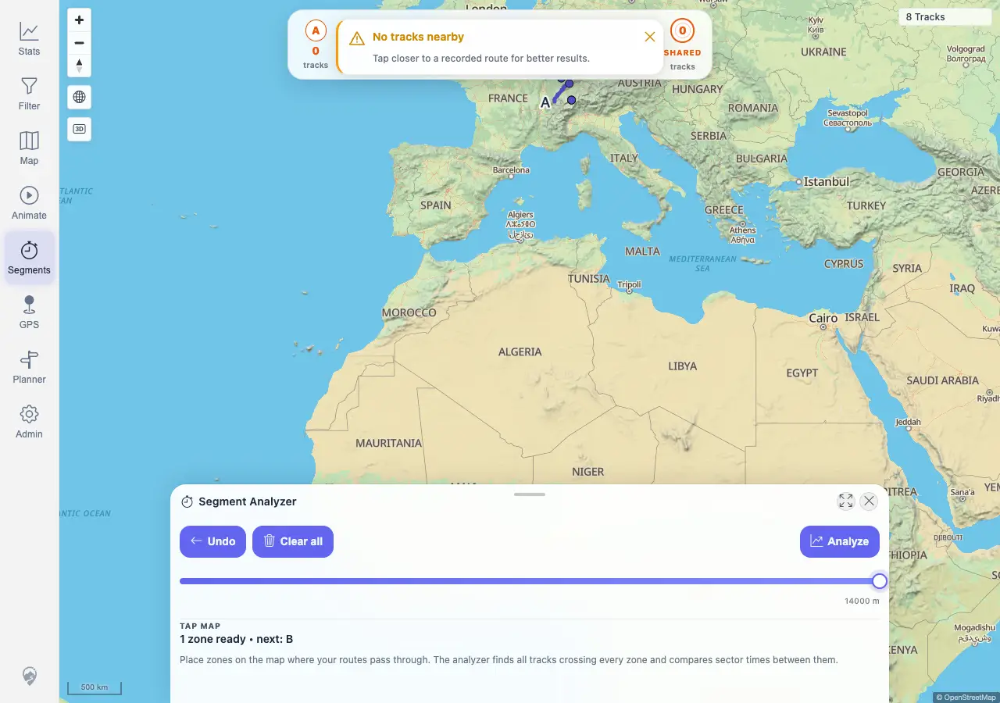
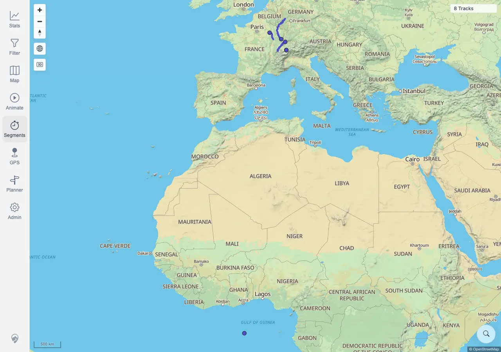
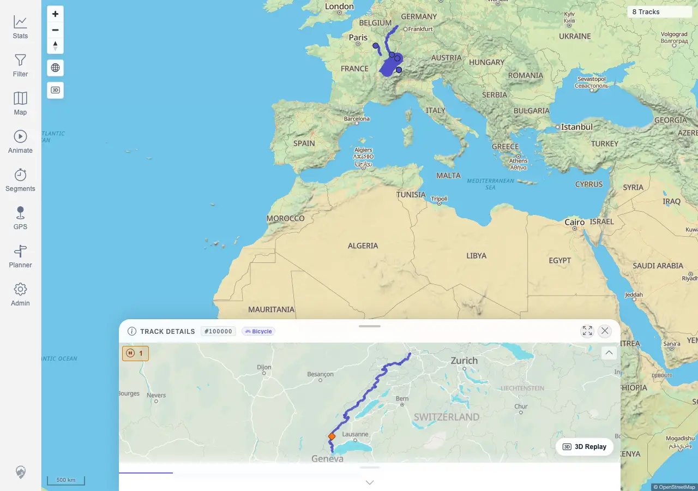

# Packet: MCT_03

## Scope

- Coverage source: `documentation/testing/frontend-regression-test-plan.md`
- Coverage ID or run packet: MCT_03
- In scope: Stop Segment Analyzer and verify temporary markers/listeners are cleaned up.
- Out of scope: Comparison charts and segment extraction, covered by later MCT IDs.

## Prerequisites

- Required previous coverage IDs or run packets: MCT_02
- Required app/data state: Imported tracks visible on the map.
- Required browser context: Authenticated desktop browser context against `http://178.104.209.132:18080/mtl/`.

## Allowed Mutations

- Allowed: Open/close Segment Analyzer and place temporary measure zones.
- Not allowed: Modify imported tracks or persisted application data.

## Actions And Results

| Coverage ID | Action | Expected result | Actual result | Status | Evidence |
|---|---|---|---|---|---|
| MCT_03 | Opened Segment Analyzer after map readiness, placed one temporary zone with radius `14000 m`, toggled Segments off, then clicked the map twice after the tool was stopped. | Temporary measure markers/overlay disappear, Segments is inactive, and later map clicks do not add measure markers or invoke measure-zone listeners. | PASS. The active tool showed an overlay and two flow nodes, then toggling Segments off removed the visible sheet/overlay/nodes. Post-stop clicks opened normal track-detail behavior and made normal map proximity calls, but no `14000 m` analyzer zone-count calls returned. | PASS | [assets/MCT_03-cleanup-results.txt](../assets/MCT_03-cleanup-results.txt); [assets/MCT_03-segments-open-empty.webp](../assets/MCT_03-segments-open-empty.webp); [assets/MCT_03-zone-a-active.webp](../assets/MCT_03-zone-a-active.webp); [assets/MCT_03-stopped-clean.webp](../assets/MCT_03-stopped-clean.webp); [assets/MCT_03-post-stop-map-click.webp](../assets/MCT_03-post-stop-map-click.webp) |

## Issues

| ID | Severity | Summary | Reproduction | Expected | Actual | Evidence | Release impact |
|---|---|---|---|---|---|---|---|
|  |  |  |  |  |  |  |  |

## Evidence Files

| File | Purpose |
|---|---|
| [assets/MCT_03-cleanup-results.txt](../assets/MCT_03-cleanup-results.txt) | Segment Analyzer active, stopped, post-stop click, API, and assertion summary. |
| [assets/MCT_03-segments-open-empty.webp](../assets/MCT_03-segments-open-empty.webp) | Segment Analyzer open before placing a zone. |
| [assets/MCT_03-zone-a-active.webp](../assets/MCT_03-zone-a-active.webp) | Temporary zone overlay visible while active. |
| [assets/MCT_03-stopped-clean.webp](../assets/MCT_03-stopped-clean.webp) | Segment Analyzer stopped with overlay gone. |
| [assets/MCT_03-post-stop-map-click.webp](../assets/MCT_03-post-stop-map-click.webp) | Post-stop map click state remained free of Segment Analyzer UI. |

## Screenshot Evidence

## Timings

| Step | Timing |
|---|---:|
| Open tool, place zone, stop, post-stop click, repeat confirmation | ~3 min |

## Handoff Notes

- Completed: MCT_03 passed for Segment Analyzer temporary-marker and listener cleanup.
- Remaining unfinished coverage: MCT_04 onward.
- Blocked or not applicable: None for MCT_03.
- State left for the next packet: Browser context closed; no data mutation.
