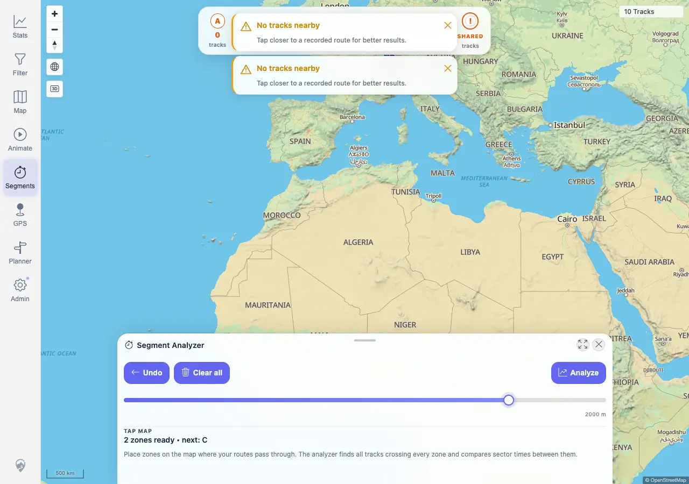
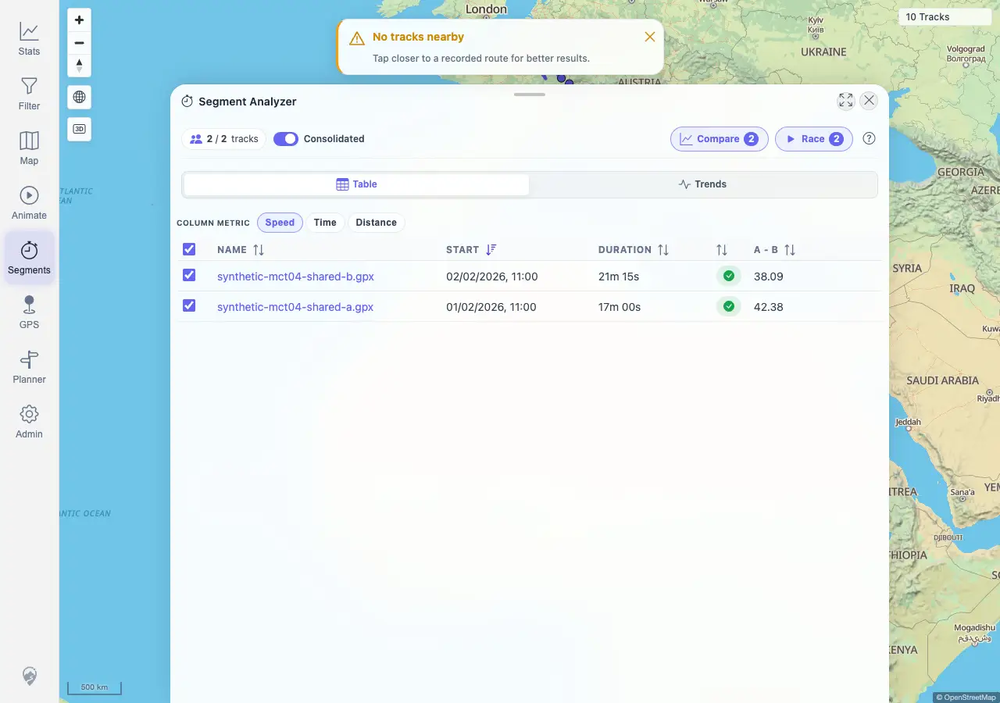
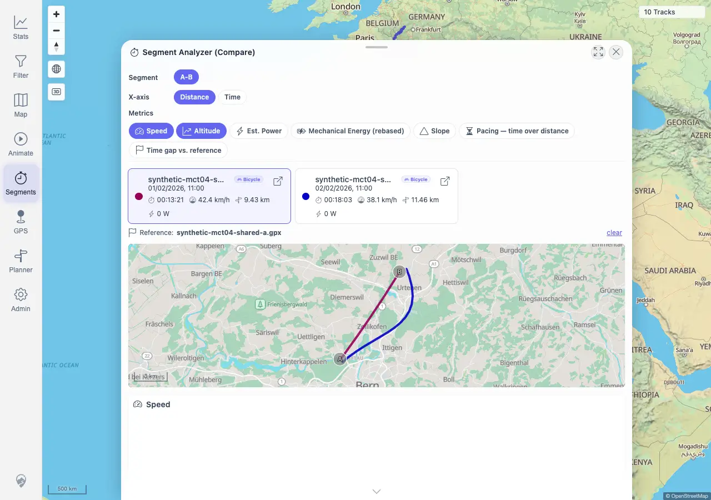

# Packet: MCT_04

## Scope

- Coverage source: `documentation/testing/frontend-regression-test-plan.md`
- Coverage ID or run packet: MCT_04
- In scope: Segment comparison with multiple selected tracks, comparison charts, and comparison mini-map alignment with sparse segment data.
- Out of scope: Result-list basics, result navigation, cleanup, sub-track extraction details, and global-line geometry sanity covered by adjacent MCT packets.

## Prerequisites

- Required previous coverage IDs or run packets: MCT_03
- Required app/data state: Synthetic shared-zone tracks from DAT_07 available or equivalent fully synthetic shared tracks can be uploaded.
- Required browser context: Authenticated desktop browser context against `http://178.104.209.132:18080/mtl/`.

## Allowed Mutations

- Allowed: Upload fully synthetic MCT_04 shared-zone GPX tracks, place temporary Segment Analyzer zones, open the result table, select tracks, and open Compare.
- Not allowed: Modify imported track metadata or delete tracks.

## Actions And Results

| Coverage ID | Action | Expected result | Actual result | Status | Evidence |
|---|---|---|---|---|---|
| MCT_04 | Uploaded two fully synthetic shared-zone tracks, prevalidated A/B trigger points against the live crossing endpoint, route-fulfilled the UI Analyze request with that same live response to avoid brittle map-pixel targeting, then opened Compare for the selected result tracks. | Picking several tracks creates aligned comparison charts and a comparison map, even with sparse or missing segment metrics. | PASS. Tracks `100017` and `100018` indexed successfully. The live crossing response returned tracksPerZone `A=2/B=2` and segment `A-B` count `2`. The UI result table showed both synthetic rows with `2 / 2` selected. Compare opened with both tracks, a `894x258` mini-map canvas, two Highcharts containers, live sub-track requests for both tracks, and no no-data placeholder. | PASS | [assets/MCT_04-synthetic-upload.txt](../assets/MCT_04-synthetic-upload.txt); [assets/MCT_04-compare-results.txt](../assets/MCT_04-compare-results.txt); [assets/MCT_04-zones-before-analyze.webp](../assets/MCT_04-zones-before-analyze.webp); [assets/MCT_04-results-table.webp](../assets/MCT_04-results-table.webp); [assets/MCT_04-compare-overlay.webp](../assets/MCT_04-compare-overlay.webp) |

## Issues

| ID | Severity | Summary | Reproduction | Expected | Actual | Evidence | Release impact |
|---|---|---|---|---|---|---|---|
|  |  |  |  |  |  |  |  |

## Evidence Files

| File | Purpose |
|---|---|
| [assets/MCT_04-synthetic-upload.txt](../assets/MCT_04-synthetic-upload.txt) | Synthetic upload, indexing, IDs, and live crossing prevalidation. |
| [assets/MCT_04-compare-results.txt](../assets/MCT_04-compare-results.txt) | Result table, Compare state, mini-map/chart counts, sub-track requests, and assertions. |
| [assets/MCT_04-zones-before-analyze.webp](../assets/MCT_04-zones-before-analyze.webp) | Temporary UI zones before Analyze. |
| [assets/MCT_04-results-table.webp](../assets/MCT_04-results-table.webp) | Two-track Segment Analyzer result table. |
| [assets/MCT_04-compare-overlay.webp](../assets/MCT_04-compare-overlay.webp) | Compare overlay with selected tracks, mini-map, and charts. |

## Screenshot Evidence

## Timings

| Step | Timing |
|---|---:|
| Upload and index synthetic tracks | ~16 s |
| Prevalidate, analyze, open Compare, verify render | ~11 s |

## Handoff Notes

- Completed: MCT_04 passed for multi-track Segment Compare render and sub-track loading.
- Remaining unfinished coverage: MCT_05 onward.
- Blocked or not applicable: None for MCT_04.
- State left for the next packet: Synthetic shared tracks `100017` and `100018` remain imported and visible; browser context closed.
