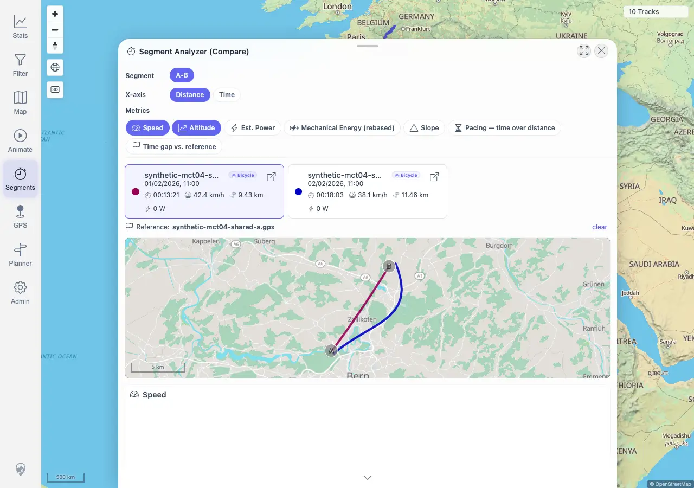

# Packet: MCT_06

## Scope

- Coverage source: `documentation/testing/frontend-regression-test-plan.md`
- Coverage ID or run packet: MCT_06
- In scope: Segment comparison map geometry sanity after selecting a measured segment.
- Out of scope: Basic Compare rendering and sub-track API inclusiveness, covered by MCT_04 and MCT_05.

## Prerequisites

- Required previous coverage IDs or run packets: MCT_05
- Required app/data state: Synthetic shared-zone tracks `100017` and `100018` are imported.
- Required browser context: Authenticated desktop browser context against `http://178.104.209.132:18080/mtl/`.

## Allowed Mutations

- Allowed: Reopen temporary Segment Analyzer/Compare state and read live sub-track geometry.
- Not allowed: Modify imported tracks, filter state, or persisted metadata.

## Actions And Results

| Coverage ID | Action | Expected result | Actual result | Status | Evidence |
|---|---|---|---|---|---|
| MCT_06 | Reopened the synthetic A/B Segment Analyzer comparison, opened Compare, captured the live sub-track geometries feeding the mini-map, and checked combined geometry bounds/steps. | After selecting a measured segment, the comparison map line stays within the selected tracks' real local bounds with no straight global line, `[0,0]` jump, or off-continent segment. | PASS. Compare rendered an `894x258` mini-map and two charts. Live sub-track coordinates stayed within `lng 7.421589..7.505584`, `lat 46.966625..47.046000`; max step was `0.011225` degrees, no zero-like coordinate appeared, and no point left the local Bern-area bounds. | PASS | [assets/MCT_06-geometry-sanity.txt](../assets/MCT_06-geometry-sanity.txt); [assets/MCT_06-compare-geometry.webp](../assets/MCT_06-compare-geometry.webp) |

## Issues

| ID | Severity | Summary | Reproduction | Expected | Actual | Evidence | Release impact |
|---|---|---|---|---|---|---|---|
|  |  |  |  |  |  |  |  |

## Evidence Files

| File | Purpose |
|---|---|
| [assets/MCT_06-geometry-sanity.txt](../assets/MCT_06-geometry-sanity.txt) | Compare mini-map, sub-track geometry bounds, max-step, zero/off-continent, and assertion summary. |
| [assets/MCT_06-compare-geometry.webp](../assets/MCT_06-compare-geometry.webp) | Compare overlay mini-map and charts for the measured A/B segment. |

## Screenshot Evidence

## Timings

| Step | Timing |
|---|---:|
| Reopen Compare and validate geometry | <1 min |

## Handoff Notes

- Completed: MCT_06 passed for local segment geometry sanity.
- Remaining unfinished coverage: AVR_01 onward.
- Blocked or not applicable: None for MCT_06.
- State left for the next packet: Synthetic tracks remain imported; browser context closed.
