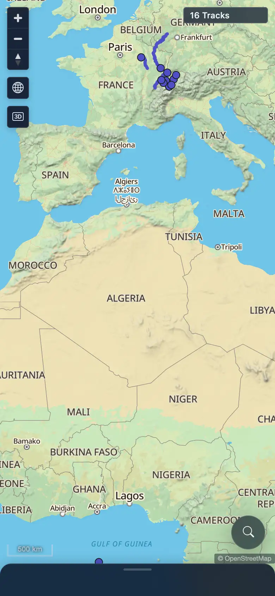
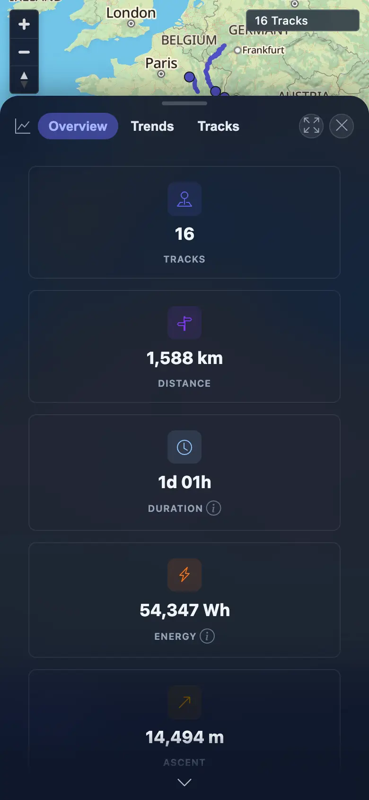
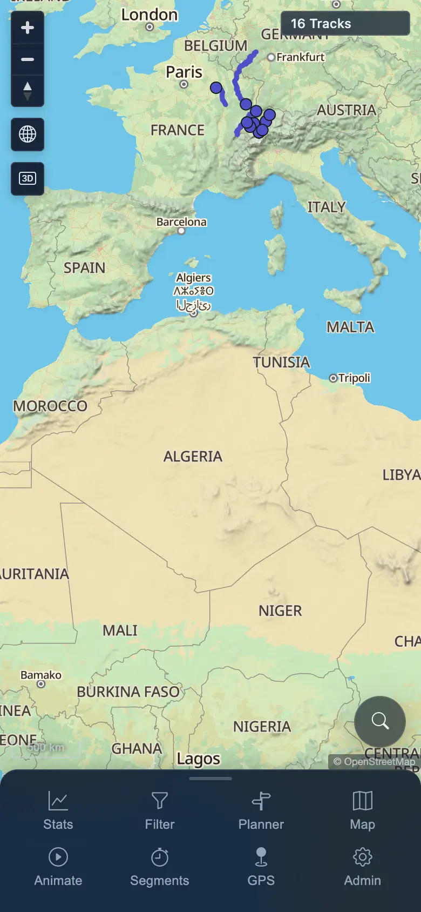

# Packet: MOB_02

## Scope

- Coverage source: `documentation/testing/frontend-regression-test-plan.md`
- Coverage ID or run packet: MOB_02
- In scope: Mobile navigation sheet and bottom-sheet drag, snap, and close behavior.
- Out of scope: Mobile table/chart content usability, covered by MOB_03.

## Prerequisites

- Required previous coverage IDs or run packets: MOB_01
- Required app/data state: Signed-in mobile context with 16 visible tracks.
- Required browser context: 390x844 touch-enabled mobile Chromium/Chrome context.

## Allowed Mutations

- Allowed: Open/close mobile sheets and update mobile browser storage state.
- Not allowed: Server data mutation or track import/delete.

## Actions And Results

| Coverage ID | Action | Expected result | Actual result | Status | Evidence |
|---|---|---|---|---|---|
| MOB_02 | Used touch gestures on the mobile navigation sheet handle, opened Stats from the nav sheet, dragged the Stats bottom sheet between detents, then closed it. | Navigation sheet snaps collapsed/expanded; bottom sheet opens, drags to a larger detent, snaps back down, and closes cleanly without overflow or stuck sheets. | Navigation sheet changed `132px` expanded to `46px` collapsed and back to `132px`; Stats sheet opened at ~506px, dragged to ~743px, dragged back to ~506px, and then closed with zero open sheets remaining. | PASS | [assets/MOB_02-sheet-interactions.txt](../assets/MOB_02-sheet-interactions.txt); [assets/MOB_02-nav-collapsed.webp](../assets/MOB_02-nav-collapsed.webp); [assets/MOB_02-nav-expanded.webp](../assets/MOB_02-nav-expanded.webp); [assets/MOB_02-stats-sheet-large.webp](../assets/MOB_02-stats-sheet-large.webp); [assets/MOB_02-after-sheet-close.webp](../assets/MOB_02-after-sheet-close.webp) |

## Issues

| ID | Severity | Summary | Reproduction | Expected | Actual | Evidence | Release impact |
|---|---|---|---|---|---|---|---|

## Evidence Files

| File | Purpose |
|---|---|
| [assets/MOB_02-sheet-interactions.txt](../assets/MOB_02-sheet-interactions.txt) | Touch gesture measurements and pass/fail checks. |
| [assets/MOB_02-nav-collapsed.webp](../assets/MOB_02-nav-collapsed.webp) | Navigation sheet collapsed state. |
| [assets/MOB_02-nav-expanded.webp](../assets/MOB_02-nav-expanded.webp) | Navigation sheet expanded state. |
| [assets/MOB_02-stats-sheet-large.webp](../assets/MOB_02-stats-sheet-large.webp) | Stats bottom sheet large detent. |
| [assets/MOB_02-after-sheet-close.webp](../assets/MOB_02-after-sheet-close.webp) | App after closing the Stats bottom sheet. |

## Screenshot Evidence

## Timings

| Step | Timing |
|---|---:|
| Nav sheet collapse/expand | ~4 s |
| Stats sheet drag/snap/close | ~7 s |

## Handoff Notes

- Completed: MOB_02 passed with direct touch gesture evidence.
- Remaining unfinished coverage: MOB_03 through ERR_02.
- Blocked or not applicable: None for this packet.
- State left for the next packet: Mobile context remains signed in; no server data changed.
