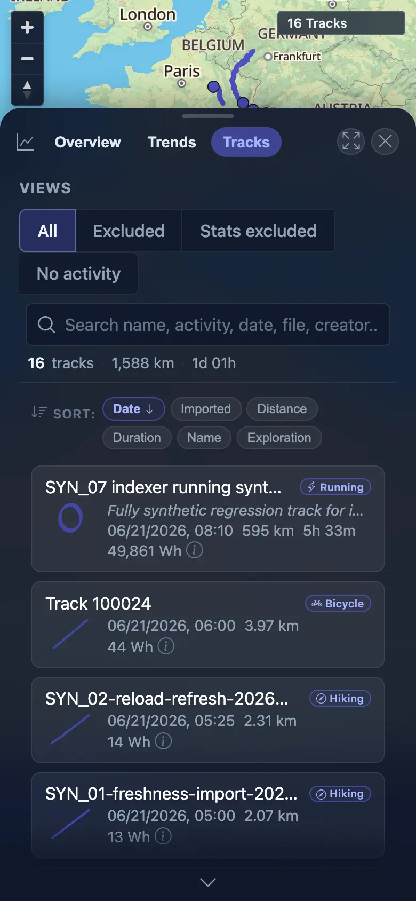
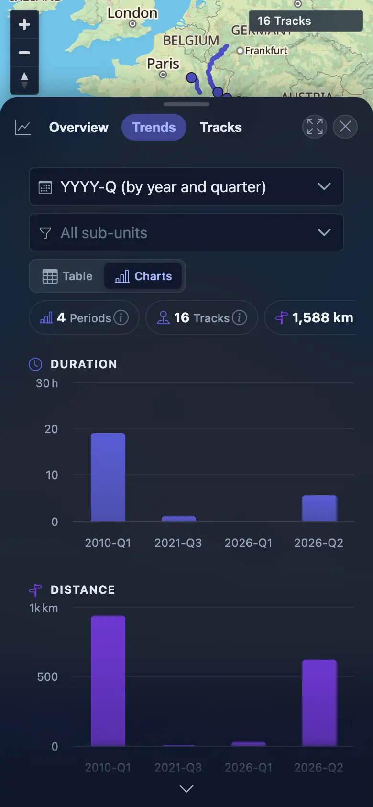
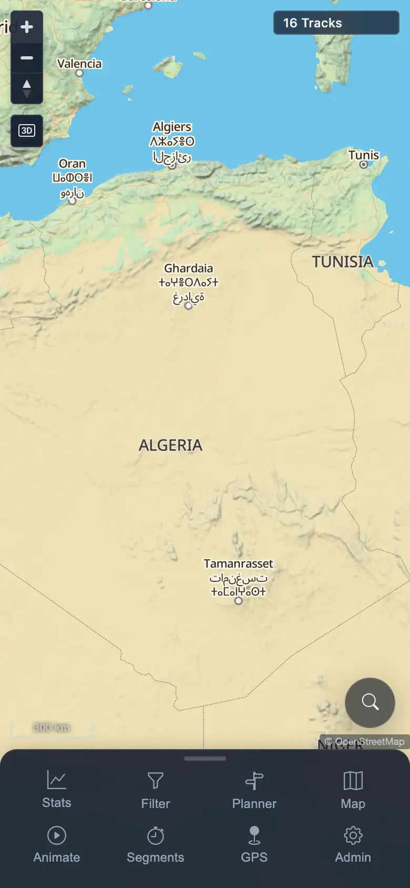

# Packet: MOB_03

## Scope

- Coverage source: `documentation/testing/frontend-regression-test-plan.md`
- Coverage ID or run packet: MOB_03
- In scope: Mobile usability for tables/card lists, charts, and map controls; text overflow checks.
- Out of scope: Planner touch gestures, covered by MOB_04.

## Prerequisites

- Required previous coverage IDs or run packets: MOB_02
- Required app/data state: Signed-in mobile context with 16 visible tracks.
- Required browser context: 390x844 touch-enabled mobile Chromium/Chrome context.

## Allowed Mutations

- Allowed: Open/close Stats mobile sheet, switch Stats tabs, zoom map.
- Not allowed: Server data mutation or track import/delete.

## Actions And Results

| Coverage ID | Action | Expected result | Actual result | Status | Evidence |
|---|---|---|---|---|---|
| MOB_03 | Opened mobile Stats, switched to Tracks/card-list view, switched to Trends/charts, closed Stats, then tapped the map zoom control. | Tables/card lists, charts, and map controls remain usable on mobile; document has no horizontal overflow and text does not spill out of containers. | Tracks rendered 16 mobile cards plus search/sort controls; long names/descriptions used controlled ellipsis, with no document overflow; Trends rendered 8 Highcharts roots / 7 visible chart containers; map zoom changed scale from `500 km` to `300 km`, with canvases and `16 Tracks` still visible. | PASS | [assets/MOB_03-mobile-surfaces.txt](../assets/MOB_03-mobile-surfaces.txt); [assets/MOB_03-mobile-table.webp](../assets/MOB_03-mobile-table.webp); [assets/MOB_03-mobile-charts.webp](../assets/MOB_03-mobile-charts.webp); [assets/MOB_03-mobile-map-controls.webp](../assets/MOB_03-mobile-map-controls.webp) |

## Issues

| ID | Severity | Summary | Reproduction | Expected | Actual | Evidence | Release impact |
|---|---|---|---|---|---|---|---|

## Evidence Files

| File | Purpose |
|---|---|
| [assets/MOB_03-mobile-surfaces.txt](../assets/MOB_03-mobile-surfaces.txt) | Table/chart/map metrics and overflow checks. |
| [assets/MOB_03-mobile-table.webp](../assets/MOB_03-mobile-table.webp) | Mobile track card list. |
| [assets/MOB_03-mobile-charts.webp](../assets/MOB_03-mobile-charts.webp) | Mobile Trends charts. |
| [assets/MOB_03-mobile-map-controls.webp](../assets/MOB_03-mobile-map-controls.webp) | Mobile map after zoom control interaction. |

## Screenshot Evidence

## Timings

| Step | Timing |
|---|---:|
| Mobile table/card-list check | ~7 s |
| Mobile chart check | ~4 s |
| Mobile map-control check | ~3 s |

## Handoff Notes

- Completed: MOB_03 passed; long card labels are intentionally clipped with ellipsis and did not create document overflow.
- Remaining unfinished coverage: MOB_04 through ERR_02.
- Blocked or not applicable: None for this packet.
- State left for the next packet: Mobile context remains signed in; map zoom scale is `300 km`.
