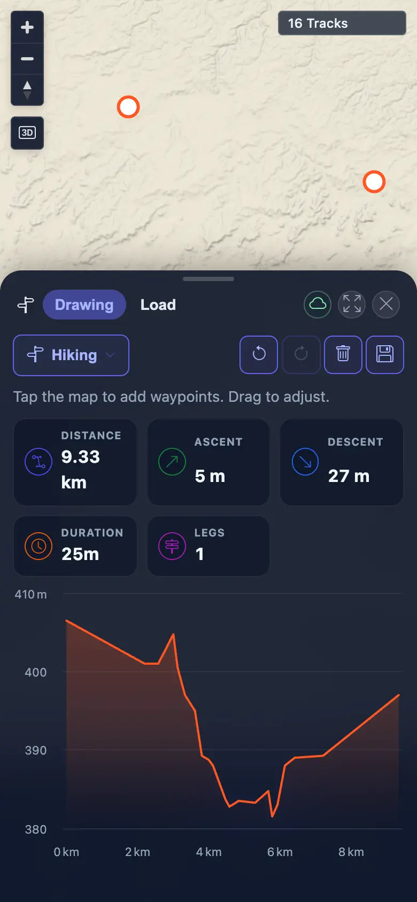
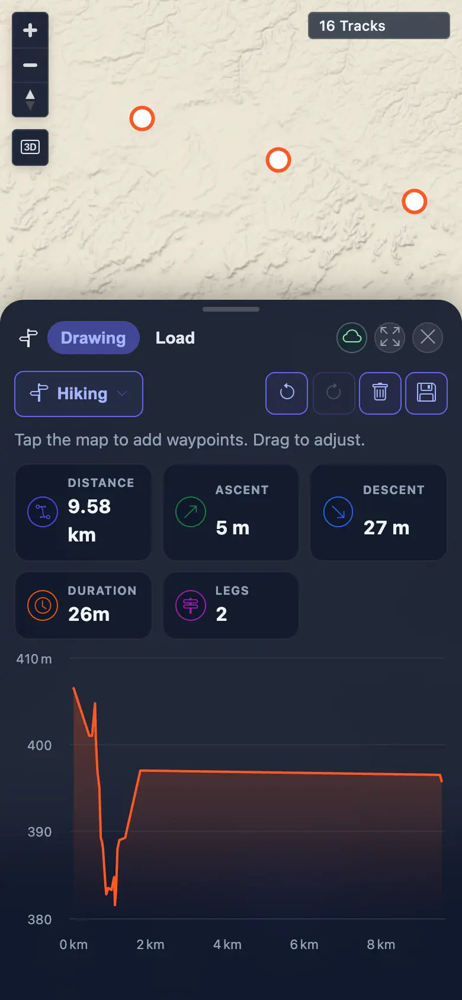
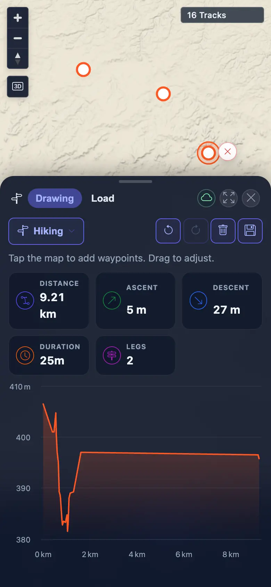

# Packet: MOB_04

## Scope

- Coverage source: `documentation/testing/frontend-regression-test-plan.md`
- Coverage ID or run packet: MOB_04
- In scope: Mobile planner waypoint tap, drag, and insertion behavior.
- Out of scope: Desktop planner editing, covered by PLN_03/PLN_04.

## Prerequisites

- Required previous coverage IDs or run packets: MOB_03
- Required app/data state: Signed-in mobile context with planner enabled and BRouter available.
- Required browser context: 390x844 touch-enabled mobile Chromium/Chrome context.

## Allowed Mutations

- Allowed: Create, edit, and clear a transient unsaved planner route.
- Not allowed: Save planner routes or mutate imported track data.

## Actions And Results

| Coverage ID | Action | Expected result | Actual result | Status | Evidence |
|---|---|---|---|---|---|
| MOB_04 | Cleared planner zoom guard, tapped two waypoints, attempted a route-line touch insertion, dragged a waypoint, and cleared the transient route. | Touch taps create a route; a route-line touch inserts a waypoint into the existing leg; dragging a waypoint recomputes the route. | Touch taps created a routed leg (`9.33 km`, 1 leg); dragging recomputed a 3-waypoint route (`9.21 km`, 2 legs). The route-line tap produced a 3-waypoint request, but request order was start, original end, new point, indicating append rather than confirmed insertion into the existing leg. | BLOCKED | [assets/MOB_04-planner-touch.txt](../assets/MOB_04-planner-touch.txt); [assets/MOB_04-touch-route.webp](../assets/MOB_04-touch-route.webp); [assets/MOB_04-inserted-waypoint.webp](../assets/MOB_04-inserted-waypoint.webp); [assets/MOB_04-dragged-waypoint.webp](../assets/MOB_04-dragged-waypoint.webp) |

## Issues

| ID | Severity | Summary | Reproduction | Expected | Actual | Evidence | Release impact |
|---|---|---|---|---|---|---|---|

## Evidence Files

| File | Purpose |
|---|---|
| [assets/MOB_04-planner-touch.txt](../assets/MOB_04-planner-touch.txt) | Mobile planner route request order, stats, and blocked insertion note. |
| [assets/MOB_04-touch-route.webp](../assets/MOB_04-touch-route.webp) | Route after mobile touch placement. |
| [assets/MOB_04-inserted-waypoint.webp](../assets/MOB_04-inserted-waypoint.webp) | Route after attempted route-line touch; append rather than confirmed insertion. |
| [assets/MOB_04-dragged-waypoint.webp](../assets/MOB_04-dragged-waypoint.webp) | Route after touch waypoint drag/recompute. |

## Screenshot Evidence

## Timings

| Step | Timing |
|---|---:|
| Planner zoom guard, placement, insertion attempt, drag, clear | ~1 min |

## Handoff Notes

- Completed: Mobile touch placement and waypoint drag/recompute passed.
- Remaining unfinished coverage: MOB_05 through ERR_02.
- Blocked or not applicable: Route-line insertion remains blocked by browser targeting/visibility; the same general route-hit limitation was recorded for PLN_03.
- State left for the next packet: Transient planner route was cleared; no saved route or server data changed.
