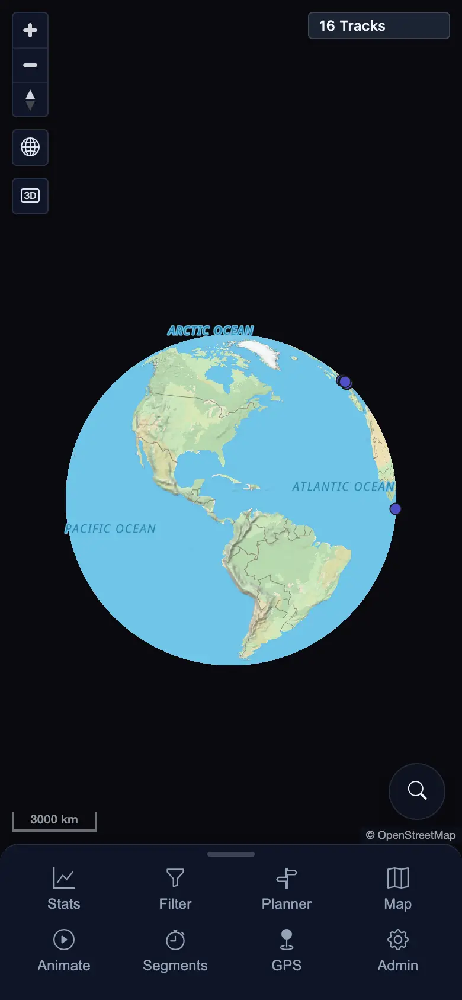

# Packet: MOB_05

## Scope

- Coverage source: `documentation/testing/frontend-regression-test-plan.md`
- Coverage ID or run packet: MOB_05
- In scope: Mobile map drag, double-tap, and pinch gestures after using each tool.
- Out of scope: Live geolocation behavior, covered by GPS_01 through GPS_05.

## Prerequisites

- Required previous coverage IDs or run packets: MOB_04
- Required app/data state: Signed-in mobile context with 16 visible tracks.
- Required browser context: 390x844 touch-enabled mobile Chromium/Chrome context.

## Allowed Mutations

- Allowed: Open/close mobile tools and change transient map viewport/zoom.
- Not allowed: Server data mutation or track import/delete.

## Actions And Results

| Coverage ID | Action | Expected result | Actual result | Status | Evidence |
|---|---|---|---|---|---|
| MOB_05 | For Stats, Filter, Planner, Map, Animate, Segments, GPS, and Admin, opened/closed the tool, then performed touch drag, double-tap zoom, and pinch zoom-out on the map. | Map gestures remain usable after each tool; no stuck listeners, broken canvases, or gesture dead zones. | For every tool, drag left the map valid, double-tap changed scale from `3000 km` to `2000 km`, pinch changed it back to `3000 km`, map canvases stayed present, `16 Tracks` remained visible, document overflow stayed `0`, and no page/console errors fired. | PASS | [assets/MOB_05-map-gestures.txt](../assets/MOB_05-map-gestures.txt); [assets/MOB_05-map-gestures-after-tools.webp](../assets/MOB_05-map-gestures-after-tools.webp) |

## Issues

| ID | Severity | Summary | Reproduction | Expected | Actual | Evidence | Release impact |
|---|---|---|---|---|---|---|---|

## Evidence Files

| File | Purpose |
|---|---|
| [assets/MOB_05-map-gestures.txt](../assets/MOB_05-map-gestures.txt) | Per-tool gesture metrics and checks. |
| [assets/MOB_05-map-gestures-after-tools.webp](../assets/MOB_05-map-gestures-after-tools.webp) | Final mobile map state after all gesture checks. |

## Screenshot Evidence

## Timings

| Step | Timing |
|---|---:|
| Per-tool gesture loop | ~50 s |

## Handoff Notes

- Completed: MOB_05 passed across all eight mobile tools.
- Remaining unfinished coverage: NET_01 through ERR_02.
- Blocked or not applicable: None for this packet.
- State left for the next packet: Mobile context remains signed in; map viewport changed only transiently.
