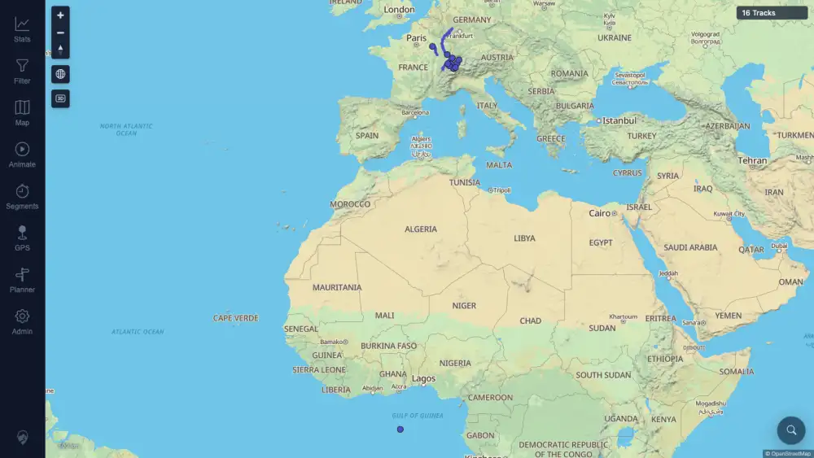

# Packet: NET_01

## Scope

- Coverage source: `documentation/testing/frontend-regression-test-plan.md` section 19.
- Coverage ID or run packet: NET_01.
- In scope: Determine whether the installed-PWA offline reload check applies to this configured run.
- Out of scope: Installing MTL Explorer as a browser web app or validating installed-app offline cache behavior.

## Prerequisites

- Required previous coverage IDs or run packets: RUN_SETUP, SGN_02, SYN_07.
- Required app/data state: Authenticated desktop browser state; synced map showing current imported tracks.
- Required browser context: Normal desktop browser tab using `assets/browser-state-desktop.json`.

## Allowed Mutations

- Allowed: Read-only browser context inspection.
- Not allowed: Install the app, change service-worker state, mutate server data, or alter persisted app settings.

## Actions And Results

| Coverage ID | Action | Expected result | Actual result | Status | Evidence |
|---|---|---|---|---|---|
| NET_01 | Loaded MTL Explorer in the configured desktop browser context and checked display-mode/app-install signals before deciding offline-cache applicability. | The row applies only when MTL Explorer is installed as a web app; a normal browser-tab run should not be judged against installed-app offline reload behavior. | The current context was a normal browser tab: `display-mode browser: true`, `display-mode standalone: false`, no service-worker registrations in this context, and the app was loaded with `16 Tracks`. This run did not install MTL Explorer as a web app. | NOT APPLICABLE | [assets/NET_01-pwa-applicability.txt](../assets/NET_01-pwa-applicability.txt); [assets/NET_01-normal-browser-tab.webp](../assets/NET_01-normal-browser-tab.webp) |

## Issues

| ID | Severity | Summary | Reproduction | Expected | Actual | Evidence | Release impact |
|---|---|---|---|---|---|---|---|

## Evidence Files

| File | Purpose |
|---|---|
| [assets/NET_01-pwa-applicability.txt](../assets/NET_01-pwa-applicability.txt) | Normal browser-tab display-mode and app-load evidence. |
| [assets/NET_01-normal-browser-tab.webp](../assets/NET_01-normal-browser-tab.webp) | Loaded normal browser-tab app surface with current track count. |

## Screenshot Evidence

## Timings

| Step | Timing |
|---|---:|
| Browser context load and applicability check | 2026-06-21 06:10 CEST |

## Handoff Notes

- Completed: NET_01 terminalized as `NOT APPLICABLE` because the required installed web-app mode was not part of this configured run.
- Remaining unfinished coverage: NET_02, NET_03, NET_04, ERR_01, ERR_02, RUN_CLEANUP.
- Blocked or not applicable: NET_01 installed-PWA offline reload behavior requires an installed app context.
- State left for the next packet: No server or browser storage mutations made.
