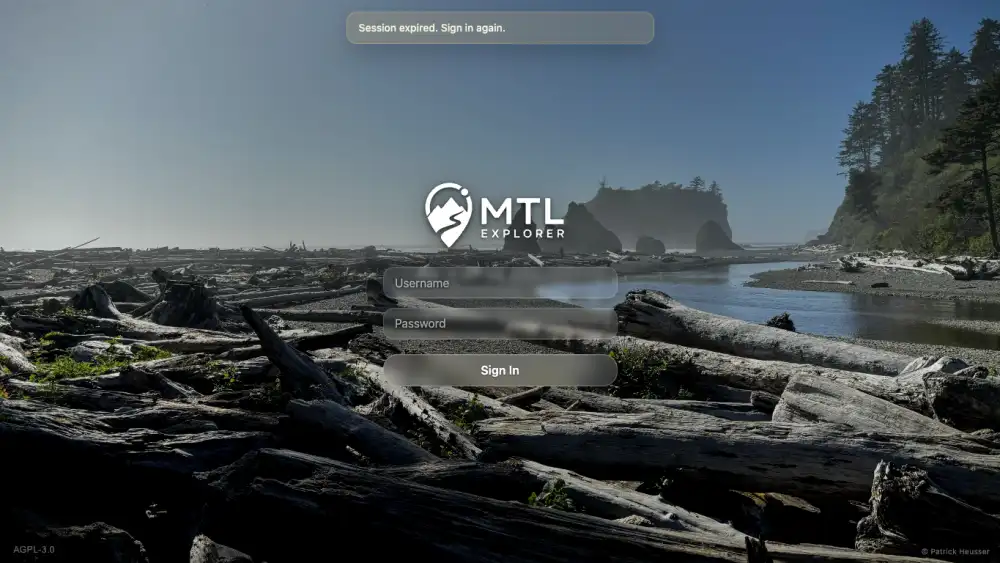

# Packet: NET_03

## Scope

- Coverage source: `documentation/testing/frontend-regression-test-plan.md` section 19.
- Coverage ID or run packet: NET_03.
- In scope: Verify 401 and 403 responses from a protected server API redirect the user to login.
- Out of scope: Invalid-credential login form behavior, already covered by SGN_03.

## Prerequisites

- Required previous coverage IDs or run packets: RUN_SETUP, SGN_02, NET_02.
- Required app/data state: Valid authenticated desktop storage state available.
- Required browser context: Two isolated authenticated desktop contexts, one for 401 and one for 403.

## Allowed Mutations

- Allowed: Browser-context response simulation for `/mtl/api/info/build`; local token clearing inside disposable contexts.
- Not allowed: Server-side logout, user/password mutation, or persistent browser-state changes.

## Actions And Results

| Coverage ID | Action | Expected result | Actual result | Status | Evidence |
|---|---|---|---|---|---|
| NET_03 | In two fresh authenticated contexts, intercepted the protected auth-probe endpoint `/mtl/api/info/build` and fulfilled it with 401, then 403. | 401 and 403 responses from protected server calls redirect to login instead of leaving a broken authenticated app state. | Both status simulations redirected to `http://178.104.209.132:18080/mtl/login`, displayed `Session expired. Sign in again.` with username/password controls and Sign In, and cleared `mtl.jwt` from localStorage in the disposable context. | PASS | [assets/NET_03-auth-redirects.txt](../assets/NET_03-auth-redirects.txt); [assets/NET_03-401-login-redirect.webp](../assets/NET_03-401-login-redirect.webp); [assets/NET_03-403-login-redirect.webp](../assets/NET_03-403-login-redirect.webp) |

## Issues

| ID | Severity | Summary | Reproduction | Expected | Actual | Evidence | Release impact |
|---|---|---|---|---|---|---|---|

## Evidence Files

| File | Purpose |
|---|---|
| [assets/NET_03-auth-redirects.txt](../assets/NET_03-auth-redirects.txt) | 401/403 interception counts, final URLs, login controls, token-clearing evidence, and expected induced console errors. |
| [assets/NET_03-401-login-redirect.webp](../assets/NET_03-401-login-redirect.webp) | Login screen after simulated 401. |
| [assets/NET_03-403-login-redirect.webp](../assets/NET_03-403-login-redirect.webp) | Login screen after simulated 403. |

## Screenshot Evidence

## Timings

| Step | Timing |
|---|---:|
| 401 and 403 redirect simulations | 2026-06-21 06:15 CEST |

## Handoff Notes

- Completed: NET_03 passed for both 401 and 403 auth-probe responses.
- Remaining unfinished coverage: NET_04, ERR_01, ERR_02, RUN_CLEANUP.
- Blocked or not applicable: none.
- State left for the next packet: The shared desktop storage-state file was not modified; token clearing happened only inside closed isolated contexts.
