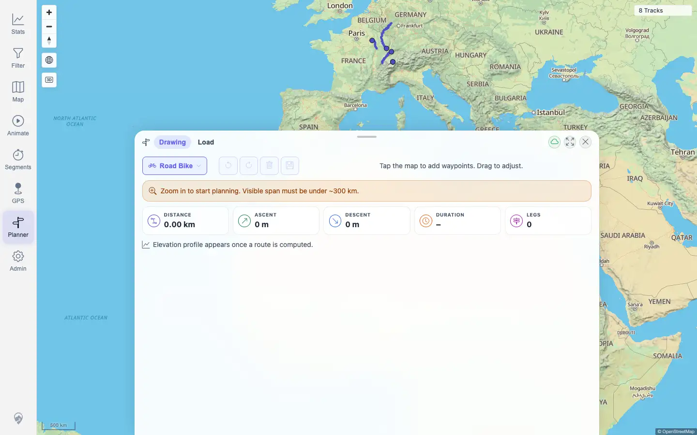

# Packet: PLN_01

## Scope

- Coverage source: `documentation/testing/frontend-regression-test-plan.md`
- Coverage ID or run packet: PLN_01
- In scope: Opening Planner and selecting a routing profile.
- Out of scope: Adding waypoints and route computation; covered by later PLN packets.

## Prerequisites

- Required previous coverage IDs or run packets: TBS_12
- Required app/data state: Standard filter restored; app map loaded.
- Required browser context: Authenticated desktop browser context.

## Allowed Mutations

- Allowed: Open Planner and change its profile selection.
- Not allowed: Save routes, import/delete tracks, or alter track data.

## Actions And Results

| Coverage ID | Action | Expected result | Actual result | Status | Evidence |
|---|---|---|---|---|---|
| PLN_01 | Opened Planner from the map nav, opened the routing profile dropdown, and selected `Road Bike`. | Planner opens and a routing profile can be picked. | Planner opened with Drawing/Load tabs, profile options `Hiking`, `Road Bike`, `Mountain Hiking`, and `Car`, BRouter status pill visible, and selected profile changed from `Hiking` to `Road Bike`. | PASS | [assets/PLN_01-open-profile.txt](../assets/PLN_01-open-profile.txt); [assets/PLN_01-open-profile.webp](../assets/PLN_01-open-profile.webp) |

## Issues

| ID | Severity | Summary | Reproduction | Expected | Actual | Evidence | Release impact |
|---|---|---|---|---|---|---|---|
| None |  |  |  |  |  |  |  |

## Evidence Files

| File | Purpose |
|---|---|
| [assets/PLN_01-open-profile.txt](../assets/PLN_01-open-profile.txt) | Planner visibility, profile options, selected profile, BRouter pill, and console/page-error summary. |
| [assets/PLN_01-open-profile.webp](../assets/PLN_01-open-profile.webp) | Planner open with Road Bike selected. |

## Screenshot Evidence

## Timings

| Step | Timing |
|---|---:|
| Open Planner and select profile | < 1 min |

## Handoff Notes

- Completed: PLN_01 passed.
- Remaining unfinished coverage: PLN_02 onward.
- Blocked or not applicable: None.
- State left for the next packet: Planner open with Road Bike selected and no route waypoints.
