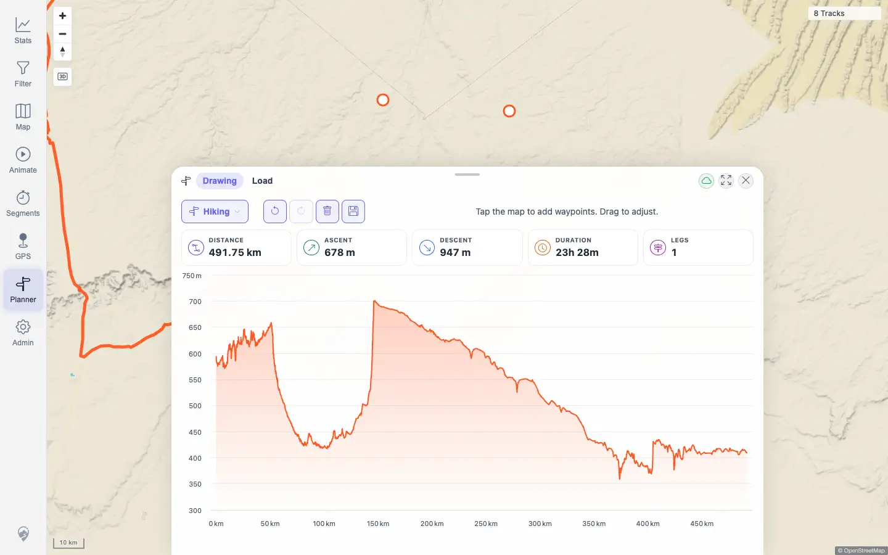

# Packet: PLN_02

## Scope

- Coverage source: `documentation/testing/frontend-regression-test-plan.md`
- Coverage ID or run packet: PLN_02
- In scope: Adding planner waypoints by clicking the map and verifying route computation/drawing.
- Out of scope: Waypoint insertion, editing, save/load, and GPX export.

## Prerequisites

- Required previous coverage IDs or run packets: PLN_01
- Required app/data state: Planner can open; routing profile available.
- Required browser context: Authenticated desktop browser context.

## Allowed Mutations

- Allowed: Zoom map and create an unsaved planner route.
- Not allowed: Save routes or change imported track data.

## Actions And Results

| Coverage ID | Action | Expected result | Actual result | Status | Evidence |
|---|---|---|---|---|---|
| PLN_02 | Zoomed in below the planner span limit, opened Planner, clicked two map points, and monitored planner route responses/live stats. | Clicking map waypoints computes and draws a route. | Two map clicks produced a 200 `/api/planner/route` response, one routed leg, and live stats `491.75 km`, `678 m` ascent, `947 m` descent, `23h 28m`, `LEGS 1`; the elevation profile appeared and no route error notice was visible. | PASS | [assets/PLN_02-route-computed.txt](../assets/PLN_02-route-computed.txt); [assets/PLN_02-route-computed.webp](../assets/PLN_02-route-computed.webp) |

## Issues

| ID | Severity | Summary | Reproduction | Expected | Actual | Evidence | Release impact |
|---|---|---|---|---|---|---|---|
| None |  |  |  |  |  |  |  |

## Evidence Files

| File | Purpose |
|---|---|
| [assets/PLN_02-route-computed.txt](../assets/PLN_02-route-computed.txt) | Click points, route API response, live stats, and console/page-error summary. |
| [assets/PLN_02-route-computed.webp](../assets/PLN_02-route-computed.webp) | Planner route and elevation profile after two waypoints. |

## Screenshot Evidence

## Timings

| Step | Timing |
|---|---:|
| Zoom, add two waypoints, compute route | ~1 min |

## Handoff Notes

- Completed: PLN_02 passed.
- Remaining unfinished coverage: PLN_03 onward.
- Blocked or not applicable: None.
- State left for the next packet: The route was unsaved and browser-session local; no persisted route/data mutations.
