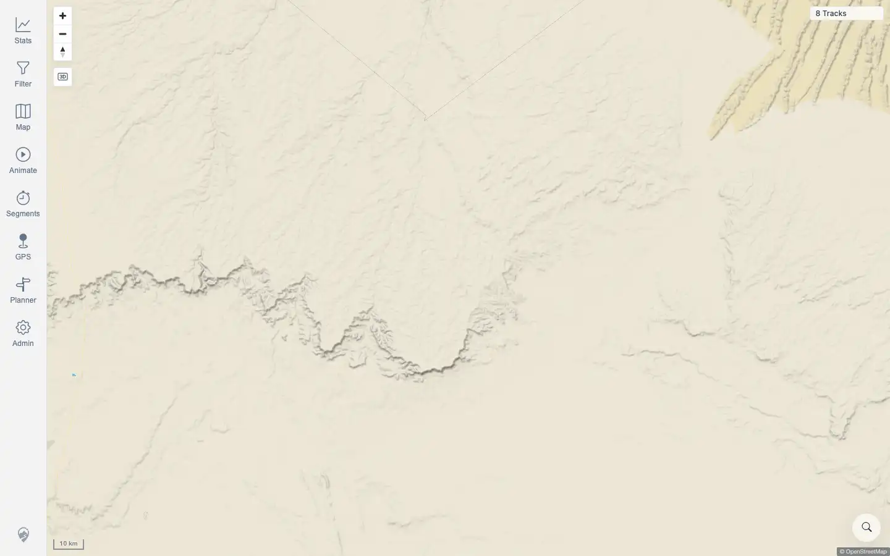

# Packet: PLN_03

## Scope

- Coverage source: `documentation/testing/frontend-regression-test-plan.md`
- Coverage ID or run packet: PLN_03
- In scope: Insert a waypoint on an existing planner leg by route interaction.
- Out of scope: Route creation baseline, save/export/share, and waypoint move/delete controls covered by adjacent planner IDs.

## Prerequisites

- Required previous coverage IDs or run packets: PLN_01, PLN_02
- Required app/data state: Beta quick-start stack running with imported public test tracks.
- Required browser context: Authenticated desktop browser context against `http://178.104.209.132:18080/mtl/`.

## Allowed Mutations

- Allowed: Create transient planner routes and attempt waypoint edits.
- Not allowed: Persist planner routes as saved tracks or mutate imported track data.

## Actions And Results

| Coverage ID | Action | Expected result | Actual result | Status | Evidence |
|---|---|---|---|---|---|
| PLN_03 | Created a planner route and attempted multiple route-leg insertion gestures: midpoint click, projected route-coordinate click, visible-line click, and planner-sheet repositioning to expose the route. | Existing leg accepts an inserted waypoint, route recomputes with waypoint order start, inserted point, end, and the planner shows an added leg. | Route creation worked, but browser automation could not reliably hit the planner route leg. Midpoint/visible-line clicks appended after the end, projected route clicks did not fire a route request, and moving the planner sheet closed/detached the planner. | BLOCKED | [assets/PLN_03-insert-waypoint.txt](../assets/PLN_03-insert-waypoint.txt); [assets/PLN_03-insert-blocked.webp](../assets/PLN_03-insert-blocked.webp); [assets/PLN_02-route-computed.webp](../assets/PLN_02-route-computed.webp) |

## Issues

| ID | Severity | Summary | Reproduction | Expected | Actual | Evidence | Release impact |
|---|---|---|---|---|---|---|---|
|  |  |  |  |  |  |  |  |

## Evidence Files

| File | Purpose |
|---|---|
| [assets/PLN_03-insert-waypoint.txt](../assets/PLN_03-insert-waypoint.txt) | Concise attempt log showing why the route-leg insertion gesture could not be verified. |
| [assets/PLN_03-insert-blocked.webp](../assets/PLN_03-insert-blocked.webp) | Final blocked state after the planner sheet was moved and the route target could no longer be interacted with. |
| [assets/PLN_02-route-computed.webp](../assets/PLN_02-route-computed.webp) | Baseline evidence that planner route creation and route stats were working before the insertion attempt. |

## Screenshot Evidence

## Timings

| Step | Timing |
|---|---:|
| Route setup and insertion attempts | Multiple attempts, each allowed route recomputation or timeout settle |

## Handoff Notes

- Completed: PLN_03 has terminal `BLOCKED` evidence.
- Remaining unfinished coverage: PLN_04 and later coverage IDs remain queued.
- Blocked or not applicable: PLN_03 is blocked by browser automation targeting of the existing planner route leg.
- State left for the next packet: No saved route or imported track mutation was made.
