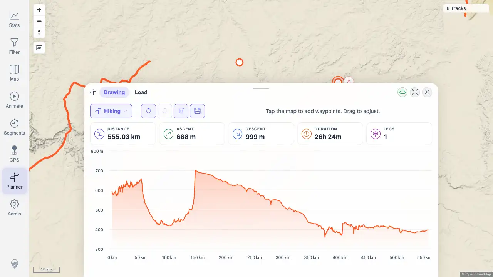
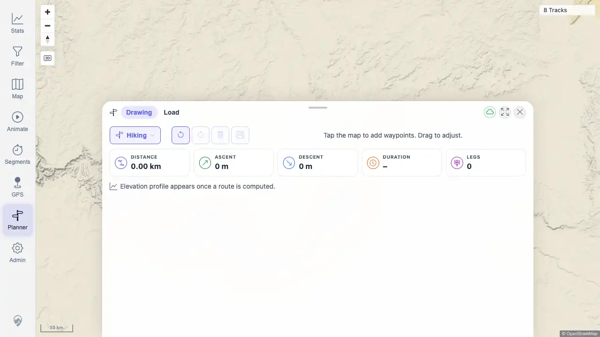

# Packet: PLN_04

## Scope

- Coverage source: `documentation/testing/frontend-regression-test-plan.md`
- Coverage ID or run packet: PLN_04
- In scope: Move and delete planner waypoints; clear route; undo and redo edits.
- Out of scope: Saving, downloading, and mobile touch dragging covered by later planner/mobile IDs.

## Prerequisites

- Required previous coverage IDs or run packets: PLN_01, PLN_02
- Required app/data state: Planner route can be created in the beta quick-start stack.
- Required browser context: Authenticated desktop browser context against `http://178.104.209.132:18080/mtl/`.

## Allowed Mutations

- Allowed: Create, edit, delete, clear, undo, and redo transient unsaved planner waypoints/routes.
- Not allowed: Save a planned route or mutate imported track data.

## Actions And Results

| Coverage ID | Action | Expected result | Actual result | Status | Evidence |
|---|---|---|---|---|---|
| PLN_04 | Opened Planner, zoomed until planning was enabled, placed two waypoints, dragged the second waypoint, selected it and used the waypoint delete marker, then exercised undo/redo for deletion and clear/undo/redo for the whole route. | Moving a waypoint recomputes the route; deleting a waypoint resets route stats; undo restores the route; redo reapplies the deletion; clear removes all route work; undo/redo work for clear. | PASS. The moved waypoint produced a changed two-waypoint route request. Delete marker reset legs to 0; undo restored a one-leg route; redo returned legs to 0. Clear reset legs to 0; undo restored the route; redo cleared it again. | PASS | [assets/PLN_04-waypoint-edit-history.txt](../assets/PLN_04-waypoint-edit-history.txt); [assets/PLN_04-route-restored.webp](../assets/PLN_04-route-restored.webp); [assets/PLN_04-cleared-redone.webp](../assets/PLN_04-cleared-redone.webp) |

## Issues

| ID | Severity | Summary | Reproduction | Expected | Actual | Evidence | Release impact |
|---|---|---|---|---|---|---|---|
|  |  |  |  |  |  |  |  |

## Evidence Files

| File | Purpose |
|---|---|
| [assets/PLN_04-waypoint-edit-history.txt](../assets/PLN_04-waypoint-edit-history.txt) | Route request summaries, live stat snapshots, and pass/fail conditions for move/delete/clear/undo/redo. |
| [assets/PLN_04-route-restored.webp](../assets/PLN_04-route-restored.webp) | Planner after route creation/waypoint movement with one live route leg. |
| [assets/PLN_04-cleared-redone.webp](../assets/PLN_04-cleared-redone.webp) | Planner after redo of clear, showing route stats reset to zero. |

## Screenshot Evidence

## Timings

| Step | Timing |
|---|---:|
| Planner zoom/setup | 6 zoom clicks until planning enabled |
| Route/edit workflow | 5 successful planner route responses |

## Handoff Notes

- Completed: PLN_04 passed for waypoint move/delete plus clear/undo/redo.
- Remaining unfinished coverage: PLN_05 and later coverage IDs remain queued.
- Blocked or not applicable: None for PLN_04.
- State left for the next packet: Transient planner route was cleared; no saved route or imported track data changed.
