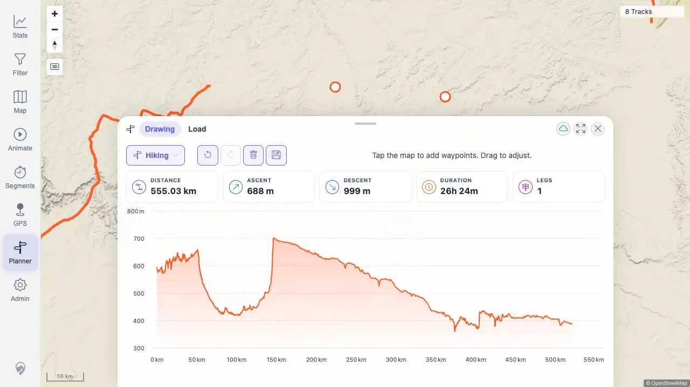

# Packet: PLN_05

## Scope

- Coverage source: `documentation/testing/frontend-regression-test-plan.md`
- Coverage ID or run packet: PLN_05
- In scope: Live stats bar updates for distance, ascent, duration, and legs while editing a planner route.
- Out of scope: Elevation-profile hover sync covered by PLN_06.

## Prerequisites

- Required previous coverage IDs or run packets: PLN_01, PLN_02, PLN_04
- Required app/data state: Planner route service available in the beta quick-start stack.
- Required browser context: Authenticated desktop browser context against `http://178.104.209.132:18080/mtl/`.

## Allowed Mutations

- Allowed: Create and clear transient unsaved planner waypoints/routes.
- Not allowed: Save a planned route or mutate imported track data.

## Actions And Results

| Coverage ID | Action | Expected result | Actual result | Status | Evidence |
|---|---|---|---|---|---|
| PLN_05 | Recorded live stats before waypoints, after creating a two-waypoint route, after clearing it, after undoing clear, and after redoing clear. | Distance, ascent, duration, and leg count start at zero, update to routed values after route computation, reset on clear, restore on undo, and reset on redo. | PASS. Initial stats were `0.00 km / 0 m / - / 0 legs`; computed route showed `555.03 km / 688 m / 26h 24m / 1 leg`; clear reset to zero; undo restored the route stats; redo reset them again. | PASS | [assets/PLN_05-live-stats-updates.txt](../assets/PLN_05-live-stats-updates.txt); [assets/PLN_05-live-stats-route.webp](../assets/PLN_05-live-stats-route.webp); [assets/PLN_05-live-stats-cleared.webp](../assets/PLN_05-live-stats-cleared.webp) |

## Issues

| ID | Severity | Summary | Reproduction | Expected | Actual | Evidence | Release impact |
|---|---|---|---|---|---|---|---|
|  |  |  |  |  |  |  |  |

## Evidence Files

| File | Purpose |
|---|---|
| [assets/PLN_05-live-stats-updates.txt](../assets/PLN_05-live-stats-updates.txt) | Live stat snapshots and route request summaries for route, clear, undo, and redo transitions. |
| [assets/PLN_05-live-stats-route.webp](../assets/PLN_05-live-stats-route.webp) | Planner live stats after route computation. |
| [assets/PLN_05-live-stats-cleared.webp](../assets/PLN_05-live-stats-cleared.webp) | Planner live stats after redo of clear. |

## Screenshot Evidence

## Timings

| Step | Timing |
|---|---:|
| Planner zoom/setup | 6 zoom clicks until planning enabled |
| Route/stat transitions | 2 successful planner route responses |

## Handoff Notes

- Completed: PLN_05 passed for live stats update/reset/restore transitions.
- Remaining unfinished coverage: PLN_06 and later coverage IDs remain queued.
- Blocked or not applicable: None for PLN_05.
- State left for the next packet: Transient planner route was cleared.
