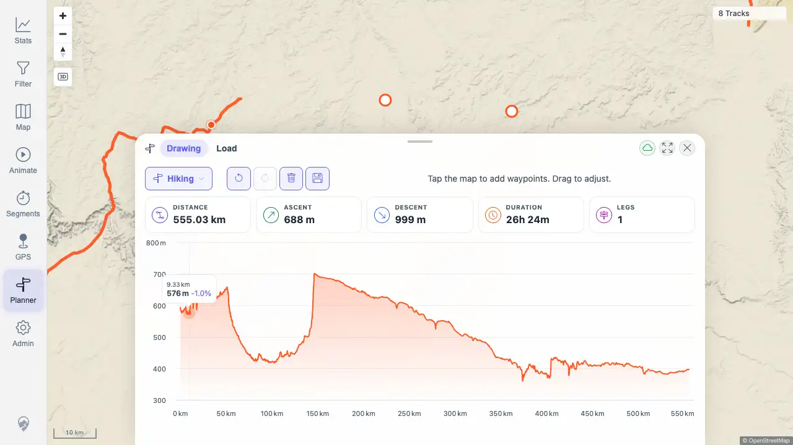
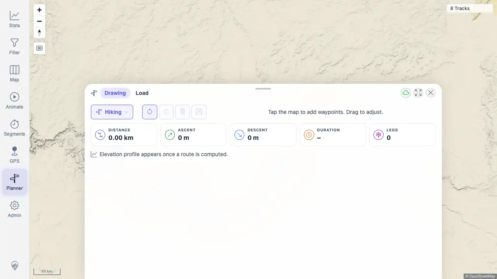

# Packet: PLN_06

## Scope

- Coverage source: `documentation/testing/frontend-regression-test-plan.md`
- Coverage ID or run packet: PLN_06
- In scope: Elevation profile rendering and chart hover highlighting the matching map point.
- Out of scope: Saved route CRUD and GPX export covered by PLN_07 and PLN_08.

## Prerequisites

- Required previous coverage IDs or run packets: PLN_01, PLN_02, PLN_05
- Required app/data state: Planner route service available in the beta quick-start stack.
- Required browser context: Authenticated desktop browser context against `http://178.104.209.132:18080/mtl/`.

## Allowed Mutations

- Allowed: Create and clear a transient unsaved planner route.
- Not allowed: Save a planned route or mutate imported track data.

## Actions And Results

| Coverage ID | Action | Expected result | Actual result | Status | Evidence |
|---|---|---|---|---|---|
| PLN_06 | Created a two-waypoint route, verified the Highcharts elevation profile rendered, hovered the elevation chart until the linked map marker appeared, then moved the pointer off the chart and cleared the route. | Elevation profile appears after routing; hovering the profile highlights the matching point on the map; leaving the chart clears the marker. | PASS. Chart rendered with distance/elevation axes; hovering at `9.33 km / 576 m` created `.planner-hover-marker` visible at screen rect `{x:334,y:195,width:14,height:14}`; moving off-chart removed the marker. | PASS | [assets/PLN_06-elevation-hover.txt](../assets/PLN_06-elevation-hover.txt); [assets/PLN_06-elevation-hover.webp](../assets/PLN_06-elevation-hover.webp); [assets/PLN_06-elevation-cleared.webp](../assets/PLN_06-elevation-cleared.webp) |

## Issues

| ID | Severity | Summary | Reproduction | Expected | Actual | Evidence | Release impact |
|---|---|---|---|---|---|---|---|
|  |  |  |  |  |  |  |  |

## Evidence Files

| File | Purpose |
|---|---|
| [assets/PLN_06-elevation-hover.txt](../assets/PLN_06-elevation-hover.txt) | Chart render and hover marker snapshots, including selected marker position and clear check. |
| [assets/PLN_06-elevation-hover.webp](../assets/PLN_06-elevation-hover.webp) | Elevation profile hovered with map marker visible. |
| [assets/PLN_06-elevation-cleared.webp](../assets/PLN_06-elevation-cleared.webp) | State after leaving chart and clearing the transient route. |

## Screenshot Evidence

## Timings

| Step | Timing |
|---|---:|
| Planner zoom/setup | 6 zoom clicks until planning enabled |
| Route computation | 1 successful planner route response |

## Handoff Notes

- Completed: PLN_06 passed for elevation profile render and hover-to-map marker sync.
- Remaining unfinished coverage: PLN_07 and later coverage IDs remain queued.
- Blocked or not applicable: None for PLN_06.
- State left for the next packet: Transient planner route was cleared.
