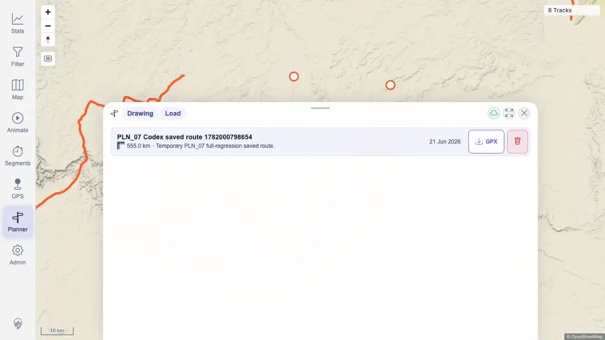
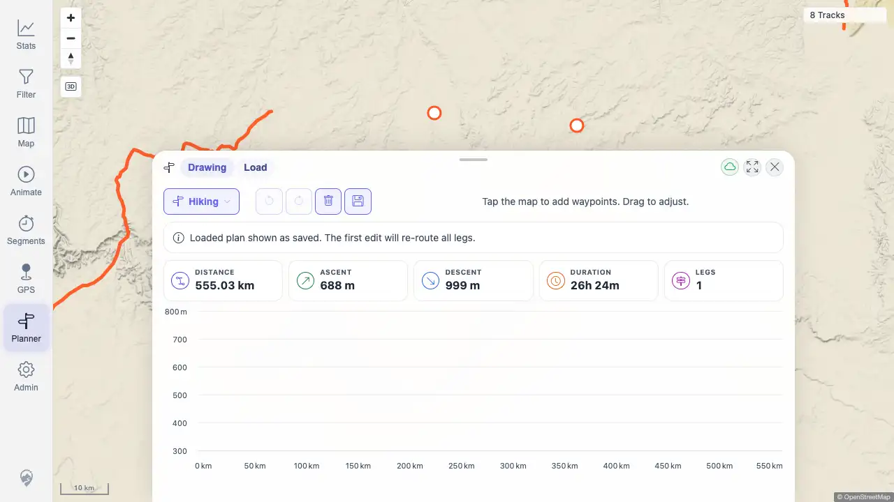
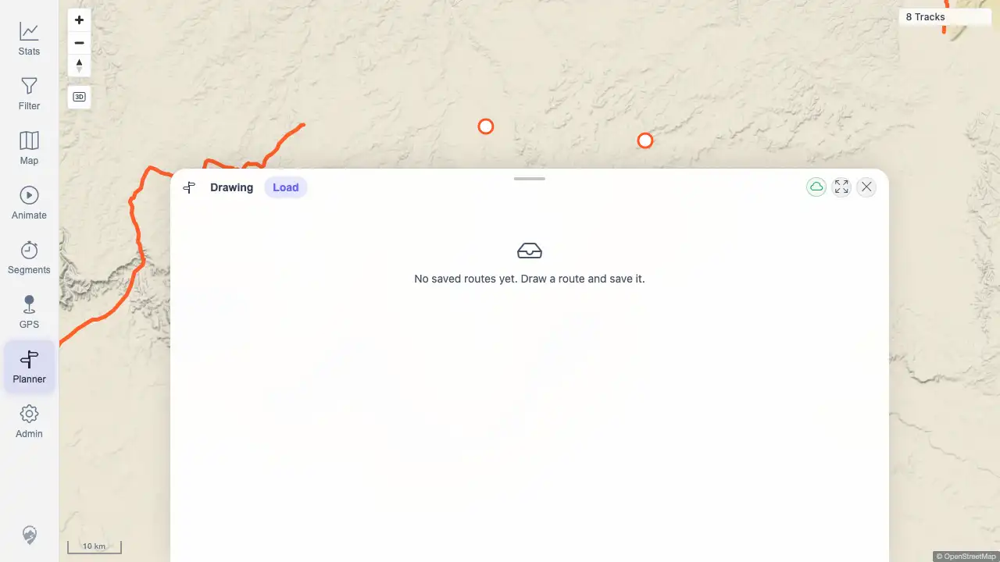

# Packet: PLN_07

## Scope

- Coverage source: `documentation/testing/frontend-regression-test-plan.md`
- Coverage ID or run packet: PLN_07
- In scope: Save plan, list saved plans, load a saved plan, and delete a saved plan.
- Out of scope: GPX download validation covered by PLN_08.

## Prerequisites

- Required previous coverage IDs or run packets: PLN_01, PLN_02, PLN_05
- Required app/data state: Planner route service and saved-plan endpoints available in the beta quick-start stack.
- Required browser context: Authenticated desktop browser context against `http://178.104.209.132:18080/mtl/`.

## Allowed Mutations

- Allowed: Create and delete a uniquely named temporary saved planner route.
- Not allowed: Leave saved planner test data behind or mutate imported track data.

## Actions And Results

| Coverage ID | Action | Expected result | Actual result | Status | Evidence |
|---|---|---|---|---|---|
| PLN_07 | Created a two-waypoint route, saved it as `PLN_07 Codex saved route 1782000798654`, opened the Load tab, loaded the saved plan, returned to Load, deleted it, and checked `/api/planner/plans`. | Saved plan appears in the saved-list UI, loads back into the drawing tab with route stats, and can be deleted from the list without remaining in the API. | PASS. Plan saved as ID `100014`, appeared once in Load, loaded with `555.03 km / 688 m / 26h 24m / 1 leg`, then was deleted by the UI and absent from the plans API. | PASS | [assets/PLN_07-save-load-delete.txt](../assets/PLN_07-save-load-delete.txt); [assets/PLN_07-saved-list.webp](../assets/PLN_07-saved-list.webp); [assets/PLN_07-loaded-plan.webp](../assets/PLN_07-loaded-plan.webp); [assets/PLN_07-deleted-list.webp](../assets/PLN_07-deleted-list.webp) |

## Issues

| ID | Severity | Summary | Reproduction | Expected | Actual | Evidence | Release impact |
|---|---|---|---|---|---|---|---|
|  |  |  |  |  |  |  |  |

## Evidence Files

| File | Purpose |
|---|---|
| [assets/PLN_07-save-load-delete.txt](../assets/PLN_07-save-load-delete.txt) | Save/list/load/delete snapshots, response summary, and cleanup confirmation. |
| [assets/PLN_07-saved-list.webp](../assets/PLN_07-saved-list.webp) | Load tab with the saved temporary route visible. |
| [assets/PLN_07-loaded-plan.webp](../assets/PLN_07-loaded-plan.webp) | Saved route loaded back into Drawing tab. |
| [assets/PLN_07-deleted-list.webp](../assets/PLN_07-deleted-list.webp) | Load tab after deleting the temporary route. |

## Screenshot Evidence

## Timings

| Step | Timing |
|---|---:|
| Planner zoom/setup | 6 zoom clicks until planning enabled |
| Route/save/load/delete workflow | 1 route response, save/list/load/delete API responses completed |

## Handoff Notes

- Completed: PLN_07 passed for save, list, load, delete, and cleanup.
- Remaining unfinished coverage: PLN_08 and later coverage IDs remain queued.
- Blocked or not applicable: None for PLN_07.
- State left for the next packet: Temporary plan ID `100014` was deleted; no saved route remains from PLN_07.
