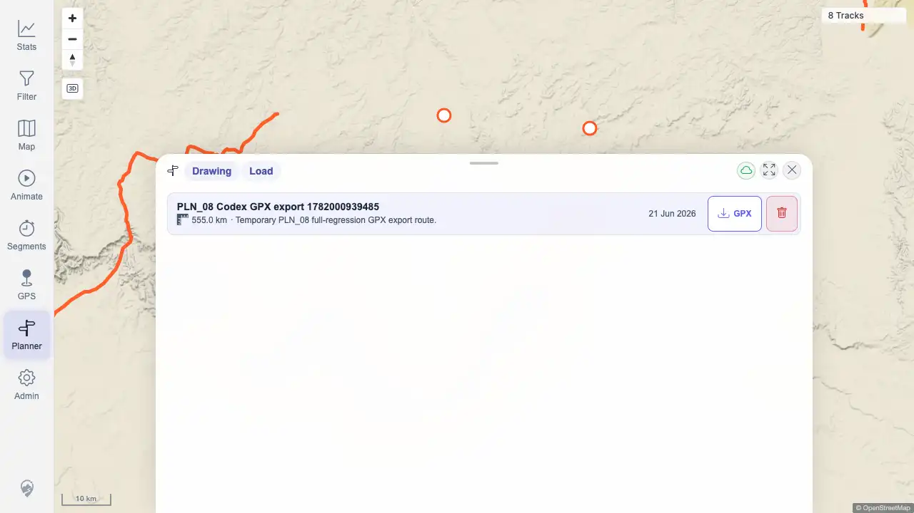
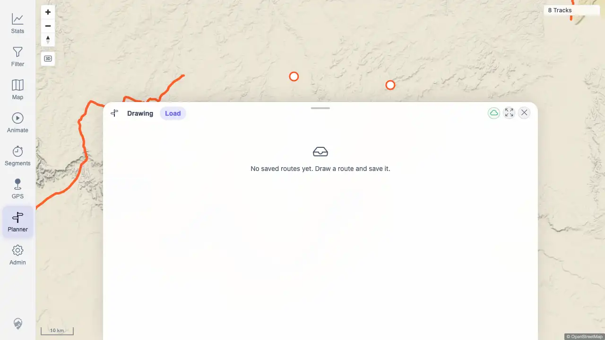

# Packet: PLN_08

## Scope

- Coverage source: `documentation/testing/frontend-regression-test-plan.md`
- Coverage ID or run packet: PLN_08
- In scope: Download a saved planned route as GPX, validate the GPX, and compare it to the planned route.
- Out of scope: Saved-plan CRUD beyond the setup/cleanup needed for export.

## Prerequisites

- Required previous coverage IDs or run packets: PLN_07
- Required app/data state: Planner route service and saved-plan export endpoint available in the beta quick-start stack.
- Required browser context: Authenticated desktop browser context against `http://178.104.209.132:18080/mtl/`.

## Allowed Mutations

- Allowed: Create, export, and delete a uniquely named temporary saved planner route.
- Not allowed: Leave saved planner test data behind or mutate imported track data.

## Actions And Results

| Coverage ID | Action | Expected result | Actual result | Status | Evidence |
|---|---|---|---|---|---|
| PLN_08 | Created a temporary saved plan, exported it from the Load tab as GPX, parsed the downloaded file, compared trackpoint count and route endpoints with `/api/planner/plans/{id}`, then deleted the plan. | Downloaded file is valid GPX for the planned route and matches the saved route geometry. | PASS. Downloaded `PLN_08 Codex GPX export 1782000939485.gpx` was valid GPX with 2,578 `trkpt` elements, matching 2,578 saved coordinates; first/last GPX lon/lat matched saved first/last coordinates; plan ID `100015` was deleted. | PASS | [assets/PLN_08-gpx-export-validation.txt](../assets/PLN_08-gpx-export-validation.txt); [assets/PLN_08-export-list.webp](../assets/PLN_08-export-list.webp); [assets/PLN_08-export-deleted.webp](../assets/PLN_08-export-deleted.webp) |

## Issues

| ID | Severity | Summary | Reproduction | Expected | Actual | Evidence | Release impact |
|---|---|---|---|---|---|---|---|
|  |  |  |  |  |  |  |  |

## Evidence Files

| File | Purpose |
|---|---|
| [assets/PLN_08-gpx-export-validation.txt](../assets/PLN_08-gpx-export-validation.txt) | Download filename, checksum, GPX structure, coordinate comparison, and cleanup confirmation. |
| [assets/PLN_08-export-list.webp](../assets/PLN_08-export-list.webp) | Load tab showing the temporary saved route with GPX export control. |
| [assets/PLN_08-export-deleted.webp](../assets/PLN_08-export-deleted.webp) | Load tab after deleting the temporary export route. |

## Screenshot Evidence

## Timings

| Step | Timing |
|---|---:|
| Planner zoom/setup | 6 zoom clicks until planning enabled |
| Export workflow | 1 route response plus save/detail/download/delete API calls |

## Handoff Notes

- Completed: PLN_08 passed for GPX download validity and saved-route geometry match.
- Remaining unfinished coverage: PLN_09 and later coverage IDs remain queued.
- Blocked or not applicable: None for PLN_08.
- State left for the next packet: Temporary plan ID `100015` was deleted; downloaded GPX remains only in `/tmp/mtl-playwright/downloads`.
