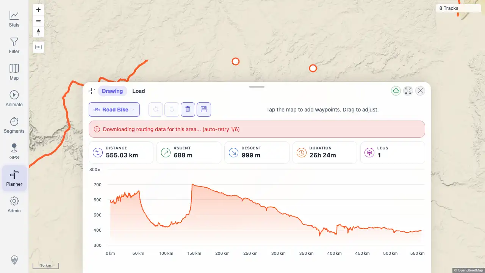
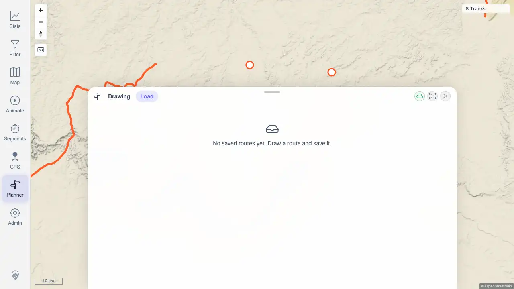

# Packet: PLN_10

## Scope

- Coverage source: `documentation/testing/frontend-regression-test-plan.md`
- Coverage ID or run packet: PLN_10
- In scope: Existing saved planned routes still display when new route fetching has trouble.
- Out of scope: GPX export covered by PLN_08 and mobile touch drag covered by PLN_11.

## Prerequisites

- Required previous coverage IDs or run packets: PLN_07, PLN_09
- Required app/data state: Planner save/load endpoints available.
- Required browser context: Authenticated desktop browser context against `http://178.104.209.132:18080/mtl/`.

## Allowed Mutations

- Allowed: Create and delete a uniquely named temporary saved route; browser-level route API interception after save.
- Not allowed: Leave saved route test data behind or mutate imported track data.

## Actions And Results

| Coverage ID | Action | Expected result | Actual result | Status | Evidence |
|---|---|---|---|---|---|
| PLN_10 | Saved a temporary plan, loaded it, then intercepted the next `/api/planner/route` request with `segment-downloading` by changing profile from Hiking to Road Bike. | Existing saved route geometry/stats remain visible even while new route fetching has trouble. | PASS. Saved plan ID `100016` loaded with `555.03 km / 688 m / 26h 24m / 1 leg`; after intercepted route failure, the same stats and elevation chart remained visible while the UI showed `Downloading routing data... (auto-retry 1/6)`. Temporary plan was deleted. | PASS | [assets/PLN_10-saved-route-during-route-failure.txt](../assets/PLN_10-saved-route-during-route-failure.txt); [assets/PLN_10-loaded-during-route-failure.webp](../assets/PLN_10-loaded-during-route-failure.webp); [assets/PLN_10-deleted-list.webp](../assets/PLN_10-deleted-list.webp) |

## Issues

| ID | Severity | Summary | Reproduction | Expected | Actual | Evidence | Release impact |
|---|---|---|---|---|---|---|---|
|  |  |  |  |  |  |  |  |

## Evidence Files

| File | Purpose |
|---|---|
| [assets/PLN_10-saved-route-during-route-failure.txt](../assets/PLN_10-saved-route-during-route-failure.txt) | Save/load/failure/delete snapshots and response summary. |
| [assets/PLN_10-loaded-during-route-failure.webp](../assets/PLN_10-loaded-during-route-failure.webp) | Saved route still visible while new route fetch shows segment-downloading. |
| [assets/PLN_10-deleted-list.webp](../assets/PLN_10-deleted-list.webp) | Load tab after deleting the temporary route. |

## Screenshot Evidence

## Timings

| Step | Timing |
|---|---:|
| Planner zoom/setup | 6 zoom clicks until planning enabled |
| Saved route resilience check | 1 normal route response, 1 intercepted failed route response |

## Handoff Notes

- Completed: PLN_10 passed for saved-route visibility during a new route-fetch failure.
- Remaining unfinished coverage: PLN_11 and later coverage IDs remain queued.
- Blocked or not applicable: None for PLN_10.
- State left for the next packet: Temporary plan ID `100016` was deleted.
