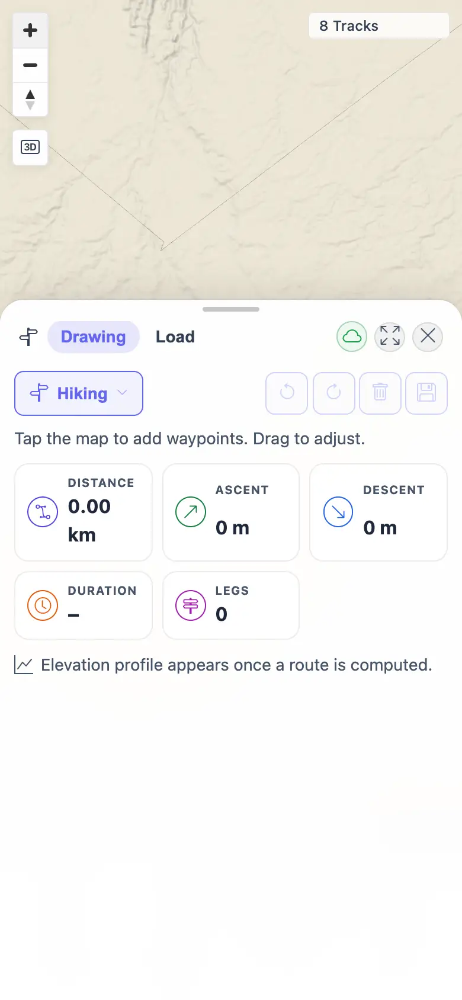
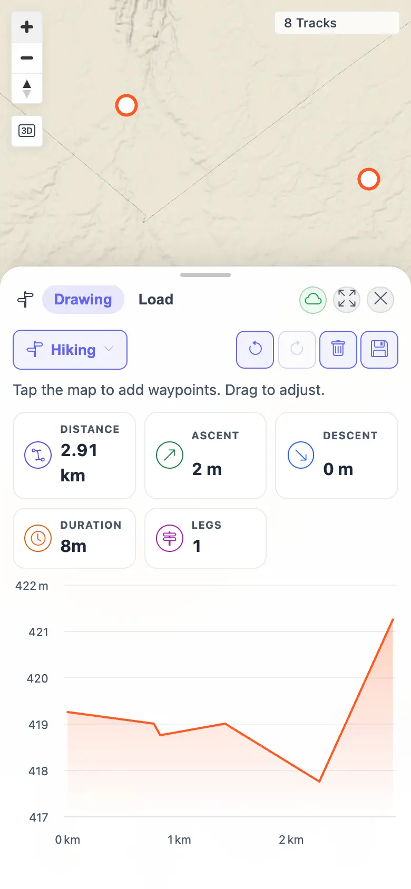
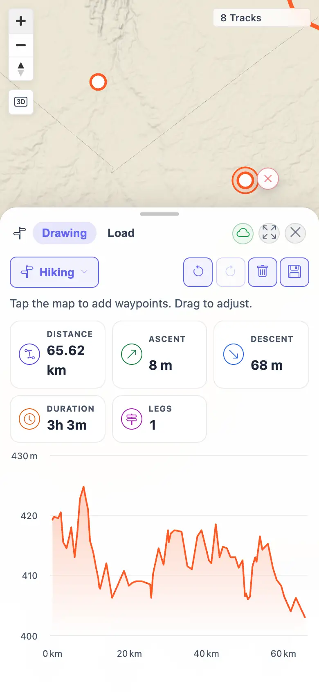

# Packet: PLN_11

## Scope

- Coverage source: `documentation/testing/frontend-regression-test-plan.md`
- Coverage ID or run packet: PLN_11
- In scope: Mobile touch waypoint placement and waypoint drag/recompute in Planner.
- Out of scope: Desktop mouse planner behavior covered by PLN_01 through PLN_10.

## Prerequisites

- Required previous coverage IDs or run packets: PLN_10
- Required app/data state: Planner enabled on the beta target and signed-in README quick-start user available.
- Required browser context: Temporary mobile Chromium context, `390x844`, `isMobile=true`, `hasTouch=true`, `deviceScaleFactor=2`.

## Allowed Mutations

- Allowed: Open a temporary mobile context, zoom to planning range, place waypoints, drag one waypoint, and clear the transient route.
- Not allowed: Save plans or leave mobile browser contexts open.

## Actions And Results

| Coverage ID | Action | Expected result | Actual result | Status | Evidence |
|---|---|---|---|---|---|
| PLN_11 | Opened Planner in a mobile touch context, cleared the zoom guard, placed two waypoints with touchscreen taps, then moved the second waypoint with CDP `Input.dispatchTouchEvent` touch start/move/end. | Touch taps place waypoints and compute a route; touch dragging a waypoint moves it and recomputes route stats. | PASS. Taps at `[120,100]` and `[350,170]` computed `2.91 km / 2 m ascent / 8m / 1 leg`; touch dragging `[350,170]` to `[300,220]` recomputed to `65.62 km / 8 m ascent / 3h 3m / 1 leg`, with changed waypoint coordinates in the second route request. | PASS | [assets/PLN_11-touch-results.txt](../assets/PLN_11-touch-results.txt); [assets/PLN_11-mobile-planning-ready.webp](../assets/PLN_11-mobile-planning-ready.webp); [assets/PLN_11-mobile-touch-route.webp](../assets/PLN_11-mobile-touch-route.webp); [assets/PLN_11-mobile-waypoint-dragged.webp](../assets/PLN_11-mobile-waypoint-dragged.webp) |

## Issues

| ID | Severity | Summary | Reproduction | Expected | Actual | Evidence | Release impact |
|---|---|---|---|---|---|---|---|
|  |  |  |  |  |  |  |  |

## Evidence Files

| File | Purpose |
|---|---|
| [assets/PLN_11-touch-results.txt](../assets/PLN_11-touch-results.txt) | Mobile context, touch placement, touch drag, route events, and assertion summary. |
| [assets/PLN_11-mobile-planning-ready.webp](../assets/PLN_11-mobile-planning-ready.webp) | Mobile planner after zoom guard cleared. |
| [assets/PLN_11-mobile-touch-route.webp](../assets/PLN_11-mobile-touch-route.webp) | Route after mobile touch waypoint placement. |
| [assets/PLN_11-mobile-waypoint-dragged.webp](../assets/PLN_11-mobile-waypoint-dragged.webp) | Route after mobile touch waypoint drag/recompute. |

## Screenshot Evidence

## Timings

| Step | Timing |
|---|---:|
| Mobile setup, touch placement, touch drag, screenshots | ~1 min |

## Handoff Notes

- Completed: PLN_11 passed for mobile touch placement and waypoint drag/recompute.
- Remaining unfinished coverage: MCT_01 onward.
- Blocked or not applicable: None for PLN_11.
- State left for the next packet: Temporary mobile context closed; transient planner route was cleared; no saved planner data was created.
