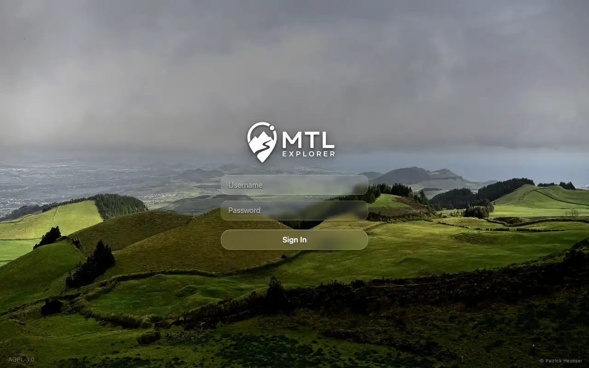

# Packet: RUN_SETUP

## Scope

- Coverage source: `documentation/testing/full-regression/retest-instructions.md` and README quick start.
- Coverage ID or run packet: RUN_SETUP
- In scope: target access, Docker prerequisite handling, quick-install stack startup, beta image override, documented URL and credentials source, baseline evidence.
- Out of scope: user-facing regression coverage IDs, data imports, cleanup.

## Prerequisites

- Required previous coverage IDs or run packets: none.
- Required app/data state: fresh disposable target server with root SSH access.
- Required browser context: desktop browser able to reach the remote app URL.

## Allowed Mutations

- Allowed: rotate expired target root password to satisfy enforced first login, install missing Docker prerequisites, create disposable install directory, download README compose file, set requested app image override, start quick-install stack.
- Not allowed: inspect or change product source code, commit credentials, prune unrelated Docker resources.

## Actions And Results

| Coverage ID | Action | Expected result | Actual result | Status | Evidence |
|---|---|---|---|---|---|
| RUN_SETUP | Connected to `178.104.209.132`, handled enforced password rotation, installed missing Docker Engine/Compose from Docker's stable Debian repo, created `/root/mtl-full-regression-2026-06-20_2114-beta-178-full-regression`, downloaded the README compose file from GitHub main, set `MTL_APP_IMAGE=wauwau0977/mytraillog:beta`, ran `docker compose up -d`, verified local and remote app access. | Quick-install stack starts in a disposable directory with the requested beta app image, documented login/source facts are recorded, and the app is reachable at the documented URL mapped to the remote host. | Debian 13 target initially had no Docker. Docker Engine 29.6.0 and Compose v5.1.4 were installed. Compose started app, PostGIS, BRouter, and location-search containers. App image was `wauwau0977/mytraillog:beta` (`a31ca9e9d444`), server reported image `1.305`, startup completed on `/mtl`, local HTTP returned 200, and the remote login screen loaded at `http://178.104.209.132:18080/mtl/`. | PASS | [assets/RUN_SETUP-setup-summary.txt](../assets/RUN_SETUP-setup-summary.txt); [assets/RUN_SETUP-login-screen.webp](../assets/RUN_SETUP-login-screen.webp) |

## Issues

| ID | Severity | Summary | Reproduction | Expected | Actual | Evidence | Release impact |
|---|---|---|---|---|---|---|---|

## Evidence Files

| File | Purpose |
|---|---|
| [assets/RUN_SETUP-setup-summary.txt](../assets/RUN_SETUP-setup-summary.txt) | Target baseline, Docker prerequisite install, quick-install command result, compose status, app startup lines, URL and import folder facts. |
| [assets/RUN_SETUP-login-screen.webp](../assets/RUN_SETUP-login-screen.webp) | Remote app login screen reachable from the browser-accessible URL. |

## Screenshot Evidence

## Timings

| Step | Timing |
|---|---:|
| SSH password rotation | < 1 min |
| Docker prerequisite install | 12 s |
| Quick-install compose pull/create/start | 28 s |
| App HTTP readiness after compose start | 31 s |

## Handoff Notes

- Completed: target is reachable, Docker prerequisites are installed, stack is running from `/root/mtl-full-regression-2026-06-20_2114-beta-178-full-regression`, app URL is `http://178.104.209.132:18080/mtl/`, credentials source is README `mtl` / `change-me`.
- Remaining unfinished coverage: all frontend coverage IDs from `ACC_01` onward.
- Blocked or not applicable: in-app browser plugin could not initialize due local tool metadata error; standalone Playwright with installed Chrome channel is being used for browser evidence.
- State left for the next packet: clean installed app with empty dataset, watched import folder at `/root/mtl-full-regression-2026-06-20_2114-beta-178-full-regression/data/gpx`.
