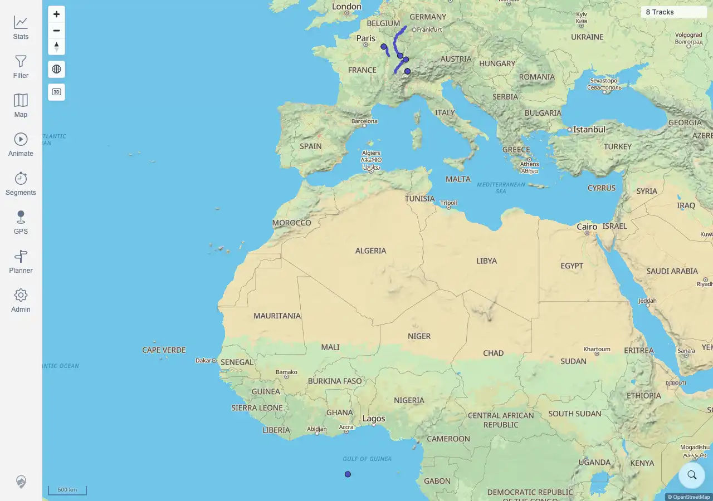

# Packet: SGN_02

## Scope

- Coverage source: `documentation/testing/frontend-regression-test-plan.md`
- Coverage ID or run packet: SGN_02
- In scope: Valid credential sign-in reaches the map.
- Out of scope: Wrong credentials and sign-out behavior; covered by SGN_03 and SGN_05.

## Prerequisites

- Required previous coverage IDs or run packets: SGN_01.
- Required app/data state: app running with README local credentials.
- Required browser context: clean signed-out desktop browser context.

## Allowed Mutations

- Allowed: sign in with documented local credentials.
- Not allowed: change account configuration.

## Actions And Results

| Coverage ID | Action | Expected result | Actual result | Status | Evidence |
|---|---|---|---|---|---|
| SGN_02 | Entered valid `mtl` / `change-me` credentials and submitted the login form. | You reach the map. | PASS: browser reached `/mtl/`, page title was `MTL Explorer`, map canvases rendered, and the main controls (`Stats`, `Filter`, `Map`, `Admin`) were visible. | PASS | [assets/SGN_02-valid-login.txt](../assets/SGN_02-valid-login.txt); [assets/SGN_02-valid-login-map.webp](../assets/SGN_02-valid-login-map.webp) |

## Issues

| ID | Severity | Summary | Reproduction | Expected | Actual | Evidence | Release impact |
|---|---|---|---|---|---|---|---|

## Evidence Files

| File | Purpose |
|---|---|
| [assets/SGN_02-valid-login.txt](../assets/SGN_02-valid-login.txt) | URL, map canvas, nav-control, and visible text evidence after valid sign-in. |
| [assets/SGN_02-valid-login-map.webp](../assets/SGN_02-valid-login-map.webp) | Map screenshot after valid sign-in. |

## Screenshot Evidence

## Timings

| Step | Timing |
|---|---:|
| Login and map load | ~5 seconds |

## Handoff Notes

- Completed: SGN_02 is terminal.
- Remaining unfinished coverage: SGN_03 onward.
- Blocked or not applicable: none.
- State left for the next packet: a separate authenticated browser state was saved as `browser-state-sgn02.json`; existing desktop state remains available.
