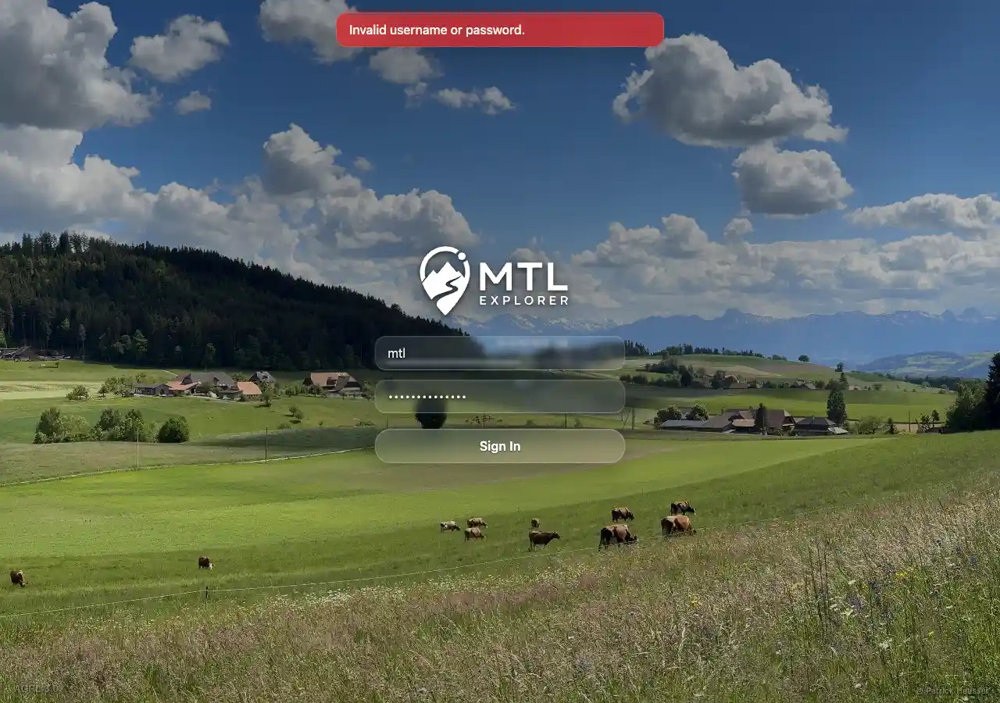

# Packet: SGN_03

## Scope

- Coverage source: `documentation/testing/frontend-regression-test-plan.md`
- Coverage ID or run packet: SGN_03
- In scope: Wrong credentials produce a clear error and do not enter the app.
- Out of scope: Valid login; covered by SGN_02.

## Prerequisites

- Required previous coverage IDs or run packets: SGN_01.
- Required app/data state: app running.
- Required browser context: clean signed-out desktop browser context.

## Allowed Mutations

- Allowed: submit an invalid password.
- Not allowed: change account configuration.

## Actions And Results

| Coverage ID | Action | Expected result | Actual result | Status | Evidence |
|---|---|---|---|---|---|
| SGN_03 | Entered `mtl` with an intentionally wrong password and submitted the login form. | A clear error appears and you stay on login. | PASS: URL remained `/mtl/login`, password input remained visible, no map canvases rendered, and the page showed `Invalid username or password.` | PASS | [assets/SGN_03-wrong-credentials.txt](../assets/SGN_03-wrong-credentials.txt); [assets/SGN_03-wrong-credentials.webp](../assets/SGN_03-wrong-credentials.webp) |

## Issues

| ID | Severity | Summary | Reproduction | Expected | Actual | Evidence | Release impact |
|---|---|---|---|---|---|---|---|

## Evidence Files

| File | Purpose |
|---|---|
| [assets/SGN_03-wrong-credentials.txt](../assets/SGN_03-wrong-credentials.txt) | URL, error text, login-control, and map-absence evidence after invalid login. |
| [assets/SGN_03-wrong-credentials.webp](../assets/SGN_03-wrong-credentials.webp) | Login screen screenshot with invalid-credential error. |

## Screenshot Evidence

## Timings

| Step | Timing |
|---|---:|
| Invalid login attempt | ~3 seconds |

## Handoff Notes

- Completed: SGN_03 is terminal.
- Remaining unfinished coverage: SGN_04 onward.
- Blocked or not applicable: none.
- State left for the next packet: invalid-login context was closed.
