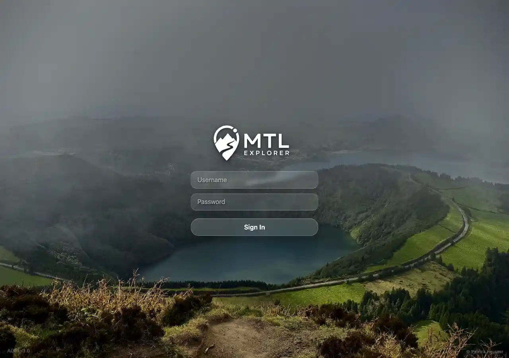
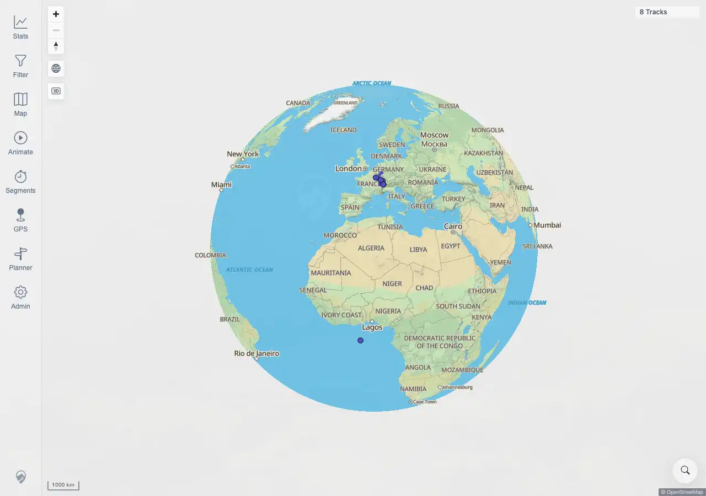

# Packet: SGN_05

## Scope

- Coverage source: `documentation/testing/frontend-regression-test-plan.md`
- Coverage ID or run packet: SGN_05
- In scope: UI sign-out returns to login, and signing in again works.
- Out of scope: wipe-and-logout behavior.

## Prerequisites

- Required previous coverage IDs or run packets: SGN_02.
- Required app/data state: signed-in browser session.
- Required browser context: authenticated desktop browser context.

## Allowed Mutations

- Allowed: sign out via Admin > Session > Logout, then sign in again.
- Not allowed: use `Wipe & Logout` or clear persistent local data beyond credentials.

## Actions And Results

| Coverage ID | Action | Expected result | Actual result | Status | Evidence |
|---|---|---|---|---|---|
| SGN_05 | Opened Admin > Session, clicked `Logout`, verified the login screen, then signed in again with valid credentials. | You return to login; signing in again works. | PASS: logout navigated to `/mtl/login` with password input and no map canvases; re-login returned to `/mtl/` with two map canvases and normal map/navigation text. | PASS | [assets/SGN_05-logout-relogin.txt](../assets/SGN_05-logout-relogin.txt); [assets/SGN_05-after-logout.webp](../assets/SGN_05-after-logout.webp); [assets/SGN_05-relogin-map.webp](../assets/SGN_05-relogin-map.webp) |

## Issues

| ID | Severity | Summary | Reproduction | Expected | Actual | Evidence | Release impact |
|---|---|---|---|---|---|---|---|

## Evidence Files

| File | Purpose |
|---|---|
| [assets/SGN_05-logout-relogin.txt](../assets/SGN_05-logout-relogin.txt) | Logout and re-login URL/control/map evidence. |
| [assets/SGN_05-after-logout.webp](../assets/SGN_05-after-logout.webp) | Login screen after UI logout. |
| [assets/SGN_05-relogin-map.webp](../assets/SGN_05-relogin-map.webp) | Map screen after signing in again. |

## Screenshot Evidence

## Timings

| Step | Timing |
|---|---:|
| Logout and re-login | ~8 seconds |

## Handoff Notes

- Completed: SGN_05 is terminal.
- Remaining unfinished coverage: SGN_06 onward.
- Blocked or not applicable: none.
- State left for the next packet: session used for SGN_05 was closed after successful re-login.
