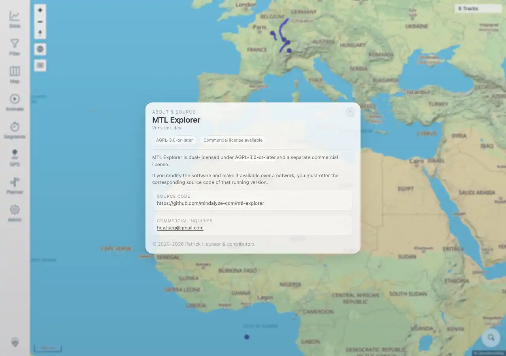

# Packet: SGN_08

## Scope

- Coverage source: `documentation/testing/frontend-regression-test-plan.md`
- Coverage ID or run packet: SGN_08
- In scope: `MTL Explorer` branding in About and public-facing copy.
- Out of scope: third-party license content validation.

## Prerequisites

- Required previous coverage IDs or run packets: SGN_02.
- Required app/data state: authenticated session.
- Required browser context: authenticated desktop browser context.

## Allowed Mutations

- Allowed: open About dialog and login/public route.
- Not allowed: edit preferences or session state.

## Actions And Results

| Coverage ID | Action | Expected result | Actual result | Status | Evidence |
|---|---|---|---|---|---|
| SGN_08 | Opened the in-app `About MTL Explorer` dialog and checked page titles/public-facing copy. | `MTL Explorer` branding appears in About and public-facing copy. | PASS: signed-in and login route page titles were `MTL Explorer`; the About dialog text contained `MTL Explorer`, source/license copy, and project links. | PASS | [assets/SGN_08-branding.txt](../assets/SGN_08-branding.txt); [assets/SGN_08-about-branding.webp](../assets/SGN_08-about-branding.webp) |

## Issues

| ID | Severity | Summary | Reproduction | Expected | Actual | Evidence | Release impact |
|---|---|---|---|---|---|---|---|

## Evidence Files

| File | Purpose |
|---|---|
| [assets/SGN_08-branding.txt](../assets/SGN_08-branding.txt) | Page-title and About copy evidence. |
| [assets/SGN_08-about-branding.webp](../assets/SGN_08-about-branding.webp) | About dialog screenshot showing `MTL Explorer`. |

## Screenshot Evidence

## Timings

| Step | Timing |
|---|---:|
| Branding checks | ~5 seconds |

## Handoff Notes

- Completed: SGN_08 is terminal.
- Remaining unfinished coverage: SGN_09 onward.
- Blocked or not applicable: none.
- State left for the next packet: no app state changes.
