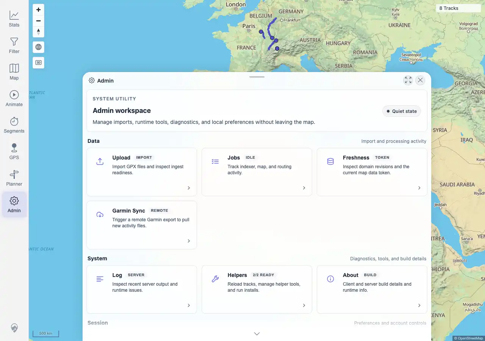

# Packet: SGN_09

## Scope

- Coverage source: `documentation/testing/frontend-regression-test-plan.md`
- Coverage ID or run packet: SGN_09
- In scope: Browser back/forward navigation between app views.
- Out of scope: deep-link behavior for every route.

## Prerequisites

- Required previous coverage IDs or run packets: SGN_02.
- Required app/data state: authenticated session.
- Required browser context: authenticated desktop browser context.

## Allowed Mutations

- Allowed: navigate among Map, Stats, and Admin views.
- Not allowed: edit app data or settings.

## Actions And Results

| Coverage ID | Action | Expected result | Actual result | Status | Evidence |
|---|---|---|---|---|---|
| SGN_09 | Navigated Map -> Stats -> Admin, then used browser Back twice and Forward twice while monitoring console/page errors. | Browser back/forward navigation between views works without errors. | PASS: route history moved through `/mtl/`, `/mtl/stats`, and `/mtl/admin`; expected view markers returned after back/forward; no console or page errors were observed. | PASS | [assets/SGN_09-history-navigation.txt](../assets/SGN_09-history-navigation.txt); [assets/SGN_09-history-admin.webp](../assets/SGN_09-history-admin.webp) |

## Issues

| ID | Severity | Summary | Reproduction | Expected | Actual | Evidence | Release impact |
|---|---|---|---|---|---|---|---|

## Evidence Files

| File | Purpose |
|---|---|
| [assets/SGN_09-history-navigation.txt](../assets/SGN_09-history-navigation.txt) | Browser history route/view matrix and error count. |
| [assets/SGN_09-history-admin.webp](../assets/SGN_09-history-admin.webp) | Final Admin view after forward navigation. |

## Screenshot Evidence

## Timings

| Step | Timing |
|---|---:|
| Navigation sequence | ~8 seconds |

## Handoff Notes

- Completed: SGN_09 is terminal.
- Remaining unfinished coverage: MAP_01 onward.
- Blocked or not applicable: none.
- State left for the next packet: no app state changes.
