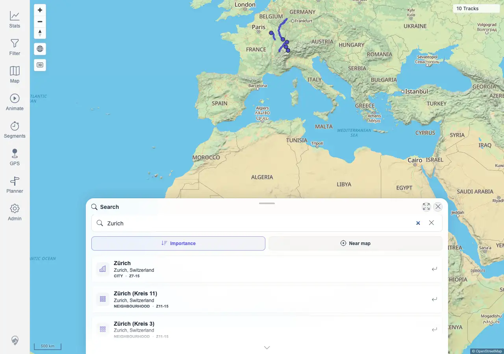

# Packet: SRC_01

## Scope

- Coverage source: `documentation/testing/frontend-regression-test-plan.md`
- Coverage ID or run packet: SRC_01
- In scope: Open location search, type a place name, and verify visible results.
- Out of scope: Result selection, marker clearing, and no-result states; covered by SRC_02 through SRC_04.

## Prerequisites

- Required previous coverage IDs or run packets: GPS_05 terminal.
- Required app/data state: Authenticated map view on the remote quick-install target.
- Required browser context: Fresh desktop Chromium context.

## Allowed Mutations

- Allowed: Open location search and type a query.
- Not allowed: Change server data or deployment configuration.

## Actions And Results

| Coverage ID | Action | Expected result | Actual result | Status | Evidence |
|---|---|---|---|---|---|
| SRC_01 | Clicked `Search location`, typed `Zurich`, and waited for the debounced search to settle. | Search results appear for the place query. | PASS. The search sheet opened, the query remained `Zurich`, 20 results appeared with first result `Zürich`, and the map stayed usable with `10 Tracks` visible. | PASS | [assets/SRC_01-location-results.webp](../assets/SRC_01-location-results.webp); [assets/SRC-location-search-results.txt](../assets/SRC-location-search-results.txt) |

## Issues

| ID | Severity | Summary | Reproduction | Expected | Actual | Evidence | Release impact |
|---|---|---|---|---|---|---|---|
|  |  |  |  |  |  |  |  |

## Evidence Files

| File | Purpose |
|---|---|
| [assets/SRC_01-location-results.webp](../assets/SRC_01-location-results.webp) | Location search sheet showing Zurich results. |
| [assets/SRC-location-search-results.txt](../assets/SRC-location-search-results.txt) | Shared location-search evidence for query, result count, marker state, no-result state, and assertions. |

## Screenshot Evidence

## Timings

| Step | Timing |
|---|---:|
| Open search and wait for Zurich results | <1 min |

## Handoff Notes

- Completed: SRC_01 is terminal PASS.
- Remaining unfinished coverage: SRC_02 onward.
- Blocked or not applicable: none.
- State left for the next packet: Shared browser run selected no server data; evidence for SRC_02 through SRC_04 is captured.
