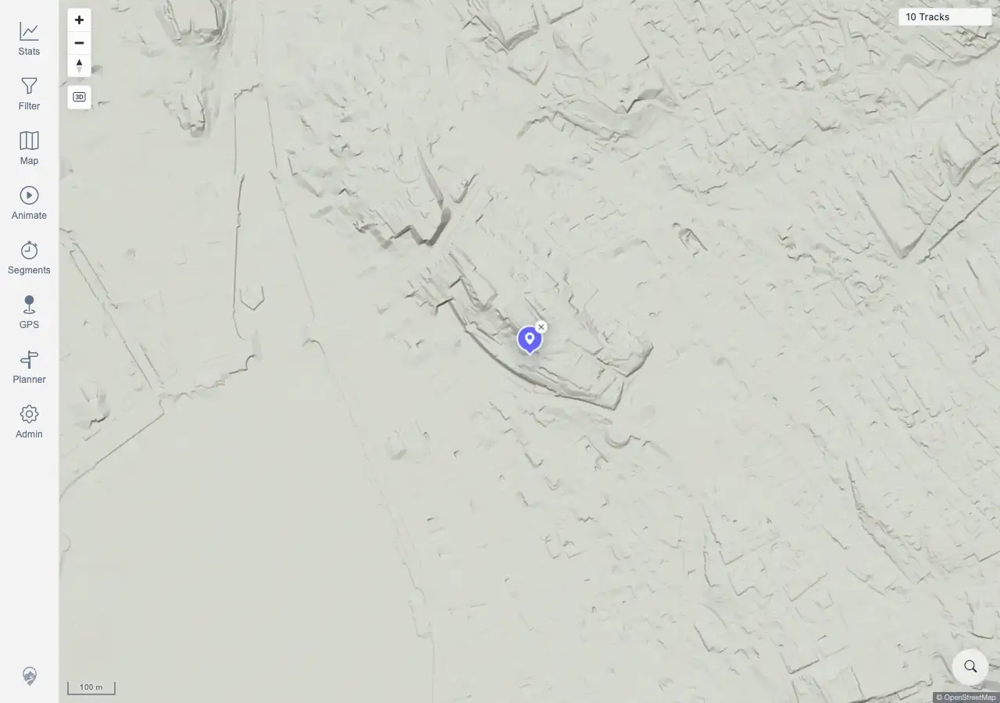

# Packet: SRC_02

## Scope

- Coverage source: `documentation/testing/frontend-regression-test-plan.md`
- Coverage ID or run packet: SRC_02
- In scope: Selecting a location search result, map fly-to behavior, and marker placement.
- Out of scope: Opening search and no-result behavior; covered by SRC_01 and SRC_04.

## Prerequisites

- Required previous coverage IDs or run packets: SRC_01 terminal.
- Required app/data state: Zurich search results visible from SRC_01.
- Required browser context: Desktop Chromium context.

## Allowed Mutations

- Allowed: Click a search result and create the temporary location marker.
- Not allowed: Change server data or imported tracks.

## Actions And Results

| Coverage ID | Action | Expected result | Actual result | Status | Evidence |
|---|---|---|---|---|---|
| SRC_02 | Clicked the first Zurich location result and waited for the marker to appear. | The map flies to the selected location and places a marker. | PASS. One `.mtl-location-search-marker` appeared with one `Clear search marker` button, the marker rendered near the map center, the map canvases stayed rendered, and `10 Tracks` remained visible. | PASS | [assets/SRC_02-location-marker.webp](../assets/SRC_02-location-marker.webp); [assets/SRC-location-search-results.txt](../assets/SRC-location-search-results.txt) |

## Issues

| ID | Severity | Summary | Reproduction | Expected | Actual | Evidence | Release impact |
|---|---|---|---|---|---|---|---|
|  |  |  |  |  |  |  |  |

## Evidence Files

| File | Purpose |
|---|---|
| [assets/SRC_02-location-marker.webp](../assets/SRC_02-location-marker.webp) | Map after selecting the first search result, showing the location marker. |
| [assets/SRC-location-search-results.txt](../assets/SRC-location-search-results.txt) | Shared evidence with marker count, clear-button count, marker rectangle, canvas rectangle, and assertions. |

## Screenshot Evidence

## Timings

| Step | Timing |
|---|---:|
| Select result and wait for marker | <1 min |

## Handoff Notes

- Completed: SRC_02 is terminal PASS.
- Remaining unfinished coverage: SRC_03 onward.
- Blocked or not applicable: none.
- State left for the next packet: Shared evidence includes marker clearing for SRC_03.
