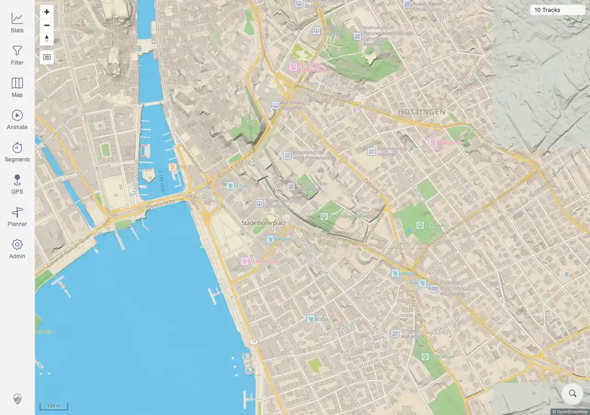

# Packet: SRC_03

## Scope

- Coverage source: `documentation/testing/frontend-regression-test-plan.md`
- Coverage ID or run packet: SRC_03
- In scope: Clear the location search marker cleanly.
- Out of scope: Initial search results and no-result state; covered by SRC_01 and SRC_04.

## Prerequisites

- Required previous coverage IDs or run packets: SRC_02 terminal.
- Required app/data state: One location search marker is visible on the map.
- Required browser context: Desktop Chromium context.

## Allowed Mutations

- Allowed: Click the marker clear button.
- Not allowed: Change server data or imported tracks.

## Actions And Results

| Coverage ID | Action | Expected result | Actual result | Status | Evidence |
|---|---|---|---|---|---|
| SRC_03 | Clicked the location marker clear button after selecting a Zurich result. | The search marker is removed cleanly. | PASS. Marker count changed from 1 to 0, the clear button disappeared, the map canvases remained rendered, and `10 Tracks` stayed visible. | PASS | [assets/SRC_03-location-marker-cleared.webp](../assets/SRC_03-location-marker-cleared.webp); [assets/SRC-location-search-results.txt](../assets/SRC-location-search-results.txt) |

## Issues

| ID | Severity | Summary | Reproduction | Expected | Actual | Evidence | Release impact |
|---|---|---|---|---|---|---|---|
|  |  |  |  |  |  |  |  |

## Evidence Files

| File | Purpose |
|---|---|
| [assets/SRC_03-location-marker-cleared.webp](../assets/SRC_03-location-marker-cleared.webp) | Map after clearing the location search marker. |
| [assets/SRC-location-search-results.txt](../assets/SRC-location-search-results.txt) | Shared evidence with marker counts before/after clearing and assertions. |

## Screenshot Evidence

## Timings

| Step | Timing |
|---|---:|
| Clear marker and verify removal | <1 min |

## Handoff Notes

- Completed: SRC_03 is terminal PASS.
- Remaining unfinished coverage: SRC_04 onward.
- Blocked or not applicable: none.
- State left for the next packet: Shared evidence includes no-result query for SRC_04.
