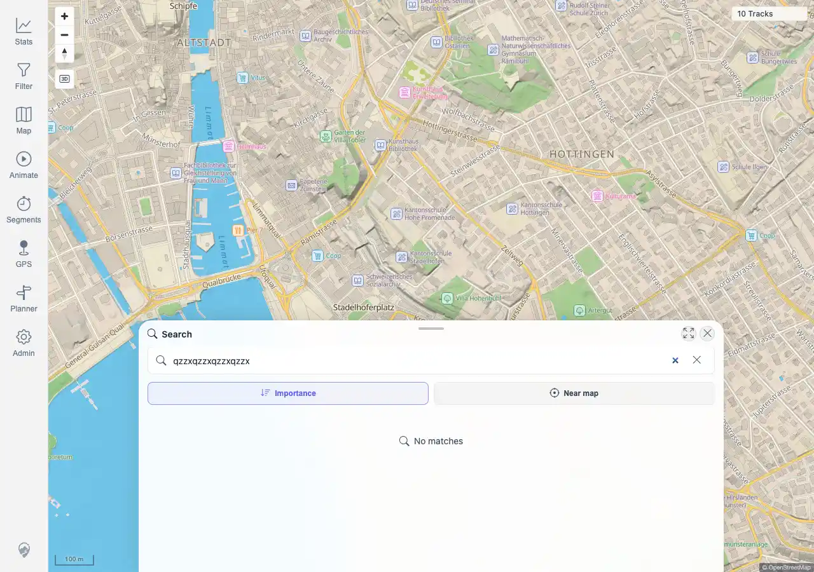

# Packet: SRC_04

## Scope

- Coverage source: `documentation/testing/frontend-regression-test-plan.md`
- Coverage ID or run packet: SRC_04
- In scope: Empty/no-result location search feedback.
- Out of scope: Positive search result selection and marker clearing; covered by SRC_01 through SRC_03.

## Prerequisites

- Required previous coverage IDs or run packets: SRC_03 terminal.
- Required app/data state: Location search can be opened from the map.
- Required browser context: Desktop Chromium context.

## Allowed Mutations

- Allowed: Open location search and type a query expected to have no matches.
- Not allowed: Change server data or imported tracks.

## Actions And Results

| Coverage ID | Action | Expected result | Actual result | Status | Evidence |
|---|---|---|---|---|---|
| SRC_04 | Opened location search and typed `qzzxqzzxqzzxqzzx`. | Empty or no-result queries show a clear message. | PASS. The search sheet showed zero result rows and the state message `No matches`; no location marker was present and `10 Tracks` remained visible. | PASS | [assets/SRC_04-location-no-results.webp](../assets/SRC_04-location-no-results.webp); [assets/SRC-location-search-results.txt](../assets/SRC-location-search-results.txt) |

## Issues

| ID | Severity | Summary | Reproduction | Expected | Actual | Evidence | Release impact |
|---|---|---|---|---|---|---|---|
|  |  |  |  |  |  |  |  |

## Evidence Files

| File | Purpose |
|---|---|
| [assets/SRC_04-location-no-results.webp](../assets/SRC_04-location-no-results.webp) | Search sheet showing the `No matches` message for a nonsense query. |
| [assets/SRC-location-search-results.txt](../assets/SRC-location-search-results.txt) | Shared evidence with no-result query, zero result rows, marker absence, and assertions. |

## Screenshot Evidence

## Timings

| Step | Timing |
|---|---:|
| Open search and wait for no-result state | <1 min |

## Handoff Notes

- Completed: SRC_04 is terminal PASS; location search section complete.
- Remaining unfinished coverage: GLB_01 onward.
- Blocked or not applicable: none.
- State left for the next packet: Browser context closed; no server data changed.
