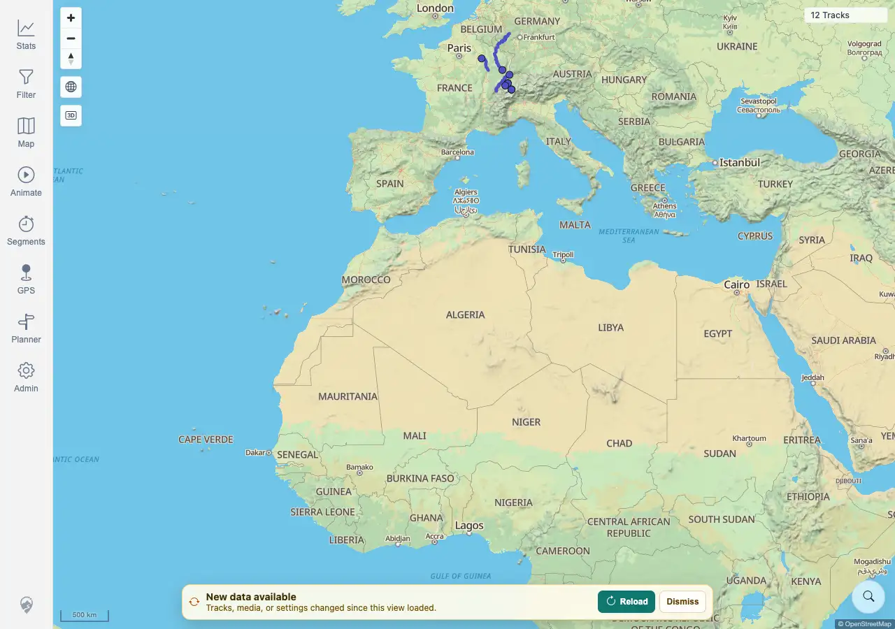

# Packet: SYN_01

## Scope

- Coverage source: `documentation/testing/frontend-regression-test-plan.md`
- Coverage ID or run packet: SYN_01
- In scope: Data-freshness banner after a server-side data change while the client remains open.
- Out of scope: Clicking Reload; covered by SYN_02.

## Prerequisites

- Required previous coverage IDs or run packets: ADM_11 terminal.
- Required app/data state: Authenticated map loaded with current cached tracks.
- Required browser context: Desktop Chromium against the remote target.

## Allowed Mutations

- Allowed: Upload one fully synthetic GPX file through the authenticated upload API to create a server-side data change.
- Not allowed: Upload private GPX data or delete existing files.

## Actions And Results

| Coverage ID | Action | Expected result | Actual result | Status | Evidence |
|---|---|---|---|---|---|
| SYN_01 | Loaded the map, recorded the current freshness token and `12 Tracks` map chip, uploaded synthetic `SYN_01-freshness-import-20260621023820.gpx`, waited for indexing, and watched the still-open client. | After server-side data changes, a data-freshness banner appears. | PASS. The upload was accepted and indexed as track `100021` with 10 points. Server freshness changed from the client token, the map stayed stale at `12 Tracks`, and a `New data available` banner appeared with `Reload` and `Dismiss`. | PASS | [assets/SYN_01-freshness-banner.txt](../assets/SYN_01-freshness-banner.txt); [assets/SYN_01-freshness-banner.webp](../assets/SYN_01-freshness-banner.webp) |

## Issues

| ID | Severity | Summary | Reproduction | Expected | Actual | Evidence | Release impact |
|---|---|---|---|---|---|---|---|
|  |  |  |  |  |  |  |  |

## Evidence Files

| File | Purpose |
|---|---|
| [assets/SYN_01-freshness-banner.txt](../assets/SYN_01-freshness-banner.txt) | Upload/index/freshness-token evidence and banner assertions. |
| [assets/SYN_01-freshness-banner.webp](../assets/SYN_01-freshness-banner.webp) | Map with `New data available` banner after server-side upload. |

## Screenshot Evidence

## Timings

| Step | Timing |
|---|---:|
| Server-side upload to banner appearance | ~1 min |

## Handoff Notes

- Completed: SYN_01 is terminal PASS.
- Remaining unfinished coverage: SYN_02 onward.
- Blocked or not applicable: none.
- State left for the next packet: Synthetic track `100021` (`SYN_01-freshness-import-20260621023820.gpx`) is indexed; a fresh client will load it after normal freshness reload.
