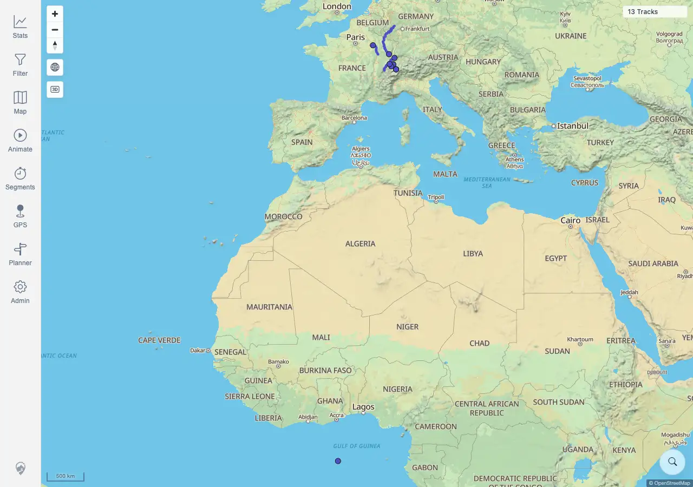
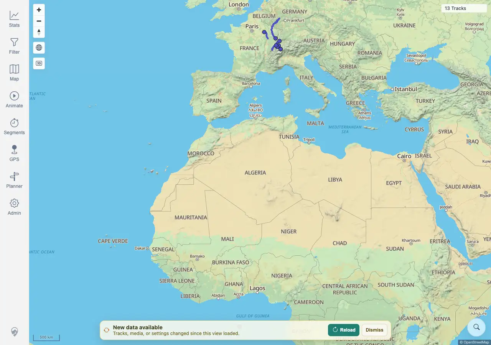
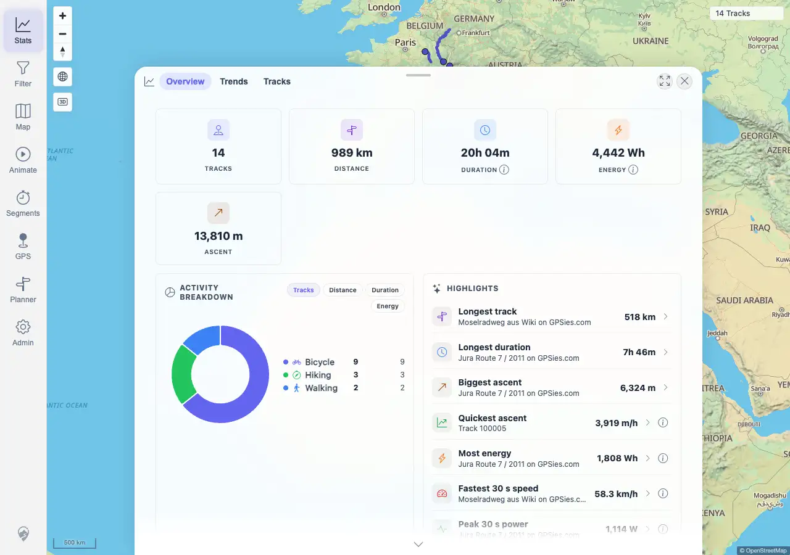

# Packet: SYN_02

## Scope

- Coverage source: `documentation/testing/frontend-regression-test-plan.md`
- Coverage ID or run packet: SYN_02
- In scope: Reloading from the data-freshness banner and verifying refreshed map/stat caches.
- Out of scope: Banner snooze behavior; covered by SYN_05.

## Prerequisites

- Required previous coverage IDs or run packets: SYN_01 terminal.
- Required app/data state: Authenticated map loaded with current cached tracks.
- Required browser context: Desktop Chromium against the remote target.

## Allowed Mutations

- Allowed: Upload one fully synthetic GPX file through the authenticated upload API and click the freshness banner Reload action.
- Not allowed: Upload private GPX data or delete existing files.

## Actions And Results

| Coverage ID | Action | Expected result | Actual result | Status | Evidence |
|---|---|---|---|---|---|
| SYN_02 | Loaded the map at `13 Tracks`, uploaded synthetic `SYN_02-reload-refresh-20260621024035.gpx`, waited for the freshness banner, clicked Reload, then opened Stats. | Reloading from the banner refreshes cached tracks and stats. | PASS. The uploaded file indexed as track `100022` with 11 points. Before Reload, the map remained stale at `13 Tracks`; after clicking Reload, the map showed `14 Tracks`. Stats Overview also showed `14 TRACKS`, and Recent Activity included `SYN_02-reload-refresh-20260621024035.gpx`. | PASS | [assets/SYN_02-reload-refresh.txt](../assets/SYN_02-reload-refresh.txt); [assets/SYN_02-banner-before-reload.webp](../assets/SYN_02-banner-before-reload.webp); [assets/SYN_02-map-after-reload.webp](../assets/SYN_02-map-after-reload.webp); [assets/SYN_02-stats-after-reload.webp](../assets/SYN_02-stats-after-reload.webp) |

## Issues

| ID | Severity | Summary | Reproduction | Expected | Actual | Evidence | Release impact |
|---|---|---|---|---|---|---|---|
|  |  |  |  |  |  |  |  |

## Evidence Files

| File | Purpose |
|---|---|
| [assets/SYN_02-reload-refresh.txt](../assets/SYN_02-reload-refresh.txt) | Upload/index, stale count, reload count, Stats sample, and assertions. |
| [assets/SYN_02-map-before-change.webp](../assets/SYN_02-map-before-change.webp) | Map before the server-side data change. |
| [assets/SYN_02-banner-before-reload.webp](../assets/SYN_02-banner-before-reload.webp) | Freshness banner before clicking Reload. |
| [assets/SYN_02-map-after-reload.webp](../assets/SYN_02-map-after-reload.webp) | Map after Reload, showing updated track count. |
| [assets/SYN_02-stats-after-reload.webp](../assets/SYN_02-stats-after-reload.webp) | Stats after Reload, showing updated count and recent activity. |

## Screenshot Evidence

## Timings

| Step | Timing |
|---|---:|
| Upload, banner reload, map/stat refresh | ~1 min |

## Handoff Notes

- Completed: SYN_02 is terminal PASS.
- Remaining unfinished coverage: SYN_03 onward.
- Blocked or not applicable: none.
- State left for the next packet: Synthetic track `100022` (`SYN_02-reload-refresh-20260621024035.gpx`) is indexed and visible; map/stat caches are refreshed to `14 Tracks`.
