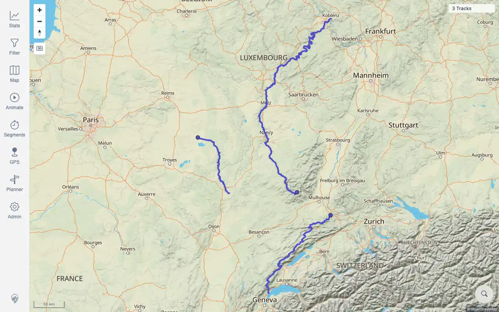
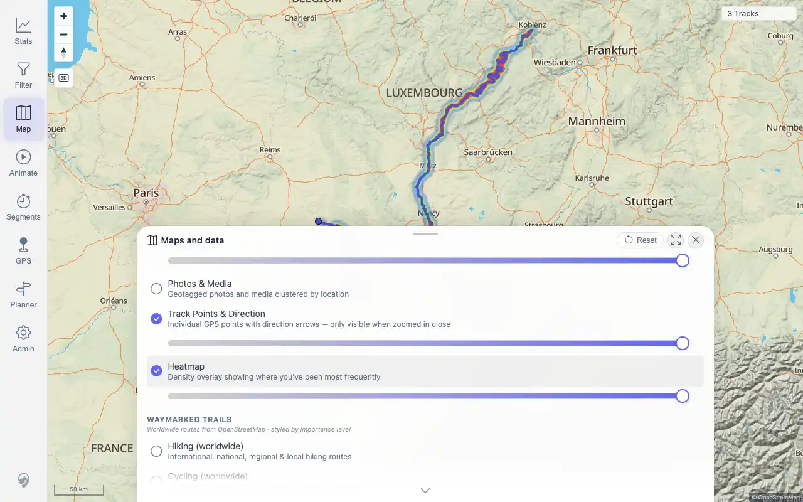
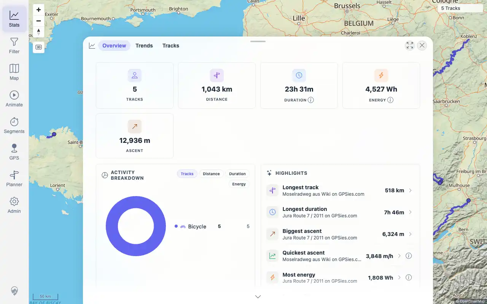

# Packet: SYN_03

## Scope

- Coverage source: `documentation/testing/frontend-regression-test-plan.md`
- Coverage ID or run packet: SYN_03
- In scope: Audit that the required five-GPX import and delete-two-track flow passed across indexer, freshness, map, browser, stats, filters, heatmap, and details.
- Out of scope: Re-running the already completed import/delete mutations.

## Prerequisites

- Required previous coverage IDs or run packets: IMP_01 through IMP_09, DEL_01 through DEL_05, SYN_02 terminal.
- Required app/data state: Current server state after import/delete flow plus later synthetic tracks.
- Required browser context: Authenticated API/browser context.

## Allowed Mutations

- Allowed: Read API state and audit existing packet evidence.
- Not allowed: Add/delete files for this packet.

## Actions And Results

| Coverage ID | Action | Expected result | Actual result | Status | Evidence |
|---|---|---|---|---|---|
| SYN_03 | Audited completed IMP/DEL packet evidence and queried current tracks/indexer state for the original five-GPX flow. | Required five-GPX import and delete-two-track flow passes: indexer state, freshness banner, map, browser, stats, filters, heatmap, and details reflect source-of-truth files. | PASS. IMP_01..IMP_09 and DEL_01..DEL_05 contain direct surface evidence for the full flow. Current API state confirms GPS pending `0`, failed `0`, removed `2`; the three retained public GPX files remain active as tracks `100000`..`100002`, and the two deleted source files are absent from active tracks. | PASS | [assets/SYN_03-required-flow-audit.txt](../assets/SYN_03-required-flow-audit.txt); [assets/IMP_05-map-after-reload.webp](../assets/IMP_05-map-after-reload.webp); [assets/DEL_03-map-after-delete.webp](../assets/DEL_03-map-after-delete.webp); [assets/DEL_03-heatmap-after-delete.webp](../assets/DEL_03-heatmap-after-delete.webp); [assets/IMP_09-stats-totals.webp](../assets/IMP_09-stats-totals.webp) |

## Issues

| ID | Severity | Summary | Reproduction | Expected | Actual | Evidence | Release impact |
|---|---|---|---|---|---|---|---|
|  |  |  |  |  |  |  |  |

## Evidence Files

| File | Purpose |
|---|---|
| [assets/SYN_03-required-flow-audit.txt](../assets/SYN_03-required-flow-audit.txt) | Current API audit plus direct source packet/evidence mapping. |
| [assets/IMP_05-map-after-reload.webp](../assets/IMP_05-map-after-reload.webp) | Imported GPX map after freshness reload. |
| [assets/DEL_03-map-after-delete.webp](../assets/DEL_03-map-after-delete.webp) | Map after the two deleted GPX sources were removed. |
| [assets/DEL_03-heatmap-after-delete.webp](../assets/DEL_03-heatmap-after-delete.webp) | Heatmap after deletion sync. |
| [assets/IMP_09-stats-totals.webp](../assets/IMP_09-stats-totals.webp) | Statistics totals after import flow. |

## Screenshot Evidence

## Timings

| Step | Timing |
|---|---:|
| Flow audit and current API check | <1 min |

## Handoff Notes

- Completed: SYN_03 is terminal PASS.
- Remaining unfinished coverage: SYN_04 onward.
- Blocked or not applicable: none.
- State left for the next packet: No state changed.
