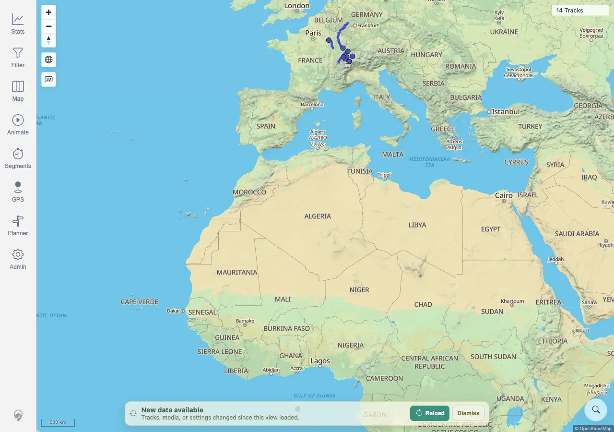
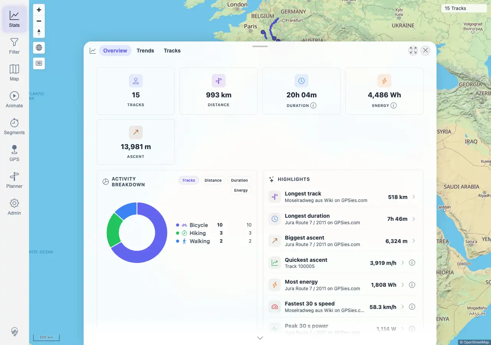

# Packet: SYN_04

## Scope

- Coverage source: `documentation/testing/frontend-regression-test-plan.md`
- Coverage ID or run packet: SYN_04
- In scope: FIT import freshness/cache behavior compared with GPX import behavior.
- Out of scope: FIT detail/download behavior; covered by FIT_02 through FIT_05.

## Prerequisites

- Required previous coverage IDs or run packets: SYN_03 terminal and earlier FIT import coverage.
- Required app/data state: Authenticated map loaded with current cached tracks.
- Required browser context: Desktop Chromium against the remote target.

## Allowed Mutations

- Allowed: Generate and upload a fully synthetic, non-private FIT file, then click the freshness banner Reload action.
- Not allowed: Upload private activity files.

## Actions And Results

| Coverage ID | Action | Expected result | Actual result | Status | Evidence |
|---|---|---|---|---|---|
| SYN_04 | Generated a fully synthetic GPX, converted it locally to FIT with GPSBabel, opened the map at `14 Tracks`, uploaded `SYN_04-synthetic-fit-20260621024711.fit`, waited for indexing and banner, clicked Reload, then opened Stats. | FIT conversion import changes freshness and cache state the same way a native GPX import does. | PASS. The synthetic FIT uploaded and indexed as track `100024` with 20 points, `load=SUCCESS`, and non-duplicate status. The open map stayed stale at `14 Tracks` until the freshness banner appeared; after clicking Reload, the map showed `15 Tracks`. Stats also showed `15 TRACKS` and listed `Track 100024` in Recent Activity. | PASS | [assets/SYN_04-fit-freshness.txt](../assets/SYN_04-fit-freshness.txt); [assets/SYN_04-fit-banner-before-reload.webp](../assets/SYN_04-fit-banner-before-reload.webp); [assets/SYN_04-fit-map-after-reload.webp](../assets/SYN_04-fit-map-after-reload.webp); [assets/SYN_04-fit-stats-after-reload.webp](../assets/SYN_04-fit-stats-after-reload.webp) |

## Issues

| ID | Severity | Summary | Reproduction | Expected | Actual | Evidence | Release impact |
|---|---|---|---|---|---|---|---|
|  |  |  |  |  |  |  |  |

## Evidence Files

| File | Purpose |
|---|---|
| [assets/SYN_04-fit-freshness.txt](../assets/SYN_04-fit-freshness.txt) | Synthetic FIT generation/upload, banner, reload, map, and Stats assertions. |
| [assets/SYN_04-fit-banner-before-reload.webp](../assets/SYN_04-fit-banner-before-reload.webp) | Freshness banner after FIT import before Reload. |
| [assets/SYN_04-fit-map-after-reload.webp](../assets/SYN_04-fit-map-after-reload.webp) | Map after Reload showing 15 tracks. |
| [assets/SYN_04-fit-stats-after-reload.webp](../assets/SYN_04-fit-stats-after-reload.webp) | Stats after Reload showing 15 tracks and Track 100024. |

## Screenshot Evidence

## Timings

| Step | Timing |
|---|---:|
| Synthetic FIT import, banner reload, map/stat refresh | ~2 min |

## Handoff Notes

- Completed: SYN_04 is terminal PASS.
- Remaining unfinished coverage: SYN_05 onward.
- Blocked or not applicable: none.
- State left for the next packet: Synthetic FIT `100024` is visible; an earlier public FIT re-upload `100023` is indexed as a duplicate of `100005` and did not affect visible count.
