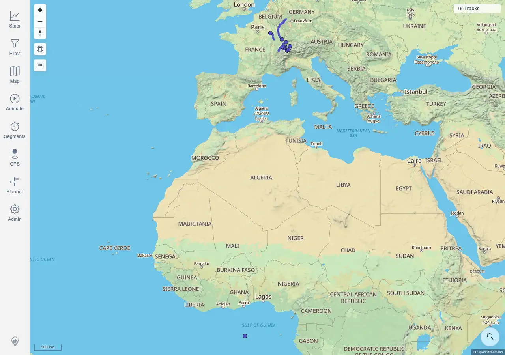
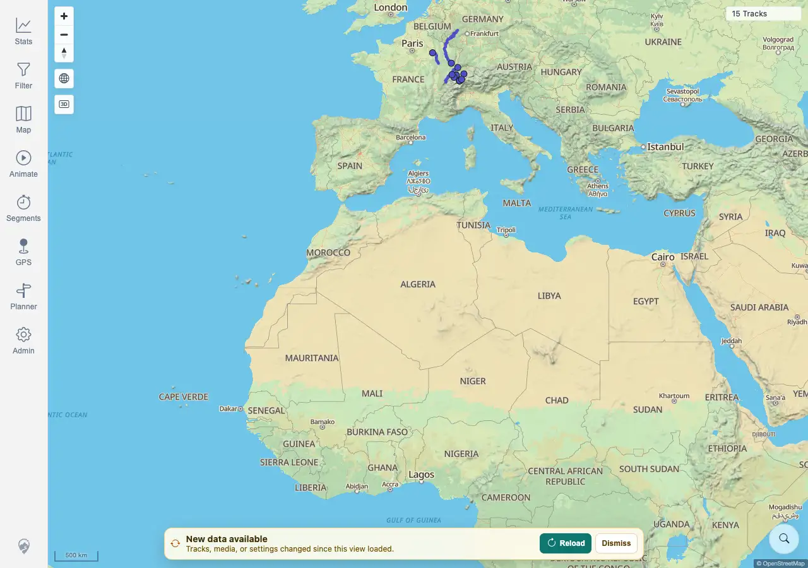

# Packet: SYN_05

## Scope

- Coverage source: `documentation/testing/frontend-regression-test-plan.md`
- Coverage ID or run packet: SYN_05
- In scope: Data-freshness banner Dismiss snooze behavior across another server-token change and the five-minute snooze window.
- Out of scope: Reload behavior; covered by SYN_02 and SYN_04.

## Prerequisites

- Required previous coverage IDs or run packets: SYN_04 terminal.
- Required app/data state: Authenticated map in sync at current track count.
- Required browser context: Desktop Chromium against the remote target.

## Allowed Mutations

- Allowed: Trigger GPS rescans to change freshness tokens without adding tracks.
- Not allowed: Upload/delete source files.

## Actions And Results

| Coverage ID | Action | Expected result | Actual result | Status | Evidence |
|---|---|---|---|---|---|
| SYN_05 | Triggered a GPS rescan to show the freshness banner, clicked Dismiss, triggered another GPS rescan while stale, waited through a polling cycle, then waited just over five minutes. | Dismissing the banner snoozes it for five minutes; it stays hidden through the next freshness polling cycle even if the server token changes again, and may reappear after the snooze if the client is still out of sync. | PASS. The banner appeared, Dismiss hid it, and it stayed hidden after a second token change and polling cycle. After 315,148 ms from Dismiss, the banner reappeared because the client was still stale. | PASS | [assets/SYN_05-banner-snooze.txt](../assets/SYN_05-banner-snooze.txt); [assets/SYN_05-banner-before-dismiss.webp](../assets/SYN_05-banner-before-dismiss.webp); [assets/SYN_05-after-dismiss.webp](../assets/SYN_05-after-dismiss.webp); [assets/SYN_05-hidden-during-snooze.webp](../assets/SYN_05-hidden-during-snooze.webp); [assets/SYN_05-reappeared-after-snooze.webp](../assets/SYN_05-reappeared-after-snooze.webp) |

## Issues

| ID | Severity | Summary | Reproduction | Expected | Actual | Evidence | Release impact |
|---|---|---|---|---|---|---|---|
|  |  |  |  |  |  |  |  |

## Evidence Files

| File | Purpose |
|---|---|
| [assets/SYN_05-banner-snooze.txt](../assets/SYN_05-banner-snooze.txt) | Token changes, elapsed snooze timing, visibility samples, and assertions. |
| [assets/SYN_05-banner-before-dismiss.webp](../assets/SYN_05-banner-before-dismiss.webp) | Banner before Dismiss. |
| [assets/SYN_05-after-dismiss.webp](../assets/SYN_05-after-dismiss.webp) | Banner hidden immediately after Dismiss. |
| [assets/SYN_05-hidden-during-snooze.webp](../assets/SYN_05-hidden-during-snooze.webp) | Banner still hidden after another token change. |
| [assets/SYN_05-reappeared-after-snooze.webp](../assets/SYN_05-reappeared-after-snooze.webp) | Banner reappeared after the snooze window. |

## Screenshot Evidence

## Timings

| Step | Timing |
|---|---:|
| Dismiss, second token change, snooze wait, reappearance | ~6 min |

## Handoff Notes

- Completed: SYN_05 is terminal PASS.
- Remaining unfinished coverage: SYN_06 onward.
- Blocked or not applicable: none.
- State left for the next packet: Client may be stale until the next normal reload; no track data changed.
