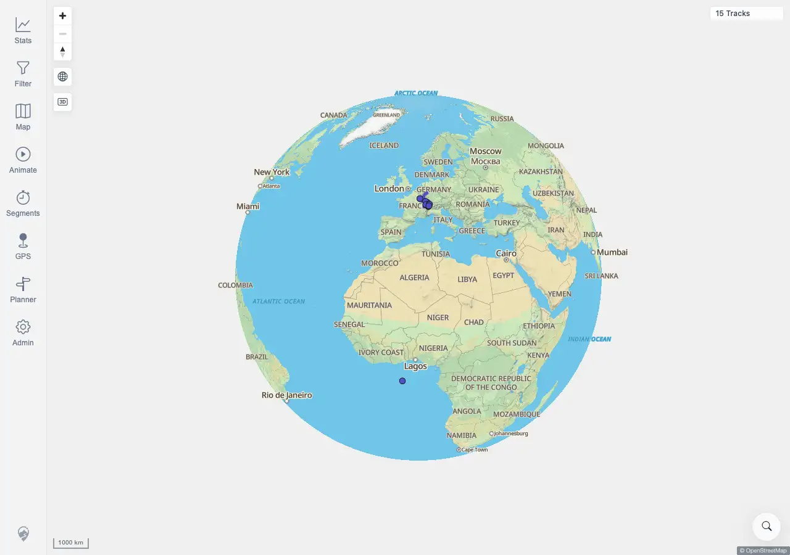

# Packet: SYN_06

## Scope

- Coverage source: `documentation/testing/frontend-regression-test-plan.md`
- Coverage ID or run packet: SYN_06
- In scope: Logout, login, and post-login observation for repeated automatic data-refresh behavior.
- Out of scope: Invalid login and basic logout coverage; covered by SGN_03 and SGN_05.

## Prerequisites

- Required previous coverage IDs or run packets: SYN_05 terminal.
- Required app/data state: Authenticated desktop map with the client synced to the current data token and 15 visible tracks.
- Required browser context: Desktop Chromium against the remote target.

## Allowed Mutations

- Allowed: Logout/login session transition and saved browser-state refresh.
- Not allowed: Upload, delete, rescan, or otherwise change source track data.

## Actions And Results

| Coverage ID | Action | Expected result | Actual result | Status | Evidence |
|---|---|---|---|---|---|
| SYN_06 | Started from the synced 15-track map, logged out through Admin > Session/Credentials, verified the token was cleared and the login form was visible, logged back in, then observed the map for 15 seconds while counting navigation and data-refresh-like requests. | Logging out and back in does not re-trigger an automatic data refresh repeatedly. | PASS. Logout cleared the JWT and showed the login form. Re-login returned to the 15-track map, no freshness banner appeared, no post-login navigations occurred, no sampled track/stat/freshness requests repeated during the 15-second observation, and the loop detector stayed false. | PASS | [assets/SYN_06-logout-login-refresh-loop.txt](../assets/SYN_06-logout-login-refresh-loop.txt); [assets/SYN_06-login-after-logout.webp](../assets/SYN_06-login-after-logout.webp); [assets/SYN_06-after-relogin-map.webp](../assets/SYN_06-after-relogin-map.webp) |

## Issues

| ID | Severity | Summary | Reproduction | Expected | Actual | Evidence | Release impact |
|---|---|---|---|---|---|---|---|
|  |  |  |  |  |  |  |  |

## Evidence Files

| File | Purpose |
|---|---|
| [assets/SYN_06-logout-login-refresh-loop.txt](../assets/SYN_06-logout-login-refresh-loop.txt) | Logout/login assertions and post-login navigation/request-loop counters. |
| [assets/SYN_06-login-after-logout.webp](../assets/SYN_06-login-after-logout.webp) | Login screen after credentials logout. |
| [assets/SYN_06-after-relogin-map.webp](../assets/SYN_06-after-relogin-map.webp) | Stable 15-track map after re-login. |

## Screenshot Evidence

## Timings

| Step | Timing |
|---|---:|
| Post-login refresh-loop observation | 15 s |

## Handoff Notes

- Completed: SYN_06 is terminal PASS.
- Remaining unfinished coverage: SYN_07 onward.
- Blocked or not applicable: none.
- State left for the next packet: Authenticated desktop browser state on the stable 15-track map.
