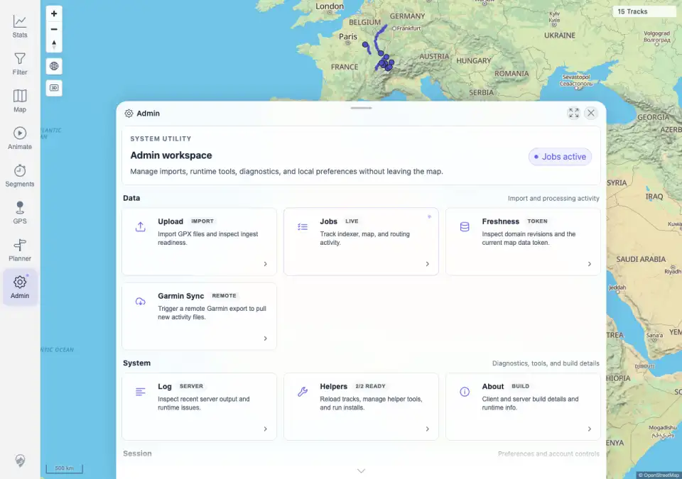
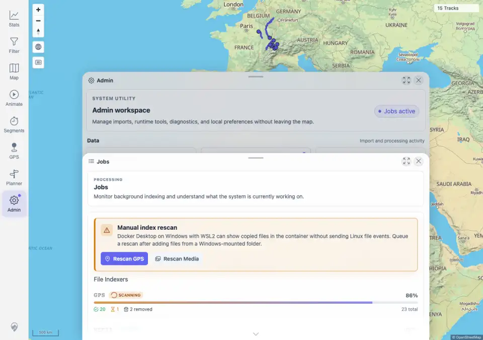
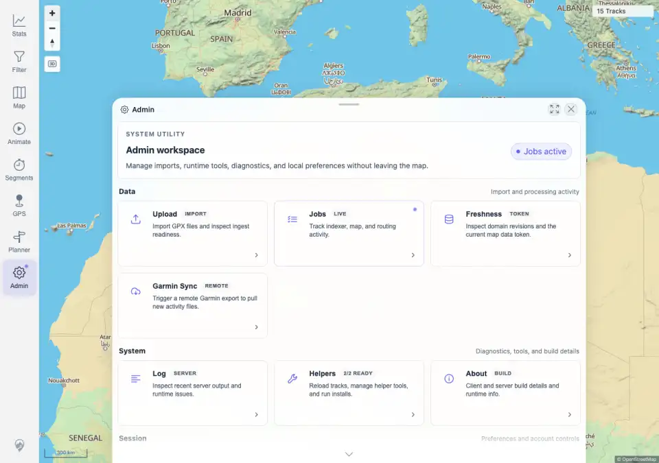

# Packet: SYN_07

## Scope

- Coverage source: `documentation/testing/frontend-regression-test-plan.md`
- Coverage ID or run packet: SYN_07
- In scope: Indexer-running badge visibility and map interaction while indexing is pending.
- Out of scope: Detailed Admin Jobs steady-state behavior; covered by ADM_03 through ADM_06.

## Prerequisites

- Required previous coverage IDs or run packets: SYN_06 terminal.
- Required app/data state: Authenticated desktop map at 15 visible tracks; GPS indexer initially settled.
- Required browser context: Desktop Chromium against the remote target.

## Allowed Mutations

- Allowed: Upload one fully synthetic GPX file to create a real GPS indexer pending/running state; reload/sync after processing.
- Not allowed: Use private GPX tracks, delete files, or alter deployment configuration.

## Actions And Results

| Coverage ID | Action | Expected result | Actual result | Status | Evidence |
|---|---|---|---|---|---|
| SYN_07 | Opened Admin to enable fast status polling, uploaded fully synthetic `SYN_07-indexer-running-20260621050700.gpx` with 20,000 generated trackpoints, observed GPS pending `1`, captured the active Admin/Jobs badges, closed Admin, clicked map zoom, and waited for indexer/background jobs to settle. | Indexer-running state surfaces as a badge but doesn't block map interaction. | PASS. GPS status changed from total `22`, pending `0` to total `23`, pending `1`; the Admin navigation alert and `Jobs active` chip were visible, the Jobs panel showed scanning, and the map zoom scale changed from `500 km` to `300 km` while the map still showed a track count. GPS then settled to pending `0`; background jobs later settled to pending `0`; the synced map showed `16 Tracks`. | PASS | [assets/SYN_07-indexer-running.txt](../assets/SYN_07-indexer-running.txt); [assets/SYN_07-indexer-running-badge.webp](../assets/SYN_07-indexer-running-badge.webp); [assets/SYN_07-jobs-scanning-panel.webp](../assets/SYN_07-jobs-scanning-panel.webp); [assets/SYN_07-map-interaction-during-indexing.webp](../assets/SYN_07-map-interaction-during-indexing.webp); [assets/SYN_07-after-settled-sync.webp](../assets/SYN_07-after-settled-sync.webp) |

## Issues

| ID | Severity | Summary | Reproduction | Expected | Actual | Evidence | Release impact |
|---|---|---|---|---|---|---|---|
|  |  |  |  |  |  |  |  |

## Evidence Files

| File | Purpose |
|---|---|
| [assets/SYN_07-indexer-running.txt](../assets/SYN_07-indexer-running.txt) | Upload, indexer status, badge assertions, map zoom assertion, indexed track ID, and final quiet-state check. |
| [assets/SYN_07-indexer-running-badge.webp](../assets/SYN_07-indexer-running-badge.webp) | Admin home with active Jobs badge while GPS pending was observed. |
| [assets/SYN_07-jobs-scanning-panel.webp](../assets/SYN_07-jobs-scanning-panel.webp) | Jobs panel with File Indexers scanning state. |
| [assets/SYN_07-map-interaction-during-indexing.webp](../assets/SYN_07-map-interaction-during-indexing.webp) | Map after zoom interaction during the pending indexer window. |
| [assets/SYN_07-after-settled-sync.webp](../assets/SYN_07-after-settled-sync.webp) | Synced map after indexer/background jobs settled. |

## Screenshot Evidence

## Timings

| Step | Timing |
|---|---:|
| Upload, pending capture, map interaction, and GPS settle | ~1 min |
| Background job quiet-state wait | ~45 s |

## Handoff Notes

- Completed: SYN_07 is terminal PASS.
- Remaining unfinished coverage: APP_01 onward.
- Blocked or not applicable: none.
- State left for the next packet: GPS indexer pending `0`, background jobs pending `0`, authenticated desktop map synced at `16 Tracks`.
