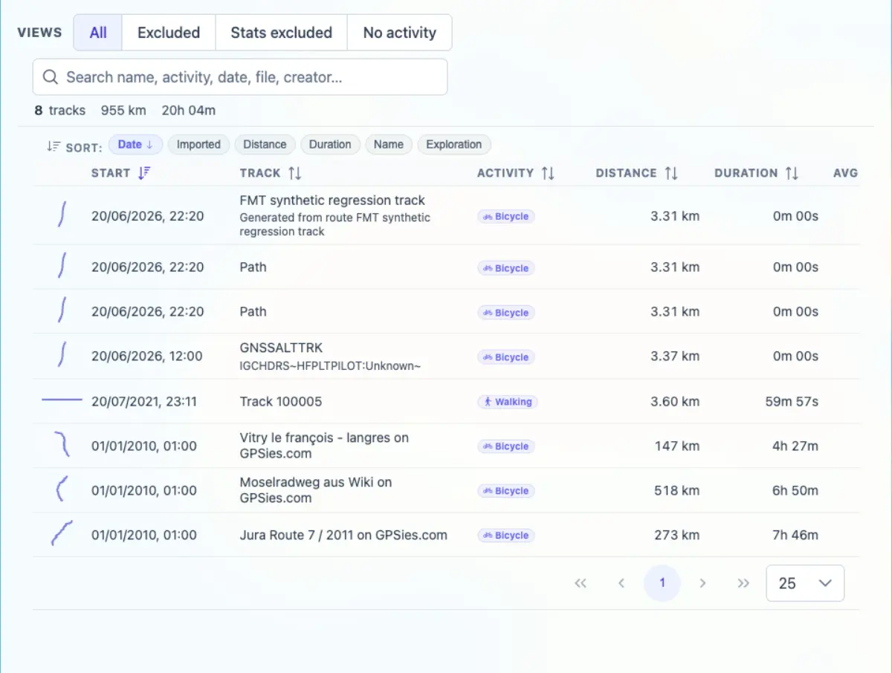

# Packet: TBS_01

## Scope

- Coverage source: `documentation/testing/frontend-regression-test-plan.md`
- Coverage ID or run packet: TBS_01
- In scope: Track Browser list contents and key row fields.
- Out of scope: Search, sorting, quick views, and row navigation; covered by later TBS packets.

## Prerequisites

- Required previous coverage IDs or run packets: FLT_08
- Required app/data state: Filter disabled; current dataset has 8 tracks.
- Required browser context: Authenticated desktop browser context.

## Allowed Mutations

- Allowed: Open Stats > Tracks.
- Not allowed: Change filters or track data.

## Actions And Results

| Coverage ID | Action | Expected result | Actual result | Status | Evidence |
|---|---|---|---|---|---|
| TBS_01 | Opened `/mtl/stats`, selected the Tracks tab, and inspected the Track Browser table headers, summary, and visible rows. | Track browser lists all tracks with name, date, distance, duration, activity, and related metadata. | The Tracks tab showed 8 rows, summary `8 tracks / 955 km / 20h 04m`, quick-view buttons, search input, and table headers for Start, Track, Activity, Distance, Duration, Avg km/h, Energy, Exploration, and Imported. Rows included activity badges, distances, durations, dates, and track names/descriptions. | PASS | [assets/TBS_01-track-browser-list.txt](../assets/TBS_01-track-browser-list.txt); [assets/TBS_01-track-browser-list.webp](../assets/TBS_01-track-browser-list.webp) |

## Issues

| ID | Severity | Summary | Reproduction | Expected | Actual | Evidence | Release impact |
|---|---|---|---|---|---|---|---|
| None |  |  |  |  |  |  |  |

## Evidence Files

| File | Purpose |
|---|---|
| [assets/TBS_01-track-browser-list.txt](../assets/TBS_01-track-browser-list.txt) | Headers, row count, row sample, quick view/search state, and console counts. |
| [assets/TBS_01-track-browser-list.webp](../assets/TBS_01-track-browser-list.webp) | Track Browser table listing all 8 tracks. |

## Screenshot Evidence

## Timings

| Step | Timing |
|---|---:|
| Open Stats > Tracks and inspect list | < 1 min |

## Handoff Notes

- Completed: TBS_01 passed.
- Remaining unfinished coverage: TBS_02 onward.
- Blocked or not applicable: None.
- State left for the next packet: Stats > Tracks tab open; filter disabled.
