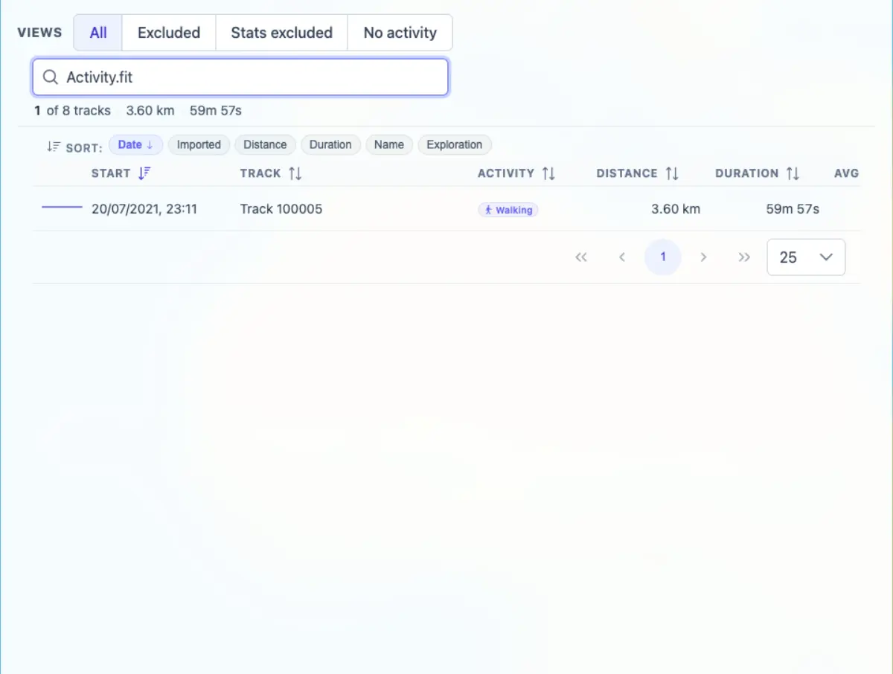

# Packet: TBS_02

## Scope

- Coverage source: `documentation/testing/frontend-regression-test-plan.md`
- Coverage ID or run packet: TBS_02
- In scope: Track Browser search across names, descriptions, dates, distances, durations, activity, and file paths.
- Out of scope: Sorting and quick views.

## Prerequisites

- Required previous coverage IDs or run packets: TBS_01
- Required app/data state: Filter disabled; Stats > Tracks can list all 8 tracks.
- Required browser context: Authenticated desktop browser context.

## Allowed Mutations

- Allowed: Type and clear Track Browser search queries.
- Not allowed: Change imported track data.

## Actions And Results

| Coverage ID | Action | Expected result | Actual result | Status | Evidence |
|---|---|---|---|---|---|
| TBS_02 | Queried the Track Browser for `Jura`, `Generated from route`, `20/06/2026`, `518 km`, `59m 57s`, `Walking`, and `Activity.fit`. | Search matches names, descriptions, dates, distances, durations, activity, and file paths. | Each query returned matching rows: name, generated description, date/imported date, distance, duration, Walking activity, and the FIT file path/name search all matched expected tracks. | PASS | [assets/TBS_02-search-fields.txt](../assets/TBS_02-search-fields.txt); [assets/TBS_02-search-file-path.webp](../assets/TBS_02-search-file-path.webp) |

## Issues

| ID | Severity | Summary | Reproduction | Expected | Actual | Evidence | Release impact |
|---|---|---|---|---|---|---|---|
| None |  |  |  |  |  |  |  |

## Evidence Files

| File | Purpose |
|---|---|
| [assets/TBS_02-search-fields.txt](../assets/TBS_02-search-fields.txt) | Query, count, and row snippets for each search dimension. |
| [assets/TBS_02-search-file-path.webp](../assets/TBS_02-search-file-path.webp) | File/path search for `Activity.fit`. |

## Screenshot Evidence

## Timings

| Step | Timing |
|---|---:|
| Search field matrix | < 1 min |

## Handoff Notes

- Completed: TBS_02 passed.
- Remaining unfinished coverage: TBS_03 onward.
- Blocked or not applicable: None.
- State left for the next packet: Stats > Tracks tab open; last search query was `Activity.fit`.
