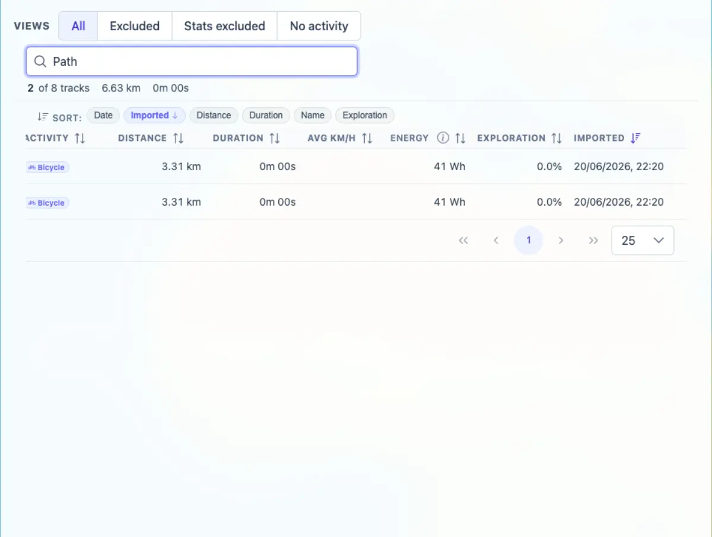

# Packet: TBS_03

## Scope

- Coverage source: `documentation/testing/frontend-regression-test-plan.md`
- Coverage ID or run packet: TBS_03
- In scope: Track Browser sortable columns and visible-subset summary row.
- Out of scope: Quick-view presets and row navigation.

## Prerequisites

- Required previous coverage IDs or run packets: TBS_01, TBS_02
- Required app/data state: Filter disabled; Track Browser has 8 rows.
- Required browser context: Authenticated desktop browser context.

## Allowed Mutations

- Allowed: Click sort headers and set a search query.
- Not allowed: Change filters or track data.

## Actions And Results

| Coverage ID | Action | Expected result | Actual result | Status | Evidence |
|---|---|---|---|---|---|
| TBS_03 | Clicked each sortable table header twice and then searched `Path` to verify the summary row for the visible subset. | Sort by each column works; summary row reflects what is currently visible. | Start, Track, Activity, Distance, Duration, Avg km/h, Energy, Exploration, and Imported each produced non-empty ascending/descending first-row states. Searching `Path` reduced the table to 2 rows and the summary to `2 of 8 tracks · 6.63 km · 0m 00s`. | PASS | [assets/TBS_03-sort-summary.txt](../assets/TBS_03-sort-summary.txt); [assets/TBS_03-search-summary-sort.webp](../assets/TBS_03-search-summary-sort.webp) |

## Issues

| ID | Severity | Summary | Reproduction | Expected | Actual | Evidence | Release impact |
|---|---|---|---|---|---|---|---|
| None |  |  |  |  |  |  |  |

## Evidence Files

| File | Purpose |
|---|---|
| [assets/TBS_03-sort-summary.txt](../assets/TBS_03-sort-summary.txt) | First-row states after sorting each column and filtered summary text. |
| [assets/TBS_03-search-summary-sort.webp](../assets/TBS_03-search-summary-sort.webp) | Filtered `Path` table and summary row. |

## Screenshot Evidence

## Timings

| Step | Timing |
|---|---:|
| Sort matrix and visible summary check | < 2 min |

## Handoff Notes

- Completed: TBS_03 passed.
- Remaining unfinished coverage: TBS_04 onward.
- Blocked or not applicable: None.
- State left for the next packet: Stats > Tracks tab open with `Path` search from the check.
