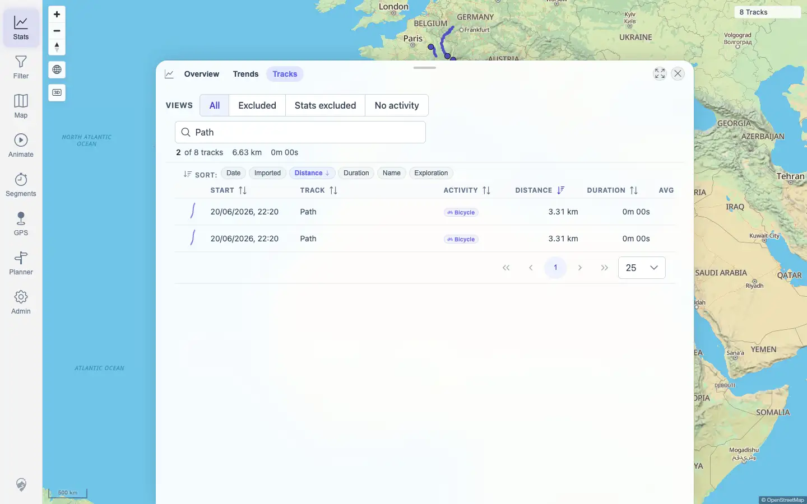

# Packet: TBS_04

## Scope

- Coverage source: `documentation/testing/frontend-regression-test-plan.md`
- Coverage ID or run packet: TBS_04
- In scope: Track Browser quick-view presets and continued search/sort usability after switching presets.
- Out of scope: Row navigation and statistics overview totals.

## Prerequisites

- Required previous coverage IDs or run packets: TBS_01, TBS_02, TBS_03
- Required app/data state: Filter disabled; Stats > Tracks has 8 rows in the All quick view.
- Required browser context: Authenticated desktop browser context.

## Allowed Mutations

- Allowed: Switch quick views, set table search, and use table sort controls.
- Not allowed: Change track data, filters, curation exclusions, or imports.

## Actions And Results

| Coverage ID | Action | Expected result | Actual result | Status | Evidence |
|---|---|---|---|---|---|
| TBS_04 | Opened Stats > Tracks, verified initial All, switched Excluded, Stats excluded, No activity, and back to All, then searched `Path` and sorted by Distance. | Quick-view/preset buttons switch the browser subset correctly and preserve usable sorting/search behavior. | Initial All was active with 8 rows. Excluded, Stats excluded, and No activity each became active and showed a valid empty-state message for this dataset. Returning to All restored 8 rows. Searching `Path` after the quick-view switches showed `2 of 8 tracks` and Distance sort remained active with 2 visible rows. | PASS | [assets/TBS_04-quick-views.txt](../assets/TBS_04-quick-views.txt); [assets/TBS_04-quick-views-subset.webp](../assets/TBS_04-quick-views-subset.webp); [assets/TBS_04-quick-views-search.webp](../assets/TBS_04-quick-views-search.webp) |

## Issues

| ID | Severity | Summary | Reproduction | Expected | Actual | Evidence | Release impact |
|---|---|---|---|---|---|---|---|
| None |  |  |  |  |  |  |  |

## Evidence Files

| File | Purpose |
|---|---|
| [assets/TBS_04-quick-views.txt](../assets/TBS_04-quick-views.txt) | Quick-view active states, row counts, summary text, empty states, and final search/sort result. |
| [assets/TBS_04-quick-views-subset.webp](../assets/TBS_04-quick-views-subset.webp) | Stats excluded quick view active with the expected empty-state view. |
| [assets/TBS_04-quick-views-search.webp](../assets/TBS_04-quick-views-search.webp) | Returned All quick view with `Path` search and Distance sort active. |

## Screenshot Evidence

## Timings

| Step | Timing |
|---|---:|
| Quick-view matrix and search/sort check | < 2 min |

## Handoff Notes

- Completed: TBS_04 passed.
- Remaining unfinished coverage: TBS_05 onward.
- Blocked or not applicable: None.
- State left for the next packet: Stats > Tracks tab open with All quick view, `Path` search, and Distance sort from the check.
