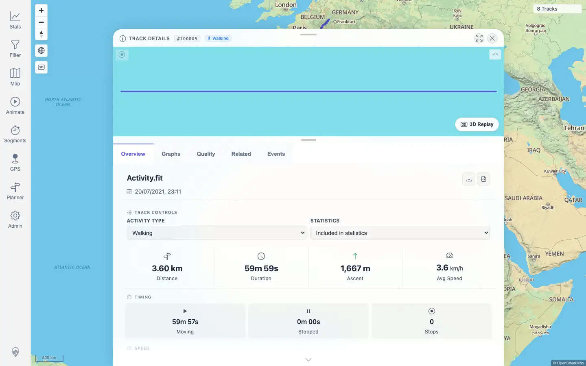

# Packet: TBS_05

## Scope

- Coverage source: `documentation/testing/frontend-regression-test-plan.md`
- Coverage ID or run packet: TBS_05
- In scope: Opening track details by clicking a Track Browser row.
- Out of scope: Full detail-tab validation; covered by TRD packets.

## Prerequisites

- Required previous coverage IDs or run packets: TBS_01 through TBS_04
- Required app/data state: Track Browser contains imported FIT-backed track `100005` from `Activity.fit`.
- Required browser context: Authenticated desktop browser context.

## Allowed Mutations

- Allowed: Search the Track Browser and click a row to navigate.
- Not allowed: Change track data, filters, or persistent settings.

## Actions And Results

| Coverage ID | Action | Expected result | Actual result | Status | Evidence |
|---|---|---|---|---|---|
| TBS_05 | Opened Stats > Tracks, searched `Activity.fit`, and clicked the single `Track 100005` table row. | Clicking a row opens the track's details. | Search showed `1 of 8 tracks`; clicking the row navigated to `/mtl/track/100005`. The detail sheet displayed `TRACK DETAILS #100005`, `Activity.fit`, Overview/Graphs/Quality/Related/Events tabs, and no track-detail load error. | PASS | [assets/TBS_05-row-navigation.txt](../assets/TBS_05-row-navigation.txt); [assets/TBS_05-row-detail.webp](../assets/TBS_05-row-detail.webp) |

## Issues

| ID | Severity | Summary | Reproduction | Expected | Actual | Evidence | Release impact |
|---|---|---|---|---|---|---|---|
| None |  |  |  |  |  |  |  |

## Evidence Files

| File | Purpose |
|---|---|
| [assets/TBS_05-row-navigation.txt](../assets/TBS_05-row-navigation.txt) | Search state, clicked row text, detail URL, visible detail text checks, and console/page-error summary. |
| [assets/TBS_05-row-detail.webp](../assets/TBS_05-row-detail.webp) | Track detail sheet opened from the Track Browser row. |

## Screenshot Evidence

## Timings

| Step | Timing |
|---|---:|
| Search row and open detail | < 1 min |

## Handoff Notes

- Completed: TBS_05 passed.
- Remaining unfinished coverage: TBS_06 onward.
- Blocked or not applicable: None.
- State left for the next packet: Track `100005` detail view open; no data or persistent setting mutations.
