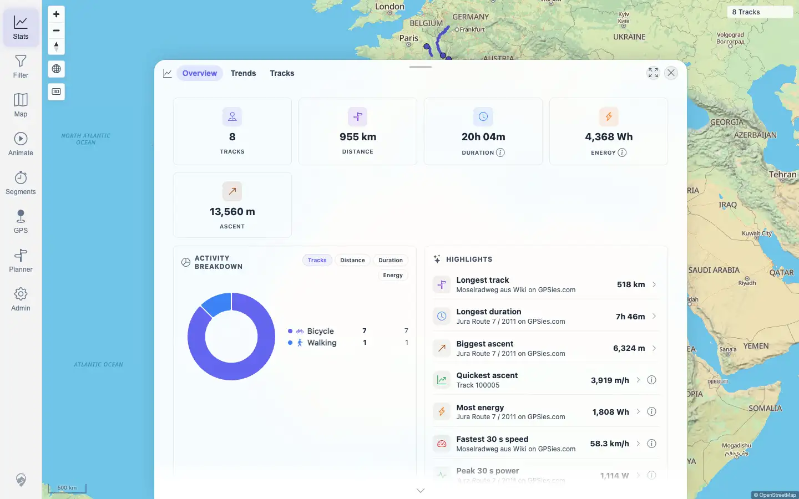
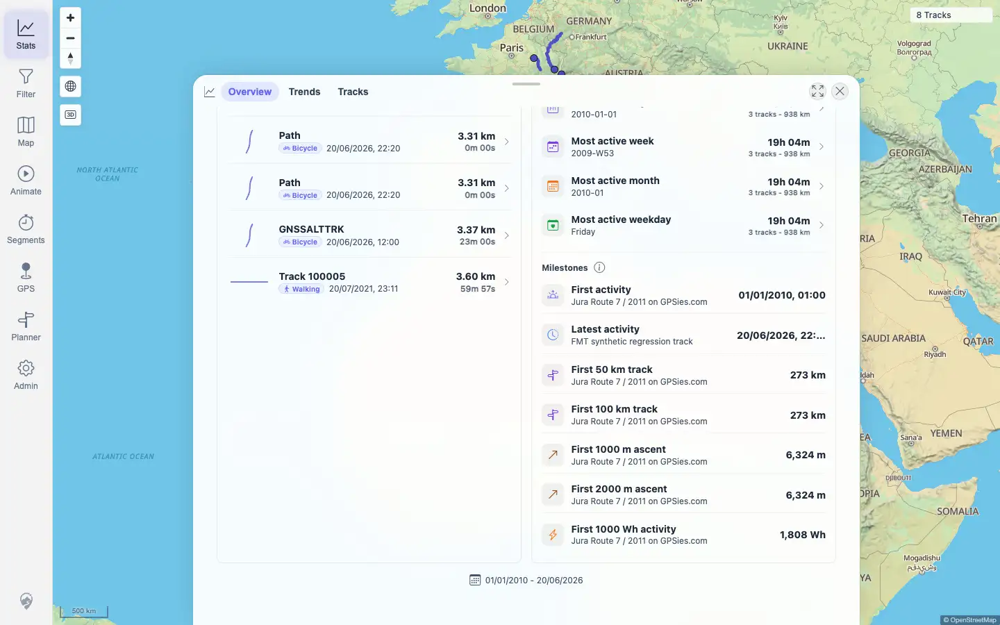
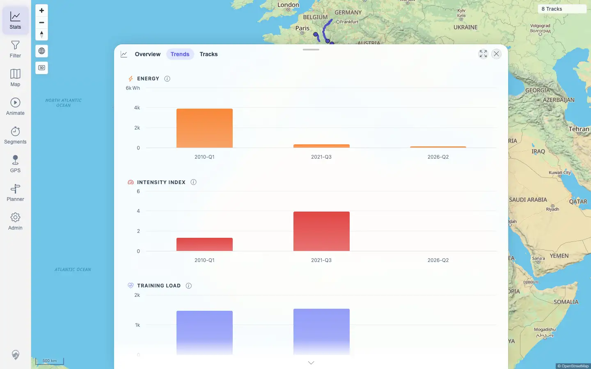

# Packet: TBS_06

## Scope

- Coverage source: `documentation/testing/frontend-regression-test-plan.md`
- Coverage ID or run packet: TBS_06
- In scope: Statistics overview totals, activity breakdown, rankings/highlights, milestones, active period rows, and a light period-chart render check.
- Out of scope: Detailed daily/weekly/monthly chart switching; covered by TBS_09.

## Prerequisites

- Required previous coverage IDs or run packets: TBS_01 through TBS_05
- Required app/data state: Filter disabled; current dataset has 8 tracks.
- Required browser context: Authenticated desktop browser context.

## Allowed Mutations

- Allowed: Navigate between Stats Overview and Trends tabs.
- Not allowed: Change track data, filters, curation exclusions, or imports.

## Actions And Results

| Coverage ID | Action | Expected result | Actual result | Status | Evidence |
|---|---|---|---|---|---|
| TBS_06 | Opened Stats Overview, inspected summary tiles, Activity Breakdown, Highlights, Rhythm & Milestones, then opened Trends to verify period charts render. | Statistics overview shows total distance, time, elevation, activity breakdown, rankings, milestones, and period charts. | Overview showed 8 tracks, 955 km distance, 20h 04m duration, 13,560 m ascent, 4,368 Wh energy, Bicycle/Walking activity rows, ranking/highlight rows, most active periods, and milestone rows. Trends rendered 7 chart containers and summary tiles for periods, tracks, total distance, total time, and total energy. | PASS | [assets/TBS_06-overview-statistics.txt](../assets/TBS_06-overview-statistics.txt); [assets/TBS_06-overview-summary.webp](../assets/TBS_06-overview-summary.webp); [assets/TBS_06-overview-milestones.webp](../assets/TBS_06-overview-milestones.webp); [assets/TBS_06-trends-charts.webp](../assets/TBS_06-trends-charts.webp) |

## Issues

| ID | Severity | Summary | Reproduction | Expected | Actual | Evidence | Release impact |
|---|---|---|---|---|---|---|---|
| None |  |  |  |  |  |  |  |

## Evidence Files

| File | Purpose |
|---|---|
| [assets/TBS_06-overview-statistics.txt](../assets/TBS_06-overview-statistics.txt) | Summary tile checks, activity rows, ranking rows, period rows, milestone rows, chart count, and console/page-error summary. |
| [assets/TBS_06-overview-summary.webp](../assets/TBS_06-overview-summary.webp) | Overview summary, Activity Breakdown, Highlights, and Recent Activity. |
| [assets/TBS_06-overview-milestones.webp](../assets/TBS_06-overview-milestones.webp) | Rhythm & Milestones section. |
| [assets/TBS_06-trends-charts.webp](../assets/TBS_06-trends-charts.webp) | Trends chart render check for period-chart coverage. |

## Screenshot Evidence

## Timings

| Step | Timing |
|---|---:|
| Overview and Trends inspection | < 1 min |

## Handoff Notes

- Completed: TBS_06 passed.
- Remaining unfinished coverage: TBS_07 onward.
- Blocked or not applicable: None.
- State left for the next packet: Stats Trends tab open; no data or persistent setting mutations.
