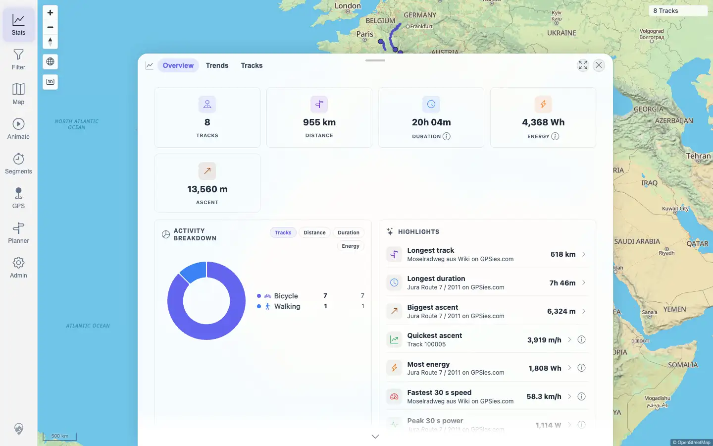
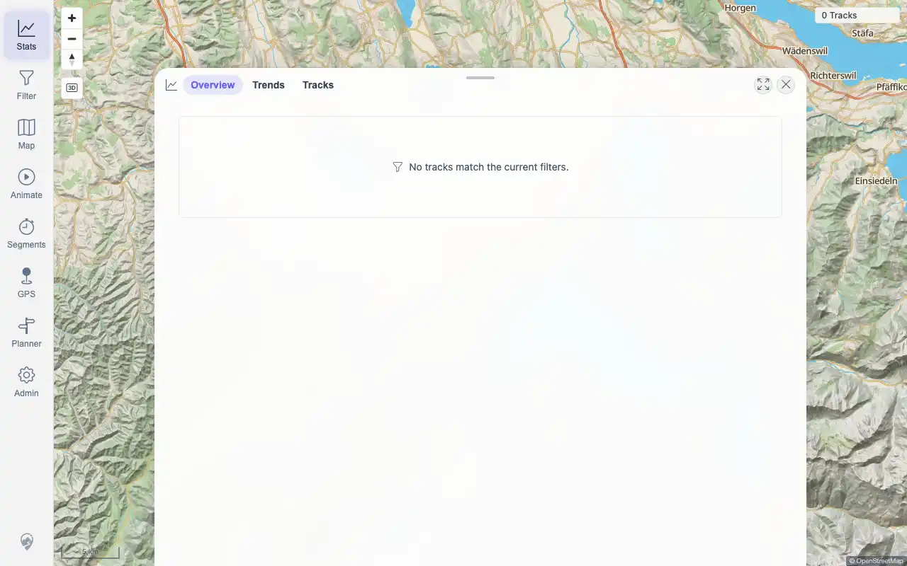

# Packet: TBS_07

## Scope

- Coverage source: `documentation/testing/frontend-regression-test-plan.md`
- Coverage ID or run packet: TBS_07
- In scope: Statistics correctness for empty, single-track, and many-track sets.
- Out of scope: Data import/delete deltas; covered by IMP and DEL packets.

## Prerequisites

- Required previous coverage IDs or run packets: IMP_01, TBS_06
- Required app/data state: Current visible set has 8 tracks; empty baseline evidence exists from the clean install phase.
- Required browser context: Authenticated desktop browser context.

## Allowed Mutations

- Allowed: Query read-only statistics APIs and open Stats Overview.
- Not allowed: Import, delete, edit, or reclassify tracks.

## Actions And Results

| Coverage ID | Action | Expected result | Actual result | Status | Evidence |
|---|---|---|---|---|---|
| TBS_07 | Queried the same server overview/statistics endpoints used by the frontend for `[]`, `[100005]`, and the live visible 8-track ID set; cross-checked current many-track UI and the earlier real empty-install UI baseline. | Stats are correct for empty dataset, a single track, and many tracks. | Empty overview returned trackCount/distance/duration/ascent/energy all 0 and TOTAL stats empty. Single Track `100005` returned 1 track, 3,598.76 m, 3,597 s, 1,666.68 m ascent, Walking activity, and TOTAL stats with 1 track. Live many set `100000,100001,100002,100005,100008,100009,100011,100012` returned 8 tracks, 955,195.08 m, 72,276 s, 13,559.85 m ascent, Bicycle 7 / Walking 1, and UI showed 8 tracks / 955 km / 20h 04m. | PASS | [assets/TBS_07-stats-empty-single-many.txt](../assets/TBS_07-stats-empty-single-many.txt); [assets/TBS_07-many-stats-overview.webp](../assets/TBS_07-many-stats-overview.webp); [assets/IMP_01-baseline-stats.webp](../assets/IMP_01-baseline-stats.webp); [assets/IMP_01-baseline.txt](../assets/IMP_01-baseline.txt); [assets/TBS_06-overview-statistics.txt](../assets/TBS_06-overview-statistics.txt) |

## Issues

| ID | Severity | Summary | Reproduction | Expected | Actual | Evidence | Release impact |
|---|---|---|---|---|---|---|---|
| None |  |  |  |  |  |  |  |

## Evidence Files

| File | Purpose |
|---|---|
| [assets/TBS_07-stats-empty-single-many.txt](../assets/TBS_07-stats-empty-single-many.txt) | Empty, single-track, and many-track API totals plus current many-track UI sample. |
| [assets/TBS_07-many-stats-overview.webp](../assets/TBS_07-many-stats-overview.webp) | Current many-track Stats Overview. |
| [assets/IMP_01-baseline-stats.webp](../assets/IMP_01-baseline-stats.webp) | Real empty-install Stats UI baseline captured before imports. |
| [assets/IMP_01-baseline.txt](../assets/IMP_01-baseline.txt) | Empty-install API baseline with zero overview/statistics totals. |
| [assets/TBS_06-overview-statistics.txt](../assets/TBS_06-overview-statistics.txt) | Current many-track Overview/Trends UI validation. |

## Screenshot Evidence

## Timings

| Step | Timing |
|---|---:|
| API/UI statistics comparison | < 1 min |

## Handoff Notes

- Completed: TBS_07 passed.
- Remaining unfinished coverage: TBS_08 onward.
- Blocked or not applicable: None.
- State left for the next packet: Stats Overview open; no data or persistent setting mutations.
