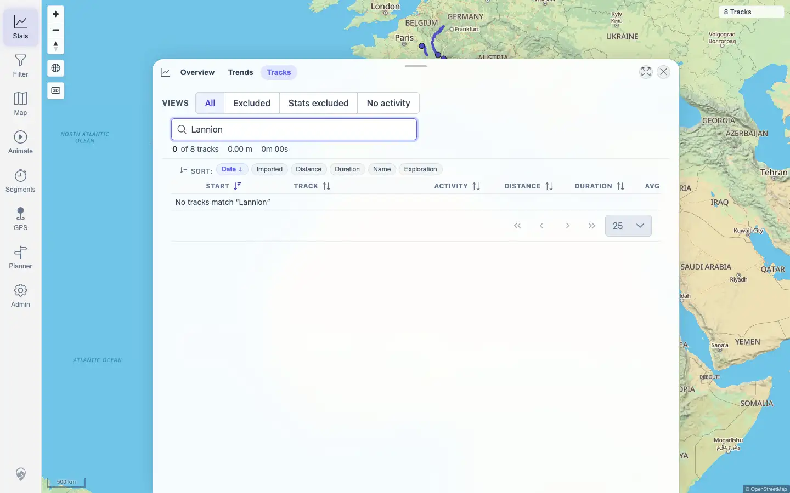
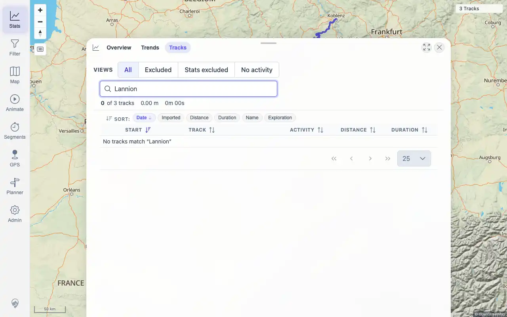

# Packet: TBS_08

## Scope

- Coverage source: `documentation/testing/frontend-regression-test-plan.md`
- Coverage ID or run packet: TBS_08
- In scope: Statistics updates after the required five-GPX import, after deleting two imported tracks, and absence of stale deleted-track totals.
- Out of scope: Repeating destructive import/delete operations already performed in this run.

## Prerequisites

- Required previous coverage IDs or run packets: IMP_09, DEL_03, TBS_07
- Required app/data state: Current visible set has 8 tracks; Lannion and Voie GPX files were deleted earlier in the run.
- Required browser context: Authenticated desktop browser context.

## Allowed Mutations

- Allowed: Search Track Browser for deleted names and query read-only UI/API state.
- Not allowed: Import, delete, or edit tracks.

## Actions And Results

| Coverage ID | Action | Expected result | Actual result | Status | Evidence |
|---|---|---|---|---|---|
| TBS_08 | Cross-checked the run's import/delete delta evidence, then searched current Stats > Tracks for `voie verte` and `Lannion`. | Stats update after the required five-GPX import and again after deleting two imported tracks; no stale deleted-track totals remain. | IMP_09 recorded baseline 0 -> five GPX tracks with Stats UI 5 tracks / 1,043 km / 23h 31m. DEL_03 recorded deletion to 3 tracks / 938 km / 19h 04m with deleted-name searches at 0 of 3. Current final dataset has 8 visible IDs, and both deleted-name searches show `0 of 8 tracks` with no deleted data rows. | PASS | [assets/TBS_08-import-delete-deltas.txt](../assets/TBS_08-import-delete-deltas.txt); [assets/TBS_08-current-deleted-search.webp](../assets/TBS_08-current-deleted-search.webp); [assets/IMP_09-totals.txt](../assets/IMP_09-totals.txt); [assets/DEL_03-surfaces.txt](../assets/DEL_03-surfaces.txt); [assets/DEL_03-deleted-search.webp](../assets/DEL_03-deleted-search.webp) |

## Issues

| ID | Severity | Summary | Reproduction | Expected | Actual | Evidence | Release impact |
|---|---|---|---|---|---|---|---|
| None |  |  |  |  |  |  |  |

## Evidence Files

| File | Purpose |
|---|---|
| [assets/TBS_08-import-delete-deltas.txt](../assets/TBS_08-import-delete-deltas.txt) | Current stale-deleted search plus import/delete delta references. |
| [assets/TBS_08-current-deleted-search.webp](../assets/TBS_08-current-deleted-search.webp) | Current Track Browser empty result for a deleted GPX name. |
| [assets/IMP_09-totals.txt](../assets/IMP_09-totals.txt) | Five-GPX import statistics delta from baseline. |
| [assets/DEL_03-surfaces.txt](../assets/DEL_03-surfaces.txt) | Post-delete statistics and deleted-surface checks. |
| [assets/DEL_03-deleted-search.webp](../assets/DEL_03-deleted-search.webp) | Deleted-name browser search after deletion. |

## Screenshot Evidence

## Timings

| Step | Timing |
|---|---:|
| Current stale-deleted check | < 1 min |

## Handoff Notes

- Completed: TBS_08 passed.
- Remaining unfinished coverage: TBS_09 onward.
- Blocked or not applicable: None.
- State left for the next packet: Stats > Tracks tab open with deleted-name search from the check.
