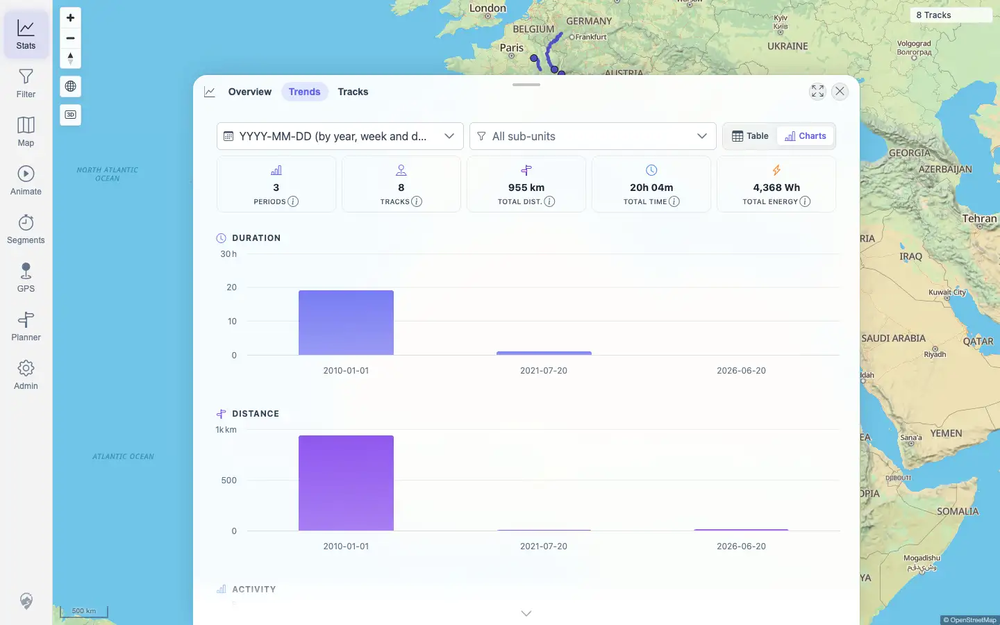

# Packet: TBS_09

## Scope

- Coverage source: `documentation/testing/frontend-regression-test-plan.md`
- Coverage ID or run packet: TBS_09
- In scope: Trends time-period chart rendering and switching for daily, weekly, and monthly groupings.
- Out of scope: Overview totals and milestone checks; covered by TBS_06 and TBS_07.

## Prerequisites

- Required previous coverage IDs or run packets: TBS_06, TBS_07
- Required app/data state: Current visible set has 8 tracks.
- Required browser context: Authenticated desktop browser context.

## Allowed Mutations

- Allowed: Change the Trends aggregation selector.
- Not allowed: Change track data, filters, or persistent settings.

## Actions And Results

| Coverage ID | Action | Expected result | Actual result | Status | Evidence |
|---|---|---|---|---|---|
| TBS_09 | Opened Stats > Trends and switched aggregation to `YYYY-MM-DD`, `YYYY-WW`, and `YYYY-MM`. | Time-period charts daily/weekly/monthly render and switch correctly. | Each grouping selected correctly, rendered 7 chart containers, and kept totals at 8 tracks / 955 km / 20h 04m. Daily labels included `2010-01-01`, `2021-07-20`, `2026-06-20`; weekly labels rendered as year-week numbers `2010-01`, `2021-29`, `2026-25`; monthly labels included `2010-01`, `2021-07`, `2026-06`. | PASS | [assets/TBS_09-period-charts.txt](../assets/TBS_09-period-charts.txt); [assets/TBS_09-daily-charts.webp](../assets/TBS_09-daily-charts.webp); [assets/TBS_09-weekly-charts.webp](../assets/TBS_09-weekly-charts.webp); [assets/TBS_09-monthly-charts.webp](../assets/TBS_09-monthly-charts.webp) |

## Issues

| ID | Severity | Summary | Reproduction | Expected | Actual | Evidence | Release impact |
|---|---|---|---|---|---|---|---|
| None |  |  |  |  |  |  |  |

## Evidence Files

| File | Purpose |
|---|---|
| [assets/TBS_09-period-charts.txt](../assets/TBS_09-period-charts.txt) | Aggregation selections, chart counts, axis labels, and console/page-error summary. |
| [assets/TBS_09-daily-charts.webp](../assets/TBS_09-daily-charts.webp) | Daily period charts rendered. |
| [assets/TBS_09-weekly-charts.webp](../assets/TBS_09-weekly-charts.webp) | Weekly period charts rendered. |
| [assets/TBS_09-monthly-charts.webp](../assets/TBS_09-monthly-charts.webp) | Monthly period charts rendered. |

## Screenshot Evidence

## Timings

| Step | Timing |
|---|---:|
| Daily/weekly/monthly chart switching | < 1 min |

## Handoff Notes

- Completed: TBS_09 passed.
- Remaining unfinished coverage: TBS_10 onward.
- Blocked or not applicable: None.
- State left for the next packet: Stats Trends tab open with monthly grouping selected.
