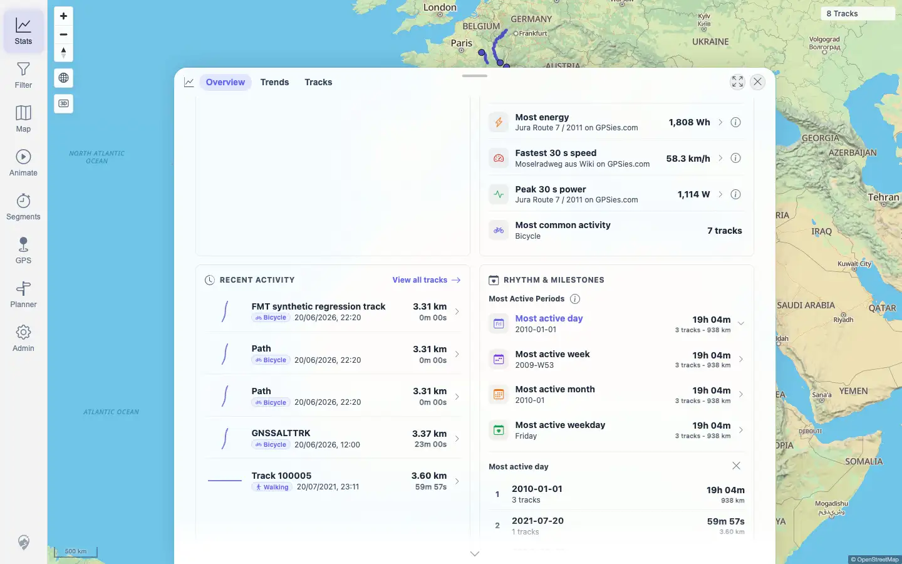
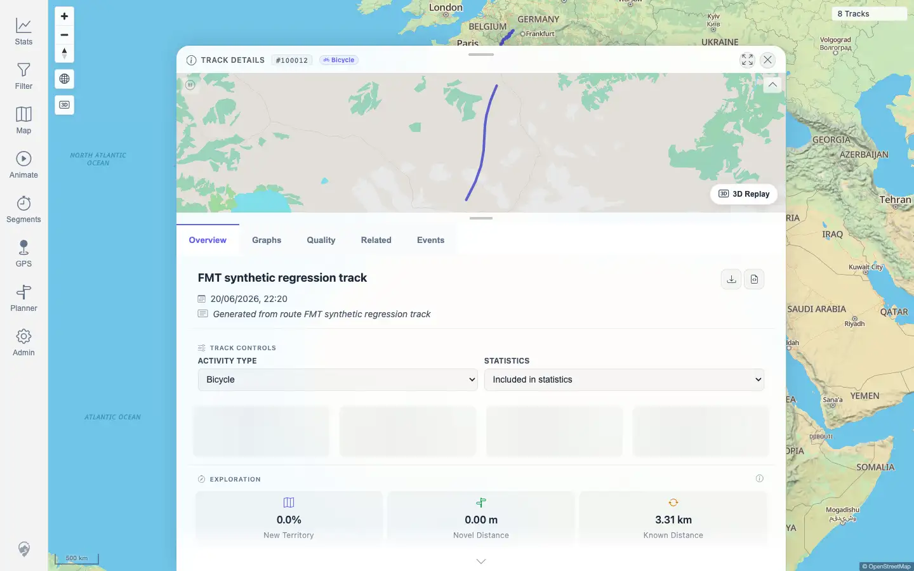

# Packet: TBS_10

## Scope

- Coverage source: `documentation/testing/frontend-regression-test-plan.md`
- Coverage ID or run packet: TBS_10
- In scope: Clicking stats entries to open drilldowns/highlight state and navigate to details.
- Out of scope: Highlight-specific drilldown and exclusion-count coverage; covered by TBS_11.

## Prerequisites

- Required previous coverage IDs or run packets: TBS_06 through TBS_09
- Required app/data state: Current visible set has 8 tracks with populated Overview recent activity and active-period rows.
- Required browser context: Authenticated desktop browser context.

## Allowed Mutations

- Allowed: Click Stats Overview rows and navigate to a detail page.
- Not allowed: Change track data, filters, curation exclusions, or imports.

## Actions And Results

| Coverage ID | Action | Expected result | Actual result | Status | Evidence |
|---|---|---|---|---|---|
| TBS_10 | Clicked the first Most Active Period row, then re-opened Overview and clicked the first Recent Activity row. | Clicking a stats entry navigates / filters / highlights as expected. | The Most Active Period row became active and opened a drilldown with daily period rows. Clicking the Recent Activity row navigated to `/mtl/track/100012` and showed Track Details tabs without a page error. | PASS | [assets/TBS_10-stats-entry-clicks.txt](../assets/TBS_10-stats-entry-clicks.txt); [assets/TBS_10-period-drilldown.webp](../assets/TBS_10-period-drilldown.webp); [assets/TBS_10-recent-detail.webp](../assets/TBS_10-recent-detail.webp) |

## Issues

| ID | Severity | Summary | Reproduction | Expected | Actual | Evidence | Release impact |
|---|---|---|---|---|---|---|---|
| None |  |  |  |  |  |  |  |

## Evidence Files

| File | Purpose |
|---|---|
| [assets/TBS_10-stats-entry-clicks.txt](../assets/TBS_10-stats-entry-clicks.txt) | Clicked row text, active/drilldown state, detail URL, and console/page-error summary. |
| [assets/TBS_10-period-drilldown.webp](../assets/TBS_10-period-drilldown.webp) | Active period drilldown opened from a stats row. |
| [assets/TBS_10-recent-detail.webp](../assets/TBS_10-recent-detail.webp) | Recent Activity row opened track details. |

## Screenshot Evidence

## Timings

| Step | Timing |
|---|---:|
| Stats entry click checks | < 1 min |

## Handoff Notes

- Completed: TBS_10 passed.
- Remaining unfinished coverage: TBS_11 onward.
- Blocked or not applicable: None.
- State left for the next packet: Track `100012` detail view open; no data or persistent setting mutations.
