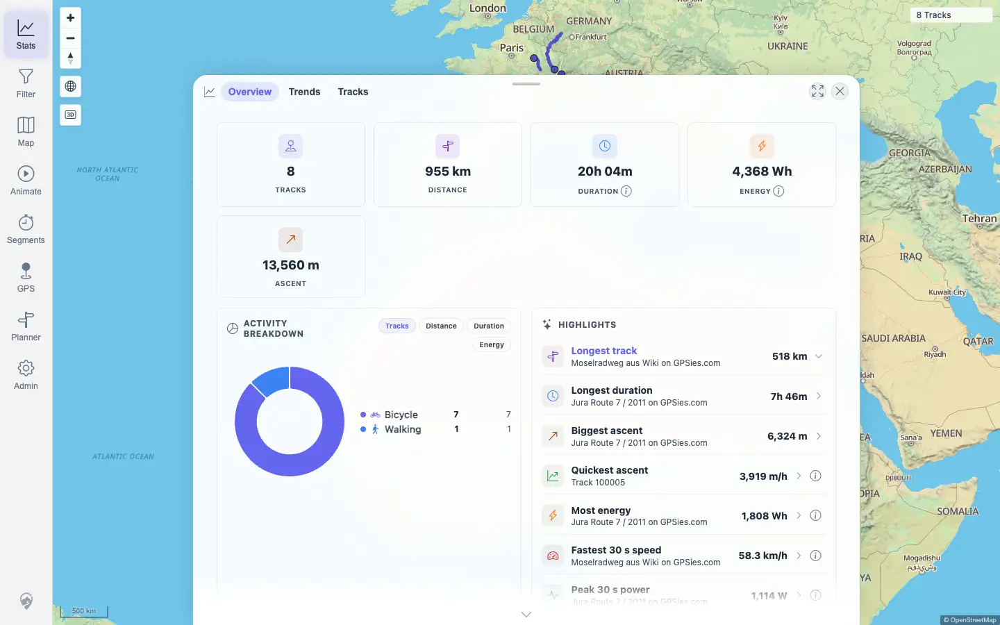
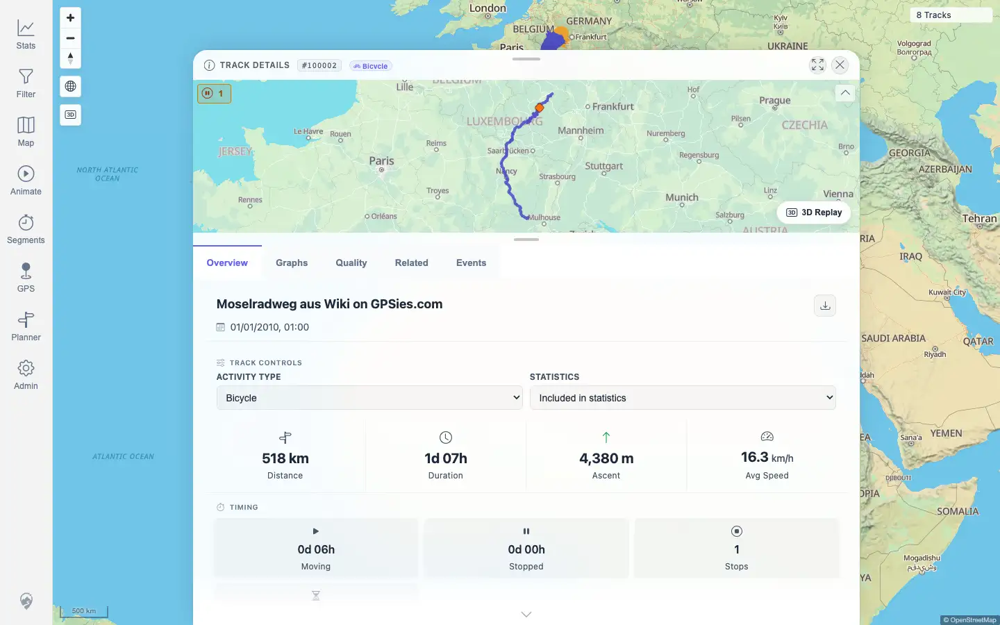

# Packet: TBS_11

## Scope

- Coverage source: `documentation/testing/frontend-regression-test-plan.md`
- Coverage ID or run packet: TBS_11
- In scope: Highlight drilldowns, opening a selected highlight track, and excluded-highlight count visibility where applicable.
- Out of scope: Generic stats-entry click behavior; covered by TBS_10.

## Prerequisites

- Required previous coverage IDs or run packets: TBS_10
- Required app/data state: Current visible set has highlight rankings; current highlight exclusion count is known from the overview API.
- Required browser context: Authenticated desktop browser context.

## Allowed Mutations

- Allowed: Click highlight rows and drilldown rows.
- Not allowed: Add or remove highlight exclusions, edit track data, or change imports.

## Actions And Results

| Coverage ID | Action | Expected result | Actual result | Status | Evidence |
|---|---|---|---|---|---|
| TBS_11 | Clicked the `Longest track` highlight, inspected the drilldown, checked excluded-highlight count applicability, then opened the first drilldown row. | Highlight drilldowns open the expected track list, open a selected track, and expose excluded-highlight counts where applicable. | The `Longest track` row opened a ranked 8-row drilldown headed by Moselradweg. Clicking the first row opened `/mtl/track/100002`. The overview API reported highlightExcludedTrackCount `0`, so no excluded-count note was applicable or visible. | PASS | [assets/TBS_11-highlight-drilldown.txt](../assets/TBS_11-highlight-drilldown.txt); [assets/TBS_11-highlight-drilldown.webp](../assets/TBS_11-highlight-drilldown.webp); [assets/TBS_11-highlight-detail.webp](../assets/TBS_11-highlight-detail.webp) |

## Issues

| ID | Severity | Summary | Reproduction | Expected | Actual | Evidence | Release impact |
|---|---|---|---|---|---|---|---|
| None |  |  |  |  |  |  |  |

## Evidence Files

| File | Purpose |
|---|---|
| [assets/TBS_11-highlight-drilldown.txt](../assets/TBS_11-highlight-drilldown.txt) | Highlight row, drilldown rows, excluded-count applicability, detail URL, and console/page-error summary. |
| [assets/TBS_11-highlight-drilldown.webp](../assets/TBS_11-highlight-drilldown.webp) | Highlight drilldown list. |
| [assets/TBS_11-highlight-detail.webp](../assets/TBS_11-highlight-detail.webp) | Track detail opened from the selected highlight row. |

## Screenshot Evidence

## Timings

| Step | Timing |
|---|---:|
| Highlight drilldown and detail navigation | < 1 min |

## Handoff Notes

- Completed: TBS_11 passed.
- Remaining unfinished coverage: TBS_12 onward.
- Blocked or not applicable: Excluded-highlight count display is not applicable in the current dataset because the API reports `0` highlight exclusions.
- State left for the next packet: Track `100002` detail view open; no data or persistent setting mutations.
