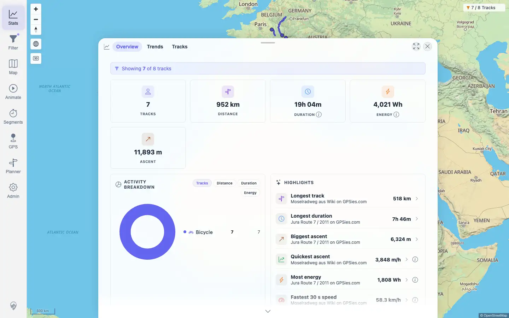
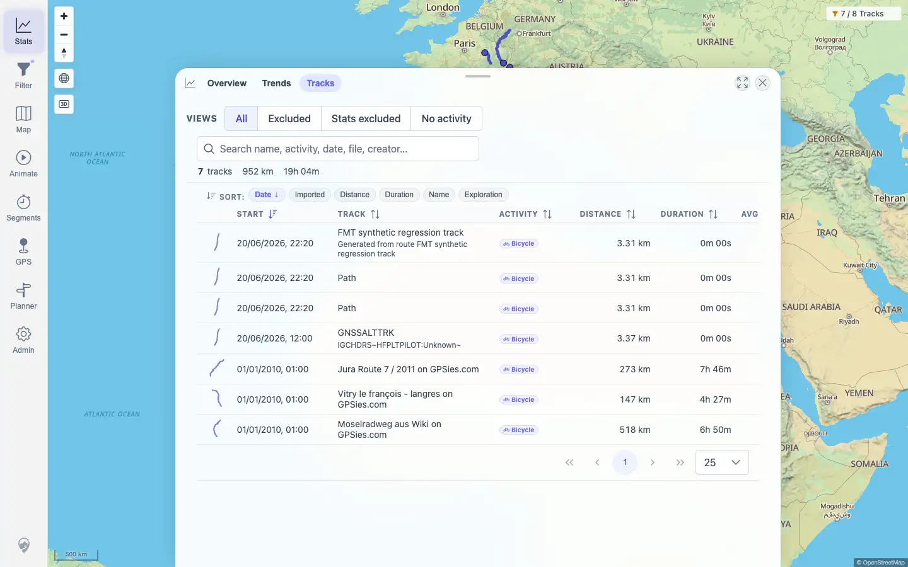
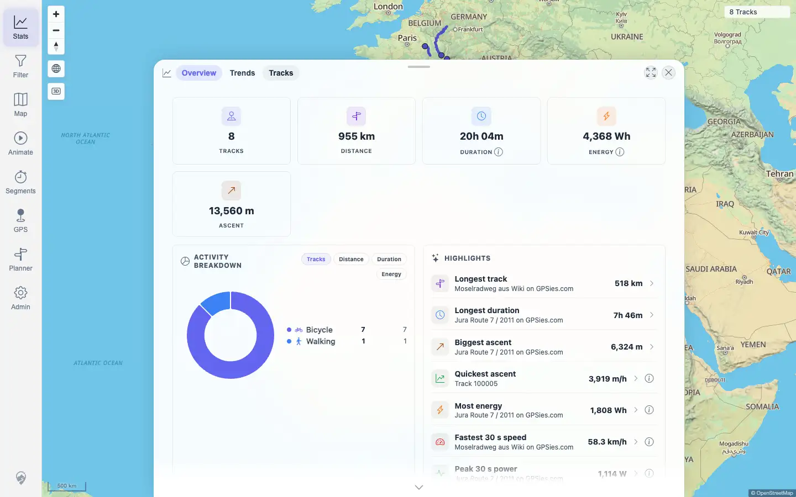

# Packet: TBS_12

## Scope

- Coverage source: `documentation/testing/frontend-regression-test-plan.md`
- Coverage ID or run packet: TBS_12
- In scope: Stats Overview, Trends, and Track Browser consistency against an active SmartBaseFilter geo-circle track set.
- Out of scope: Geo drawing toolbar persistence; already covered by FLT_04 and FLT_05.

## Prerequisites

- Required previous coverage IDs or run packets: FLT_04, FLT_05, TBS_06 through TBS_11
- Required app/data state: Current visible set has 8 tracks; standard filter can be restored afterward.
- Required browser context: Authenticated desktop browser context.

## Allowed Mutations

- Allowed: Apply a temporary geo-circle filter state and restore the original filter state.
- Not allowed: Change imported track data or leave a filter active after the packet.

## Actions And Results

| Coverage ID | Action | Expected result | Actual result | Status | Evidence |
|---|---|---|---|---|---|
| TBS_12 | Applied a temporary SmartBaseFilter geo circle (`lat=46.95`, `lng=7.44`, `radiusM=200000`), checked Map, Stats Overview, Trends, Track Browser, and server totals, then restored the original filter state. | Statistics use the same resolved track set as the active filter; clearing/restoring shows all tracks again. | The geo circle resolved IDs `100000,100001,100002,100008,100009,100011,100012`. Map showed `7 / 8 Tracks`; Overview showed `Showing 7 of 8 tracks`, 7 tracks, 952 km, 19h 04m; Trends showed 7 tracks / 952 km / 19h 04m; Track Browser showed 7 tracks / 952 km / 19h 04m; server overview/TOTAL stats also reported 7 tracks. Restoring the original filter returned Map/Overview to 8 tracks / 955 km. | PASS | [assets/TBS_12-geo-filter-stats-consistency.txt](../assets/TBS_12-geo-filter-stats-consistency.txt); [assets/TBS_12-filtered-overview.webp](../assets/TBS_12-filtered-overview.webp); [assets/TBS_12-filtered-track-browser.webp](../assets/TBS_12-filtered-track-browser.webp); [assets/TBS_12-cleared-overview.webp](../assets/TBS_12-cleared-overview.webp); [packets/FLT_04.md](FLT_04.md); [packets/FLT_05.md](FLT_05.md) |

## Issues

| ID | Severity | Summary | Reproduction | Expected | Actual | Evidence | Release impact |
|---|---|---|---|---|---|---|---|
| None |  |  |  |  |  |  |  |

## Evidence Files

| File | Purpose |
|---|---|
| [assets/TBS_12-geo-filter-stats-consistency.txt](../assets/TBS_12-geo-filter-stats-consistency.txt) | Geo circle, resolved IDs, Map/Overview/Trends/Browser/API consistency checks, cleanup check, and console/page-error summary. |
| [assets/TBS_12-filtered-overview.webp](../assets/TBS_12-filtered-overview.webp) | Filtered Stats Overview with 7 of 8 tracks. |
| [assets/TBS_12-filtered-track-browser.webp](../assets/TBS_12-filtered-track-browser.webp) | Filtered Track Browser with 7 tracks. |
| [assets/TBS_12-cleared-overview.webp](../assets/TBS_12-cleared-overview.webp) | Restored standard filter with all 8 tracks. |

## Screenshot Evidence

## Timings

| Step | Timing |
|---|---:|
| Geo filter consistency and restore | < 1 min |

## Handoff Notes

- Completed: TBS_12 passed for Stats/Map/Track Browser consistency against the same active geo-circle filter result.
- Remaining unfinished coverage: PLN_01 onward.
- Blocked or not applicable: Geo drawing toolbar persistence remains a separate known failure in FLT_04/FLT_05 (`FLT-04-P2`).
- State left for the next packet: Original standard filter restored; Map/Stats return to 8 tracks.
